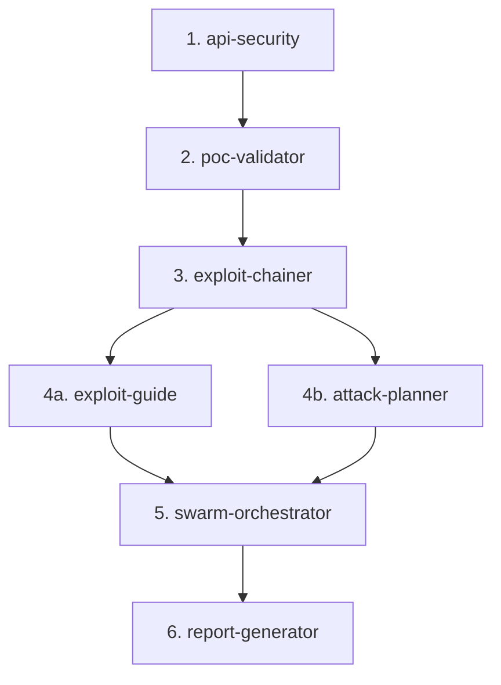

# Dokyudo Security Testing Pipeline & Rules

## Activation
- **Method**: Model Decision / Always-on when the user requests security testing, vulnerability scanning, or penetration testing on any endpoint or service of Dokyudo.
- **Files**: `apps/backend/**/*`, `apps/frontend/**/*`, `collections/**/*`

---

## 1. Skill Execution Order
When tasked with executing or guiding any security or penetration test, you MUST run the delegated agents/skills in the following strict order. No phase can be skipped.

1. **Phase 1: Reconnaissance & Scanning (`api-security`)**  
   Perform endpoint discovery, surface mapping, and initial vulnerability probing.
2. **Phase 2: Validation (`poc-validator`)**  
   Attempt to safely validate identified vulnerabilities and eliminate false positives.
3. **Phase 3: Chaining (`exploit-chainer`)**  
   Chain verified findings into multi-step attack paths showing impact escalation.
4. **Phase 4: Tactical Guidance (`exploit-guide`) & Strategic Planning (`attack-planner`)**  
   - Run `exploit-guide` (Phase 4a) to detail execution/mitigation methodologies.
   - Run `attack-planner` (Phase 4b) to map lateral movement and score attack paths.
5. **Phase 5: Swarm Coordination (`swarm-orchestrator`)**  
   Synthesize progress, manage objectives, and run conflict resolutions.
6. **Phase 6: Reporting (`report-generator`)**  
   Format final outcomes and write the security report.

---

## 2. Target Scope & Environment Selection
If you are confused about which environment to target, or before launching active scans/PoCs, ask the user to specify:
- **Type 1 (Localhost / Docker Compose)**: Target local backend API Gateway (`http://localhost:8000` or port mapped in development).
- **Type 2 (Staging)**: Target the staging environment domain provided by the user.

You MUST pre-fill scoping configurations based on the user's choice. Always verify scope authorization.

---

## 3. Reference collections
Dokyudo contains pre-configured Bruno API request collections inside the `collections/` directory:
- `collections/Auth` — JWT generation, refresh, OAuth flow callbacks.
- `collections/Documents` — Upload endpoints, presigned URLs.
- `collections/Search & RAG` — Vector search, Hybrid search, SSE chat endpoints.
- `collections/Webhooks & Quotas` — Webhook management, delivery triggers.
- `collections/Admin & Internal` — Feature flag service, admin tenant management.
- `collections/System` — Health check, system info.

Always read these collections first when mapping the API surface instead of performing raw discovery.

---

## 4. Tool Registry (Installed CLI Tools)
Use only the following installed tools on the system. Do not attempt to run tools not listed here unless verified first:

- **Bruno CLI (`bru`)**: For running request collections.
- **ffuf**: For fuzzing directories or endpoints.
- **jwt_tool**: For analyzing and attacking JWT configuration/signatures.
- **arjun**: For discovering hidden request parameters.
- **kiterunner (`kr`)**: For routing / API discovery.
- **mitmproxy**: For transparent proxying and inspection.
- **sqlmap**: For executing database injection validation.
- **nuclei**: For template-based vulnerability scanning.
- **nikto**: For web server configuration scanning.
- **feroxbuster**: For fast directory/file enumeration.
- **nmap**: For network/port scans.
- **curl / httpx**: For basic raw request testing.

---

## 5. Output and Evidence Paths
- **Security Reports**: Write the final markdown report to `tests-report/security/dokyudo_security_report_YYYYMMDD.md`.
- **Evidence Files**: Write all PoC scripts, outputs, request logs, and screenshot artifacts to `tests-report/security/evidence/` with the format `poc_{vuln_type}_{target}_{timestamp}.{ext}` or `chain_{chainID}_{step}_{timestamp}.{ext}`.
- **Vulnerabilities Database Fallback**: If `findings.sh` is unavailable, write findings to `tests-report/security/findings.json` and chains to `tests-report/security/chains.json`.
