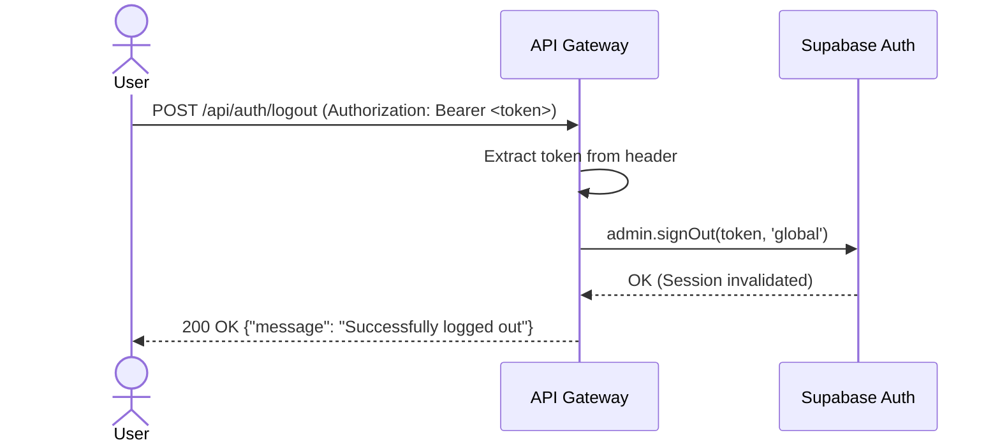

# Auth Logout Feature

## Core Logic
The `POST /api/auth/logout` endpoint allows users to invalidate their active sessions. It reads the Bearer token from the `Authorization` header and uses the Supabase Admin API to globally sign out the user, ensuring their session cannot be refreshed or used again.

## Flow Diagram

## Completion Timestamp
Completed At: 2026-06-19 19:45:00 UTC+7

## File Mapping
- `apps/backend/src/modules/auth/auth.service.ts`: Added `logoutUser` method.
- `apps/backend/src/modules/auth/auth.controller.ts`: Added `handleLogout` method.
- `apps/backend/src/modules/auth/auth.routes.ts`: Registered `/api/auth/logout` route.
- `apps/backend/src/modules/auth/auth.schema.ts`: Added `LogoutResponseSchema`.
- `apps/backend/src/shared/types/auth.types.ts`: Added `LogoutParams`.

## Connections
- **Database/Server**: Connects to the Supabase Auth instance using the Supabase Admin API (`supabase.auth.admin.signOut()`).
- **Frontend**: Frontend must call this endpoint with the access token in the `Authorization` header.

## Architectural Decisions
- Redis is completely removed from the session storage equation. Supabase manages the token revocation natively in its database schema, avoiding split-brain between an external Redis cache and the actual auth state.
