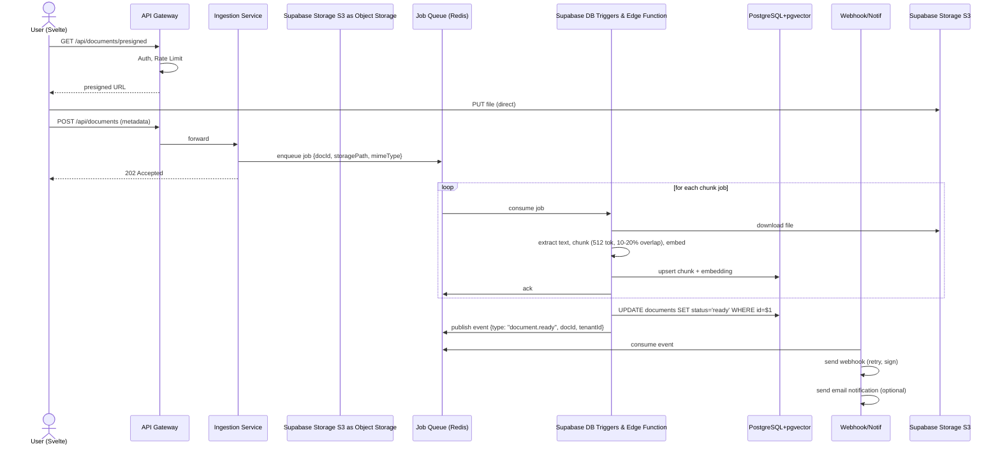
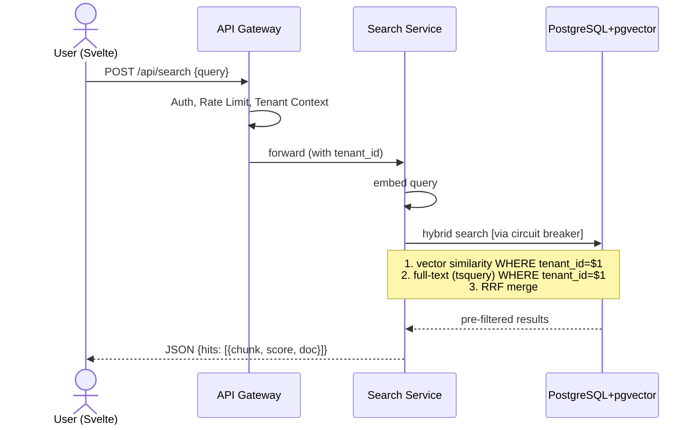
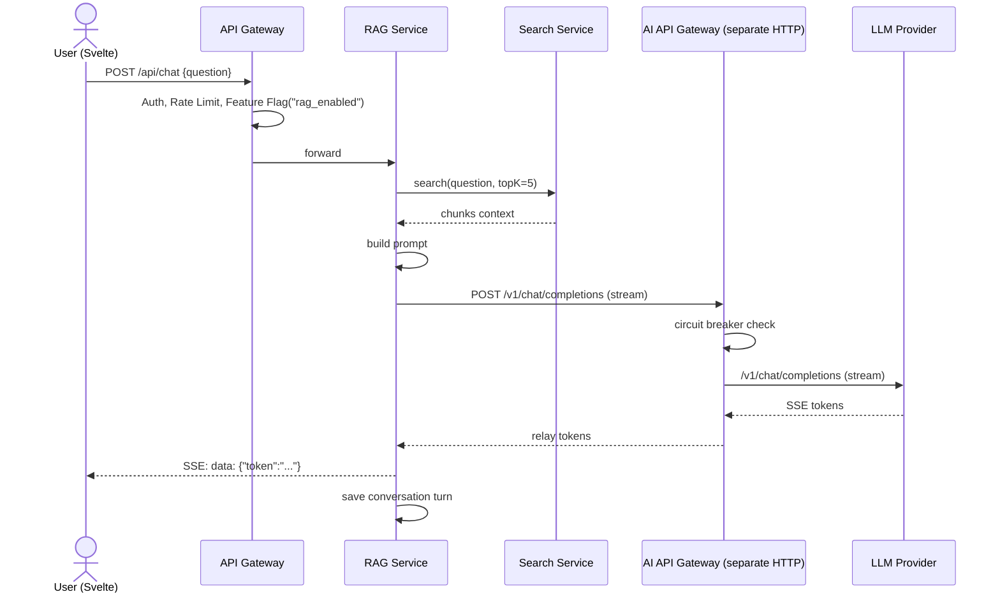
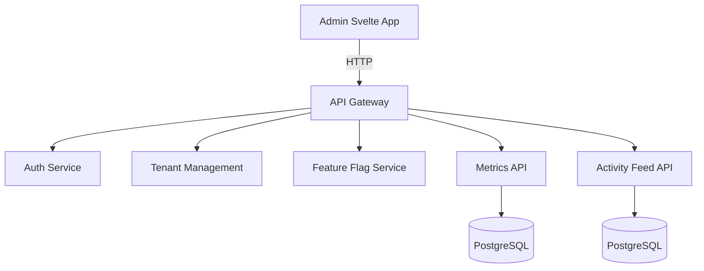

# Semantic Document Search & Q&A Platform (`Dokyudo`) — Project Requirements Document

---

## 1. Project Overview
**Dokyudo** is a *SaaS platform* that allows users to upload documents (PDF, DOCX, TXT), then search and ask semantically about their content.  
The platform is built with **SvelteKit** on the frontend (deployed to Vercel) and **Deno + Hono** on the backend (deployed to Deno Deploy), designed to demonstrate modern distributed system patterns.

---

## 2. Goals & Objectives
- Provide fast and accurate semantic document search.
- Enable contextual question‑answering on documents using RAG (*Retrieval‑Augmented Generation*).
- Implement *multi‑tenancy*, *rate limiting*, *job queue*, *webhook*, *feature flag*, and *observability* in one integrated project.

---

## 3. Core Features
1. **Multi‑Tenant SaaS** – Data isolation per user/tenant, storage & search quotas.
2. **Ingestion Pipeline** – Upload → text extraction → chunking → embedding → vector index.
3. **Semantic Search** – Vector search + full‑text (*hybrid*) with tenant filtering done inside the database queries (not post‑retrieval).
4. **RAG Q&A** – Retrieve relevant context, build prompt, and stream the LLM answer.
5. **API Gateway** – Authentication, *routing*, *rate limiting* (sliding window), distributed *session store*, and **feature‑flag enforcement**.
6. **Distributed Job Queue** – Asynchronous embedding and notification processing, with *retry* and *Dead Letter Queue*.
7. **Webhook Delivery** – Notification to tenant URL when document processing is complete (idempotency, *signature verification*).
8. **Feature Flag Service** – Enable/disable features (e.g., Q&A) dynamically per tenant. Enforced at the API Gateway.
9. **Notification System** – Send email (or push) when document is ready, using *job queue*.
10. **AI API Gateway** – A **separate service** that routes LLM requests to multiple providers (Gemini, Gemini, local) with automatic *fallback* and circuit breaker.
11. **Activity Feed & Metrics** – Log activity per tenant and aggregate latency/request count metrics.
12. **Circuit Breaker** – Protect calls to Vector DB, LLM providers, and external webhook URLs from cascading failures.
13. **Observability** – Centralized logging, metrics, and *admin dashboard* (Svelte).

---

## 4. User Roles
- **Tenant (User)** – Upload documents, search, ask questions, manage webhooks. MVP: one tenant = one user account. Can register via email/password **or OAuth (Google / GitHub)**.
- **Admin** – Manage tenants, quotas, *feature flags*, view webhook delivery logs, monitor metrics.

---

## 5. Functional Requirements

### 5.1 Multi‑Tenancy, Quotas & Registration Methods
- Each registered user becomes their own *tenant*. (MVP: 1‑to‑1, multi‑user tenants not supported.)
- Data (documents, chunks, feed) is isolated with `tenant_id` in every query.
- **Supported registration methods:**
  - Email + password (bcrypt, cost 12).
  - **OAuth via Google** (OpenID Connect, `googleapis` / `google-auth-library`).
  - **OAuth via GitHub** (GitHub OAuth Apps, `octokit/auth-oauth-app`).
  - On first OAuth login, a user + tenant record is auto‑created (email from provider profile). If the email already exists (registered via password), the OAuth provider is linked to the existing account.
  - The `users` table has an optional `password_hash` column (NULL for OAuth-only accounts) and an `oauth_providers` join table to support multiple linked providers.
  - **OAuth Email Verification Gate**: The backend MUST only proceed with account creation or linking if the email returned by the provider carries `email_verified: true`. If `email_verified` is false or absent, authentication is rejected with `401 UNAUTHORIZED`. This applies to both Google and GitHub (for GitHub, if the primary email is unverified, fall back to `GET /user/emails` — use the first email with `verified: true`; if none exist, reject).
- Quotas per tier (configurable defaults):

| Tier | Uploads/month | Searches/month | Q&A/month | Storage (MB) |
|------|---------------|----------------|-----------|---------------|
| Free | 10            | 100            | 20        | 500           |
| Pro  | 100           | 1000           | 200       | 5000          |

- **Quota Reset Policy:**
  - Counters for **Uploads, Searches, and Q&A** are reset to `0` on the **1st day of each calendar month** at 00:00 UTC. This is handled by a Deno Cron Job (implemented in Phase 4).
  - **Storage quota** (`storage_bytes`) is **cumulative and never reset** — it reflects total bytes currently stored in object storage for the tenant. It decreases only when documents are deleted.
  - The `quota_usage.period_start` column records the start of the current billing period (always the 1st of the month).
- Exceeding a quota results in a `QUOTA_EXCEEDED` error (HTTP 429). Billing / payment processing is out of scope for MVP.

### 5.2 Document Ingestion
- Upload files (max 25 MB) via *presigned URL* directly to object storage (Supabase Storage S3) → saves backend bandwidth.
- Backend records metadata and inserts the extracted text and chunks into the PostgreSQL database.
- **Automatic Embeddings**: 
  1. A Postgres trigger automatically queues an embedding generation job into `pgmq` whenever a new chunk is inserted.
  2. A scheduled `pg_cron` job processes the queue using `pg_net` to call a Supabase Edge Function.
  3. The Edge Function calls the **Embedding API** (Gemini) and updates the vector column in the database directly.
- **Retry note**: The worker always re‑runs all steps from the beginning; the upsert strategy prevents duplicate data.
- **Embedding Dimension Lock (MVP)**: The vector column is fixed at **768 dimensions**, matching Gemini `gemini-embedding-2`. If Ollama is used as a local model fallback, it must be configured with a model that natively produces 768‑dimensional vectors (e.g., `mxbai-embed-large`). Zero‑padding vectors of a different dimension is explicitly forbidden as it corrupts cosine similarity scores.

### 5.3 Semantic Search (Hybrid) – Tenant‑Safe
- Endpoint `POST /api/search` accepts a text query.
- Backend:
  1. Create query embedding.
  2. Execute **hybrid search** **within the tenant's scope**:
     - Vector similarity (cosine) via pgvector:  
       `SELECT … FROM chunks WHERE tenant_id = $1 ORDER BY embedding <=> $2 LIMIT n`
     - Full‑text search via PostgreSQL `tsvector`:  
       `SELECT … FROM chunks WHERE tenant_id = $1 AND ts_content @@ to_tsquery('english', $2) LIMIT n`
  3. Merge the two pre‑filtered result sets with **Reciprocal Rank Fusion (RRF)**.
  4. Return snippets and scores.
- The search is protected by a **circuit breaker** when accessing the vector database (see §5.12).
- The Search Service depends on the same Embedding API used during ingestion; if it is unavailable, the hybrid search **degrades to full‑text only** (configurable behavior).
- **`ts_content` Population Strategy**: The `ts_content` column on the `chunks` table MUST be implemented as a **PostgreSQL Generated Column**: `GENERATED ALWAYS AS (to_tsvector('english', content)) STORED`. The database engine automatically recomputes and indexes the tsvector whenever `content` changes. The Supabase DB Triggers & Edge Function writes only `content` and `embedding` — it never manually computes or writes `ts_content`. The GIN index on this generated column enables fast `@@` operator queries.

### 5.4 RAG Q&A (Chat)
- Endpoint `POST /api/chat` accepts a question in JSON, responds with **Server‑Sent Events (SSE)**.
- Flow:
  1. The RAG Service calls the **Search Service** with the raw text question; the Search Service embeds it and returns the top‑K chunks (by default 5).
  2. Build system prompt + context from the retrieved chunks.
  3. Call the **AI API Gateway** (a separate HTTP service) to stream the LLM response.
  4. Each token is forwarded as an SSE event to the frontend.
  5. Save conversation history to the database (see data model below).
- **Feature flag** `rag_enabled` must be active for the tenant; enforcement is done at the **API Gateway** (not re‑checked in the RAG service).
- **Conversation Scope**: Conversations are scoped at the **`tenant_id` level**, not per document. The AI can answer questions drawing from the combined content of all documents belonging to the tenant simultaneously. There is no per-document conversation isolation in MVP.
- Conversation data model:
  ```sql
  CREATE TABLE conversations (
    id UUID PRIMARY KEY,
    tenant_id UUID NOT NULL REFERENCES tenants(id),
    created_at TIMESTAMPTZ DEFAULT now()
  );
  CREATE TABLE conversation_turns (
    id UUID PRIMARY KEY,
    conversation_id UUID NOT NULL REFERENCES conversations(id),
    turn_index INT NOT NULL,
    question TEXT NOT NULL,
    answer TEXT,
    context_chunk_ids UUID[],
    model_used TEXT,
    latency_ms INT,
    created_at TIMESTAMPTZ DEFAULT now()
  );
  ```
- The request body may include an optional `conversation_id` to continue a thread; if absent, a new conversation is created and its ID returned.
- **SSE Streaming Policy (Hono Gateway)**:
  - The API Gateway MUST NOT buffer SSE responses from the RAG Service.
  - When proxying `POST /api/chat`, the Gateway takes the `ReadableStream` from the upstream `fetch()` response and returns it directly using `c.body(stream, 200, headers)`.
  - The Gateway must explicitly enforce the following headers on the SSE response to prevent proxy-level or browser-level buffering:
    - `Content-Type: text/event-stream`
    - `Cache-Control: no-cache`
    - `Connection: keep-alive`
    - `X-Accel-Buffering: no` (prevents Nginx/reverse-proxy buffering if present)
  - `Transfer-Encoding: chunked` is handled automatically by Deno when a `ReadableStream` body is returned.

### 5.5 API Gateway & Session Management
- All external requests go through the **Hono** API Gateway.
- Middleware:
  - **Auth & Session**:  
    - JWTs are **short‑lived** (15‑minute expiry).  
    - The Redis session store holds a `refresh_token` reference with a **24‑hour TTL**.  
    - On each request, the gateway validates the JWT signature and expiry. If the JWT is expired, it checks Redis for a valid session and silently issues a new JWT (using the stored refresh token).  
    - To immediately revoke access (logout, account suspension), delete the Redis session entry; the user’s next token refresh will fail.
  - **JWT Payload Specification**: Every issued JWT must contain exactly the following claims:
    - `sub` — User UUID (from `users.id`)
    - `tenantId` — Tenant UUID (from `tenants.id`)
    - `role` — `"tenant"` or `"admin"`
    - `jti` — Unique JWT ID (UUID v4), generated fresh on every issuance, for future replay-detection support
    - `iat` — Issued-at timestamp (Unix seconds)
    - `exp` — Expiry timestamp (Unix seconds; `iat + 900` for 15 minutes)
  - **Redis Key Schema** (canonical; all services must use these exact key formats):
    - Sessions: `session:{sha256(refreshToken)}` → JSON `{userId, tenantId, exp}` with 24h TTL
    - Rate limiting: `rate_limit:{tenantId}:{endpoint}` → Redis sorted set (sliding window ZSET)
    - OAuth CSRF state: `oauth:{state}` → `{provider}` string with 5-min TTL (single-use: deleted immediately after validation)
    - Feature flag cache: `flag:{flagName}:{tenantId}` → `"true"` or `"false"` string with 30s TTL
  - **OAuth Callback Handling**:
    - `GET /api/auth/oauth/:provider` — redirects to the provider’s authorization URL with `oauth:{state}` stored in Redis (5-min TTL, single-use, CSRF protection).
    - `GET /api/auth/oauth/:provider/callback` — validates `state` (delete from Redis immediately after reading), exchanges code for tokens, applies email-verification gate (see §5.1), upserts user + tenant, issues JWT + Redis session, redirects to `/app/dashboard`.
    - Provider access tokens are **not** stored beyond the callback; only the Dokyudo JWT/refresh session is retained.
  - **Rate Limiter**: *Sliding window* based on Redis sorted sets per `rate_limit:{tenantId}:{endpoint}` key.
  - **Tenant Context**: Injects `tenant_id` into the request.
  - **Feature Flag Enforcement**: The gateway evaluates feature flags for tenant‑facing endpoints. If a required flag is disabled, it returns `403 FEATURE_DISABLED`. Internal service‑to‑service calls bypass the gateway and are trusted.
- Session TTL: 24 hours, renewable on each active JWT refresh.

### 5.6 Webhook Delivery
- Tenant can register a webhook URL via API. The only supported event type for MVP is `document.ready`. The `POST /api/webhooks` request body contains only `{ url }` — no event type selection is required.
- **Webhook Secret Lifecycle**:
  - When the tenant registers a webhook (`POST /api/webhooks`), the server **auto-generates** a cryptographically random 32-byte secret (encoded as a 64-character hex string) using `crypto.getRandomValues()`.
  - The secret is stored in `webhook_registrations.secret` (hashed with SHA-256 before storage to prevent DB leaks).
  - The **raw (unhashed) secret** is returned **exactly once** in the `201 Created` response body under the key `"secret"`. It is never retrievable again. The tenant must store it securely.
  - Format: `{ "id": "...", "url": "...", "secret": "<64-char hex>", "createdAt": "..." }`
- On event `document.ready`, the webhook worker (triggered by the job queue):
  1. Create a payload containing document metadata.
  2. Add an **idempotency key** derived as:  
     `SHA‑256(event_type + ":" + document_id + ":" + tenant_id + ":" + attempt_number)` (hex encoded).
  3. Sign the payload with HMAC‑SHA256 using the tenant‑specific secret (retrieved from DB); place the signature in the `X‑Signature` header.
  4. Send POST to the tenant URL.
  5. If delivery fails, retry with *exponential backoff* (max 5 attempts).
  6. All attempts are logged in the `webhook_logs` table.
- Each webhook URL has its own **circuit breaker** (see §5.12) to halt delivery temporarily after consecutive failures.

### 5.7 Feature Flag Service
- **Admin** can create flags (e.g., `rag_enabled`, `sharing_enabled`) and assign values per tenant or globally.
- Internal evaluation endpoint: `GET /internal/features/:flagName?tenant_id=...`.
- **Caching**: Flag values are cached in Redis with a TTL of **30 seconds** per `(flagName, tenant_id)` pair. On cache miss, the gateway fetches from the service and writes to cache. Admin can flush a specific flag’s cache via the admin API.
- Tenant‑facing feature enforcement is handled exclusively by the **API Gateway**. Individual services do not independently evaluate flags for external requests.

### 5.8 Notification System
- Send email notifications (e.g., “Your document is ready to search”) via the **job queue**.
- Job payload: `{ template, recipient, payload }`.
- Worker sends via SendGrid/Mailgun. Failed deliveries go to DLQ.

### 5.9 Activity Feed
- Every action (upload, index completion, search, Q&A, webhook error) is logged in `activity_log` with `tenant_id`, type, and timestamp.
- API `GET /api/activities` returns the tenant’s latest feed, supporting **cursor‑based pagination**.
- **Retention**: Raw activity logs are kept for **90 days**. A distributed cron job (Phase 4) purges older entries. Aggregated metrics derived from the logs are retained indefinitely at hourly/daily resolution.

### 5.10 AI API Gateway (Model Routing) – Separate Service
- A **separate Deno HTTP service** that acts as a reverse proxy to multiple LLM providers.
- Routing configuration:
  - Default: Gemini.
  - Fallback order: local model (Ollama).
- Implements a **circuit breaker** per provider (see §5.12).
- Logs all calls (latency, token usage, provider, status) to structured stdout.
- The RAG Service communicates with the AI API Gateway via HTTP (e.g., `POST http://ai-gateway/v1/chat/completions`).

### 5.11 Observability & Admin Dashboard
- **Metrics Service**: Collects counters (requests, searches, Q&A, webhook success/failure) and latency histograms.
- **Log Aggregation**: Structured JSON logs; can be integrated with Grafana Loki.
- **Admin Svelte Dashboard**:
  - Tenant management (create, disable, change quotas).
  - Manage feature flags (with cache flush option).
  - View webhook delivery logs.
  - Monitor metrics with simple charts.

### 5.12 Error Response Standard
All API services return errors in a consistent JSON envelope:
```json
{
  "error": {
    "code": "MACHINE_READABLE_CODE",
    "message": "Human readable description",
    "retryAfter": 30,
    "requestId": "uuid"
  }
}
```
**Standard error codes**: `UNAUTHORIZED`, `FORBIDDEN`, `FEATURE_DISABLED`, `RATE_LIMIT_EXCEEDED`, `QUOTA_EXCEEDED`, `DOCUMENT_NOT_READY`, `PROVIDER_UNAVAILABLE`, `VALIDATION_ERROR`, `INTERNAL_ERROR`.

### 5.13 Circuit Breaker Defaults
A reusable circuit breaker configuration is applied to external dependencies:
- **Failure threshold**: 5 failures in a 10‑second sliding window.
- **Open duration**: 30 seconds, then transitions to half‑open.
- **Half‑open probe count**: 1 successful probe to close the circuit.
- Applies to:
  - pgvector calls inside Search Service.
  - Each LLM provider in the AI API Gateway.
  - Each tenant’s webhook URL in the Webhook Service.
All values can be overridden per service via environment variables.

---

## 6. Non‑Functional Requirements
- **Scalability**: Stateless components scale horizontally. PostgreSQL max connections: 100 (enforced via PgBouncer in transaction mode). Redis: single connection pool per service instance, max 20 connections.
- **Resilience**: Circuit breakers on all external dependencies. Job queue guarantees at‑least‑once processing with upserts.
- **Security**: All endpoints authenticated with JWT (short‑lived) plus session invalidation. OAuth state parameter validated (CSRF protection). Webhooks signed with HMAC‑SHA256. Strict input validation.
- **Observability**: Each service exposes a `/health` endpoint. Logs are structured JSON.
- **Performance**:
  - Hybrid search end‑to‑end (gateway→embedding→DB→response) **<500ms** at P95 under normal load. If embedding API adds >200ms, target becomes <700ms.
  - RAG first‑token latency (gateway receipt to first SSE event) **<3 seconds** at P95, including query embedding (~150ms), vector search (~100ms), prompt build (~50ms), and LLM TTFT (<2.5s).

---

## 7. Architecture Overview (High‑Level) — Revised

```
┌────────────────────────────────────────────────────────────────┐
│ CLIENT LAYER (SvelteKit — SSR + CSR)                           │
│  ┌──────────────────────┐   ┌────────────────────────────────┐ │
│  │ Tenant UI  (/app/*)  │   │ Admin UI  (/admin/*)           │ │
│  │ (SvelteKit app)      │   │ (separate SvelteKit app/build) │ │
│  └──────────────────────┘   └────────────────────────────────┘ │
└────────────────────────────────────────────────────────────────┘
                              │
                              ▼
┌────────────────────────────────────────────────────────────────┐
│                      API GATEWAY (Deno + Hono)                 │
│  ┌──────────────┐  ┌──────────────┐  ┌──────────────────────┐ │
│  │ Auth (JWT+   │  │ Rate Limit   │  │ Tenant Context       │ │
│  │ Redis sess)  │  │ (Sliding W)  │  │ + Feature Flag Enf.  │ │
│  └──────────────┘  └──────────────┘  └──────────────────────┘ │
└────────────────────────────────────────────────────────────────┘
          │                │                │
          ▼                ▼                ▼
┌───────────────┐ ┌───────────────┐ ┌──────────────────────┐
│  Ingestion    │ │  Search Svc   │ │  RAG Service         │
│  Service      │ │  (Hybrid)     │ │  (Streaming SSE)     │
│  - Upload     │ │  - Embed+RRF  │ │  - Retrieval+Prompt  │
│  - Queue Job  │ │  - Circuit    │ │  - Calls AI API GW   │
└───────┬───────┘ │    Breaker    │ └──────────┬───────────┘
        │         └───────┬───────┘            │
        │                 │                    │
        │                 ▼                    │
        │          ┌──────────────┐            │
        │          │ Vector DB    │◄───────────┘
        │          │ PostgreSQL   │
        │          │ + pgvector   │
        │          └──────────────┘
        ▼
┌───────────────────────────────────────────────┐
│            JOB QUEUE & WORKERS                │
│  ┌──────────────┐  ┌──────────────────────┐   │
│  │  Redis/Supabase pg_cron│  │  Supabase DB Triggers & Edge Function    │   │
│  │  + DLQ       │  │  Notification Worker │   │
│  │              │  │  Webhook Worker      │   │
│  └──────────────┘  └──────────────────────┘   │
└───────────────────────────────────────────────┘
        │                 │
        ▼                 ▼
┌───────────────────────────────────────────────┐
│          INFRASTRUCTURE & STORAGE             │
│  ┌──────────────┐  ┌──────────────┐          │
│  │  Redis       │  │  Supabase Storage S3    │          │
│  │  (cache,     │  │  (Object     │          │
│  │   sessions,  │  │   Storage)   │          │
│  │   rate lim)  │  │              │          │
│  └──────────────┘  └──────────────┘          │
│  ┌──────────────┐  ┌──────────────────────┐   │
│  │  PostgreSQL  │  │  LLM & Embedding API │   │
│  │  + pgvector  │  │  (Gemini/  │   │
│  │  (data+vec)  │  │   Ollama)            │   │
│  └──────────────┘  └──────────────────────┘   │
│  ┌──────────────────────────────────────┐     │
│  │ AI API Gateway (separate service)    │     │
│  │ - model routing, fallback, CB        │     │
│  └──────────────────────────────────────┘     │
└───────────────────────────────────────────────┘
```

---

## 8. Component Descriptions (Simplified & Merged) — Revised

| Service                      | Responsibilities                                                                                                                                           | Dependencies                         |
| ---------------------------- | ---------------------------------------------------------------------------------------------------------------------------------------------------------- | ------------------------------------ |
| **API Gateway**              | Auth (JWT + Redis session), rate limiting, tenant context injection, **feature flag enforcement** (single point)                                            | Redis, Feature Flag Service         |
| **Ingestion Service**        | Accept upload metadata (presigned URL), enqueue job with `{docId, storagePath, mimeType}`, track document status                                            | Object Storage, Job Queue            |
| **Supabase DB Triggers & Edge Function**         | Consumer: download, extract, chunk (sliding‑window 512 tokens, 10‑20% overlap), embed, upsert into pgvector, update DB status, publish `document.ready`     | Object Storage, Embedding API, pgvector, Job Queue |
| **Search Service**           | Embed query, execute tenant‑safe hybrid search (pgvector + full‑text with RRF), circuit breaker on pgvector calls                                           | Embedding API, pgvector              |
| **RAG Service**              | Retrieve context via Search Service, build prompt, stream via SSE using AI API Gateway, save conversation history                                           | Search Service, AI API Gateway       |
| **AI API Gateway**           | Separate HTTP service: route to LLM providers (Gemini → Ollama), circuit breaker per provider, structured logging                              | LLM providers                        |
| **Webhook & Notification**   | Consume `document.ready` events, send signed webhooks (idempotency, HMAC) with retry & CB, send email notifications via queue                               | Job Queue, email provider            |
| **Feature Flag Service**     | CRUD flags, evaluation API, values cached in Redis (30s TTL), admin cache flush                                                                             | Redis                                |
| **Activity & Metrics**       | Log activity feed (cursor pagination, 90‑day retention), collect counters & histograms                                                                      | PostgreSQL                           |
| **Tenant & User Management** | Registration, login, quota storage, 1:1 user‑tenant mapping                                                                                                  | PostgreSQL, Redis (session)          |

---

## 9. Data Flow Diagrams (Mermaid) — Revised

### 9.1 Document Upload & Ingestion


### 9.2 Hybrid Semantic Search


### 9.3 RAG Q&A (Streaming)


### 9.4 Admin Dashboard Flow


---

## 10. Technology Stack

| Layer | Technology | Justification |
|-------|------------|---------------|
| **Frontend** | SvelteKit (SSR/CSR), TailwindCSS, shadcn-svelte | Reactive, small bundle, fast |
| **Backend Runtime** | Deno 2.x + TypeScript | Native TS, Web API, npm compatible |
| **HTTP Framework** | Hono | Lightweight, middleware-friendly, first-class Deno support |
| **Database** | Supabase (PostgreSQL + pgvector) | Relational data + vectors in one DB, no extra infrastructure |
| **Object Storage** | Supabase Storage S3 (development) / Supabase Storage S3 (production) | Self-hosted, S3-compatible, signed URL |
| **Cache & Queue** | Upstash Redis + Supabase pg_cron (npm:bullmq, tested on Deno 2.1+) | Rate limiting, sessions, job queue, DLQ |
| **Job Queue (async)** | Supabase pg_cron; Supabase pg_cron can be a lightweight fallback for serverless tasks | Embedding, notification, webhook jobs |
| **LLM Providers** | Gemini, Ollama (local) | Flexibility via AI API Gateway |
| **Embedding Model** | Gemini `gemini-embedding-2` / Ollama | Lightweight, accurate |
| **Monitoring** | JSON logs + Grafana Loki (opt) | Centralized observability |
| **Auth** | Supabase Auth for refresh & revocation | Stateless with revocation capability |
| **OAuth** | Supabase Auth (Google, GitHub) | Social login; converges to the same JWT+Redis session post-handshake |
| **ORM** | Drizzle ORM | Type-safe, suitable for Deno, query builder |
| **Validation** | Zod | Frontend & Backend schema validation |

---

## 11. Infrastructure & Deployment

- **Monorepo** with Deno workspace (`deno.jsonc`).
- **Docker Compose** for local development: `postgres` + `pgvector`, `redis`, `minio`, `ollama` (optional).
- **Deployment mapping**:

| Service | Local (Docker Compose) | Cloud (Production) |
|---|---|---|
| API Gateway, Ingestion, Search, RAG, Feature Flag, Activity/Metrics | Deno Deploy | Deno Deploy |
| Supabase DB Triggers & Edge Function, Webhook Worker, Notification Worker | Supabase Edge Functions / pg_cron | Deno Deploy |
| AI API Gateway | Deno Deploy | Deno Deploy |

- **Note**: Workers are not deployable to Deno Deploy because it lacks long-running background process support. Use Deno Deploy for workers. For lightweight tasks on Deno Deploy, Supabase pg_cron can be a fallback, but for production queue semantics, Supabase pg_cron on Redis (hosted on Deno Deploy) is the primary path.
- **Production**: Serverless: Deno Deploy (Backend), Vercel (Frontend), Upstash (Redis), Supabase (Postgres, Auth, Storage).

---

## 12. Mapping to Original Component List (unchanged except minor notes)

| Original Component | Where Implemented |
|--------------------|-------------------|
| Distributed Rate Limiter (Redis + sliding window) | API Gateway middleware |
| Scalable URL Shortener (base62 + DB sharding) | *(Optional, can be added for sharing links; not integrated into tenant management)* |
| Distributed Job Queue (workers + retry + DLQ) | Supabase pg_cron, Embedding/Notification/Webhook Workers |
| Webhook Delivery System (retry, idempotency, signatures) | Webhook & Notification Service |
| API Gateway (auth, routing, rate limiting) | Hono API Gateway |
| Multi-tenant SaaS Backend (tenant isolation, billing logic) | Tenant & User Management, database row-level |
| Feature Flag Service (dynamic config rollout) | Feature Flag Service (enforced at gateway) |
| Session Store (distributed, TTL-based) | Redis via API Gateway (combined with JWT refresh) |
| Search Service (ElasticSearch + indexing pipeline) | Replaced by Supabase (PostgreSQL + pgvector) hybrid search |
| Log Aggregation System (ingestion + storage + query) | JSON logging + Grafana Loki (optional) |
| Metrics Backend (time-series DB + dashboards API) | Metrics Service + PostgreSQL |
| Event Ingestion Pipeline (Kafka + consumers) | Replaced by Redis Streams / Job Queue |
| ETL Pipeline (batch + streaming) | Ingestion Service + Supabase DB Triggers & Edge Function |
| Circuit Breaker Service (failure handling) | Embedded in Search, AI API Gateway, Webhook services |
| File Storage Backend (S3-like, signed URLs) | Supabase Storage S3, Ingestion Service |
| RAG Backend (document ingestion + retrieval + LLM) | RAG Service |
| Vector Search Backend (embeddings + similarity search) | Search Service + pgvector |
| AI API Gateway (model routing + fallback) | AI API Gateway (separate service) |
| Prompt Logging & Evaluation Backend | Stored in RAG Service (history & logging) |
| Semantic Search Engine Backend | Search Service |

---

## 13. Development Phases

### Phase 1 – Core Search MVP
- Multi‑tenant auth, session store with JWT + Redis.
- **OAuth social login** (Google + GitHub): callback endpoints, state/CSRF validation, provider account linking.
- Upload file → simple text chunking (raw text storage, no embeddings).
- Full‑text search only (PostgreSQL `tsvector`).
- API Gateway with rate limiter.
- Basic admin tenant management.

### Phase 2 – Semantic & RAG
- Integrate pgvector, embedding worker with sliding‑window chunking, job queue + DLQ.
- Hybrid semantic search (tenant‑safe) with circuit breaker on pgvector.
- RAG Q&A with streaming (SSE) via Search Service.
- AI API Gateway as a separate service with circuit breaker per LLM provider.
- Feature flag for RAG (enforced at gateway).
- **Migration**: Re‑queue all Phase 1 documents for embedding (a one‑time script).

### Phase 3 – Enterprise Features
- Webhook delivery system with retry, idempotency, HMAC signature, and per‑URL circuit breakers.
- Email notifications via job queue.
- Activity feed with cursor pagination & retention policy.
- Metrics service and admin dashboard (charts).
- Circuit breakers for Vector DB (already in Phase 2, hardened) and for webhook URLs.

### Phase 4 – Production Hardening
- AI API Gateway full fallback logic and prompt logging dashboard.
- Distributed cron (clean up expired activity logs, weekly reports).
- Scalability testing & optimization (connection pooling, caching).
- Complete error response standardization across all services.
