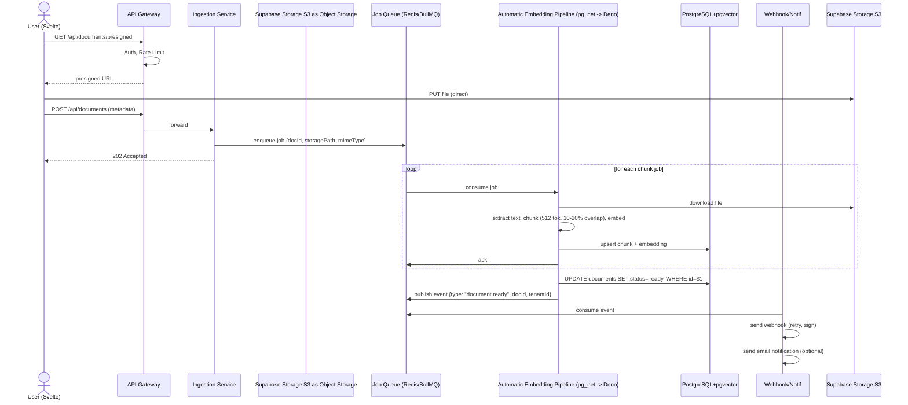
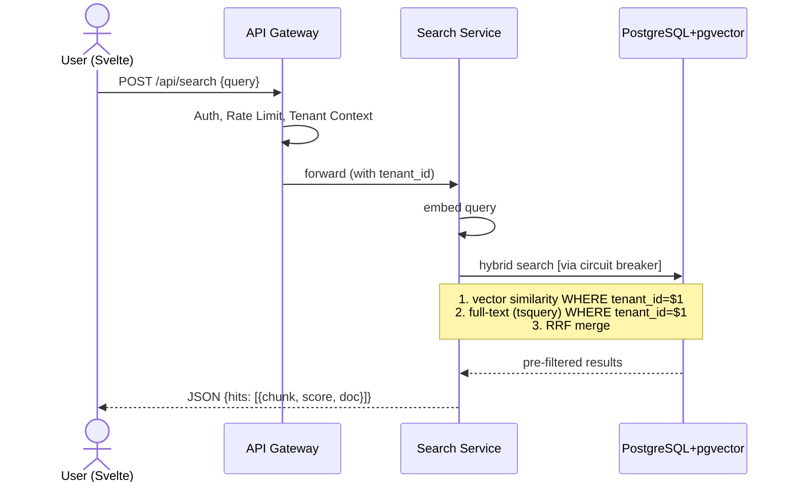
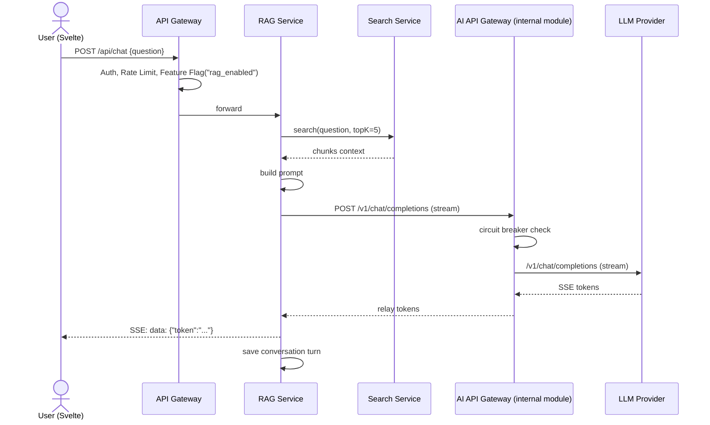
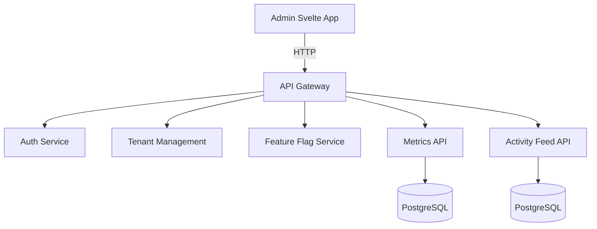

# Semantic Document Search & Q&A Platform (`Dokyudo`) — Project Requirements Document

---

## 1. Project Overview
**Dokyudo** is a _SaaS platform_ that allows users to upload documents (PDF, DOCX, TXT), then search and ask semantically about their content.

The platform is built with **SvelteKit** on the frontend (deployed to Vercel) and **Deno + Hono** on the backend (deployed to Deno Deploy). It is designed to demonstrate modern distributed system patterns, comprehensive SaaS monetization architectures, and extreme cost-optimization strategies for serverless environments.

---

## 2. Goals & Objectives
- Provide fast and accurate semantic document search.
- Enable contextual question‑answering on documents using RAG (_Retrieval‑Augmented Generation_).
- Implement _multi‑tenancy_, _rate limiting_, _job queue_, _webhook_, _feature flag_, and _observability_ in one integrated project.
- **Showcase scalable SaaS architecture** while maintaining a strict $0/month operational footprint for portfolio purposes.

---

## 3. Core Features
1. **Multi‑Tenant SaaS & Tier Management** – Data isolation per user/tenant, with a dynamic 4-tier system (Free, Simulate, Investor, Real) to showcase role-based access and quota enforcement.
2. **Sandbox Payment Gateway Integration** – Integration with Midtrans/Xendit (Sandbox mode) to demonstrate webhook handling, subscription lifecycle, and multi-seat license provisioning.
3. **Cost-Optimized Ingestion Pipeline** – Upload → text extraction → optimized chunking (256 tokens) → rate-limited embedding → HNSW vector index, specifically designed to bypass LLM free-tier rate limits.
4. **Self-Destructing Data & Teardown** – Automated cron jobs that wipe physical storage and database records for expired simulation accounts and aged portfolio data to permanently maintain a $0 cloud bill.
5. **Semantic Search** – Vector search + full‑text (_hybrid_) with tenant filtering done inside the database queries.
6. **RAG Q&A & Streaming Optimization** – Retrieve relevant context, build prompt, and stream the LLM answer using the native Web Streams API to minimize serverless CPU time consumption.
7. **API Gateway** – Authentication, _routing_, _rate limiting_ (sliding window via Redis Pipelining), and **feature‑flag enforcement**.
8. **Distributed Job Queue** – Asynchronous embedding and notification processing, with _retry_ and _Dead Letter Queue_.
9. **Webhook Delivery** – Notification to tenant URL when document processing is complete (idempotency, _signature verification_).
10. **Feature Flag Service** – Enable/disable features (e.g., Q&A) dynamically per tenant. Enforced at the API Gateway.
11. **AI API Gateway** – A dedicated module within the backend monolith that routes LLM requests to multiple providers with automatic _fallback_ and circuit breaker.
12. **Observability** – Centralized logging, metrics, and _admin dashboard_ (Svelte).
    

---

## 4. User Roles
- **Tenant (User)** – Upload documents, search, ask questions, manage webhooks. MVP: one tenant = one user account. Can register via email/password **or OAuth (Google / GitHub)**.
- **Admin** – Manage tenants, quotas, *feature flags*, view webhook delivery logs, monitor metrics.

---

## 5. Functional Requirements

### 5.1 Multi‑Tenancy, Subscription Tiers & Quotas

- Each registered user becomes their own _tenant_.
    
- Data (documents, chunks, feed) is isolated with the tenant's unique identifier in every query.
- The following tables **MUST** have a `tenant_id` column: `documents`, `document_chunks`, `conversations`, `conversation_turns`, `webhook_registrations`, `webhook_logs`, and `activity_log`. The `users` table also links to a tenant (1 User = 1 Tenant). Note: Global infrastructure tables like `login_attempts` are exempt from this requirement as they handle pre-authentication security.
    
- **Supported registration methods:**
    
    - Email + password (bcrypt, cost 12).
        
    - **OAuth via Google & GitHub**.
        
    - **OAuth Email Verification Gate**: OAuth login MUST be implemented using the **Server-Side PKCE** flow via the Deno Hono backend (e.g., `GET /api/auth/google` and `GET /api/auth/callback`). After the provider redirects back to the backend callback, the backend exchanges the code for a session and explicitly checks the `email_verified` status or `email_confirmed_at` timestamp. The backend MUST only proceed with returning the session to the frontend if the email is verified. Unverified emails trigger an immediate session deletion and a `401 UNAUTHORIZED` response.
        
- **Tier Configuration & Quotas:**
    
| Tier | Max File Size | Uploads / month | Searches / month | Q&A / month | Storage Limit | |------|---------------|----------------|-----------|---------------| | **FREE** (Default) | 2 MB | 5 documents | 50 queries | 10 queries | 10 MB | | **PRO (SIMULATE)** | 5 MB | 20 documents | 200 queries | 50 queries | 50 MB | | **PRO (INVESTOR)** | 25 MB | Unlimited | Unlimited | Unlimited | 40 GB _or_ 4x10 GB | | **PRO (REAL)** | 25 MB | Unlimited | Unlimited | 5000 queries | 10 GB |

- **Tier Mechanics & Resets:**
    
    - Counters for **Uploads, Searches, and Q&A** are reset to `0` on the **1st day of each calendar month** at 00:00 UTC via a Cron Job.
        
    - **Storage quota** is cumulative and never reset.
        
    - **The "Investor Unlock" Mechanic:** The `PRO (REAL)` plan is visible on the pricing page but strictly disabled/locked by default as a UI placeholder. It unlocks globally for all users _only_ after at least one user successfully purchases the `PRO (INVESTOR)` plan.

### 5.2 Document Ingestion (Cost-Optimized)

- Upload files via _presigned URL_ directly to object storage (Supabase Storage S3) to save backend bandwidth.
    - **Orphan File Handling**: When a presigned URL is generated, a record is created in the `documents` table with `status = 'pending'`. A daily cron job automatically deletes any `pending` documents (and their corresponding S3 files) older than 24 hours to prevent orphaned files from consuming storage if the user abandons the upload.
    
- **Internal Endpoint Security**: The Deno backend internal endpoint for processing embeddings (called by `pg_net`) MUST be protected by a middleware that verifies a `Service-Role-Key` or custom secret token in the `Authorization` header, preventing unauthorized public access.
    
- **Chunking Strategy**: To conserve RAM in Edge Functions and speed up processing, text extraction utilizes a smaller sliding window of **256 tokens with a 10% overlap**.
    
- **Embedding Job Throttling**: The job queue worker processing the embeddings will implement a mandatory **4-second sleep interval** between API calls to the Gemini Free Tier. This prevents `429 Too Many Requests` errors. If a rate limit is hit, the worker applies exponential backoff.
    
- **Index Strategy**: The database utilizes an **HNSW (Hierarchical Navigable Small World)** index for vectors instead of exact KNN to drastically reduce database CPU load during searches.
    
- **Embedding Dimension Lock**: The vector column is fixed at **768 dimensions**, matching Gemini models.

### 5.3 Semantic Search (Hybrid) – Tenant‑Safe

- Endpoint `POST /api/search` accepts a text query.
    
- Backend Flow:
    
    1. Create query embedding.
        
    2. Execute **hybrid search** strictly within the tenant's scope.
        - **Mandatory RRF Logic**: The Vector similarity search, Full-text search (tsquery), and the merging of result sets via **Reciprocal Rank Fusion (RRF)** MUST be executed natively inside the database using a PostgreSQL RPC Function (e.g., `create function hybrid_search(query_text, query_embedding, tenant_id)`). The Deno backend MUST NOT fetch raw vectors and text results separately to merge them in application code.
        
- **Vector Search Limiter**: When querying the Vector DB for context, strictly limit the retrieved chunks to a maximum of **3 (Top-K = 3)**. This ensures the generated prompt remains small, conserving LLM token limits and preventing timeouts.

### 5.4 RAG Q&A (Chat)

- Endpoint `POST /api/chat` accepts a question in JSON, responds with **Server‑Sent Events (SSE)**.
    
- Flow:
    
    1. The RAG Service fetches top-K chunks from the Search Service.
        
    2. Build system prompt + context.
        
    3. Call the **AI API Gateway** to stream the LLM response.
        
- **Streaming Optimization**: The Deno API Gateway and RAG Service MUST utilize the native **Web Streams API** for SSE. Buffering large text chunks in memory is strictly prohibited to ensure Deno Deploy CPU time stays well below the 15-hour monthly free tier limit.
    
- **Conversation Scope**: Conversations are scoped at the tenant level, allowing questions across multiple documents simultaneously.
    
- **Conversation Data Model (Logical)**:
    
    - `conversations` entity: Tracks unique conversation IDs linked to a specific tenant.
        
    - `conversation_turns` entity: Tracks the question, answer, context chunks used, model used, and latency for each back-and-forth exchange within a conversation.
- The request body may include an optional `conversation_id` to continue a thread; if absent, a new conversation is created and its ID returned.
- **SSE Streaming Policy (Hono Gateway)**:
  - The API Gateway MUST NOT buffer SSE responses from the RAG Service.
  - When proxying `POST /api/chat`, the Gateway takes the `ReadableStream` from the upstream `fetch()` response and returns it directly using `c.body(stream, 200, headers)`.
  - The Gateway must explicitly enforce the following headers on the SSE response to prevent proxy-level or browser-level buffering:
    - `Content-Type: text/event-stream`
    - `Cache-Control: no-cache`
    - `Connection: keep-alive`
    - `X-Accel-Buffering: no` (prevents Nginx/reverse-proxy buffering if present)
  - `Transfer-Encoding: chunked` is handled automatically by Deno when a `ReadableStream` body is returned.

### 5.5 API Gateway & Session Management

- All external requests go through the **Hono** API Gateway.
    
- **Auth**: Managed natively by Supabase Auth (JWT validation at the gateway).
    
- **Redis Pipelining**: To protect the Upstash Free Tier limit (500k monthly commands), the API Gateway MUST use **Redis Pipelining or Lua Scripts** to batch Rate Limiting and Session Validation checks into a single network request per API call. This cuts Redis command usage by at least 50%.
    
- **Rate Limiter**: _Sliding window_ based on Redis sorted sets.

- **Tenant Context**: Injects `tenant_id` into the request.

- **Feature Flag Enforcement**: The gateway evaluates feature flags for tenant‑facing endpoints. If a required flag is disabled, it returns `403 FEATURE_DISABLED`. Internal service‑to‑service calls bypass the gateway and are trusted.

### 5.6 Webhook Delivery
- Tenant can register a webhook URL via API. The only supported event type for MVP is `document.ready`. The `POST /api/webhooks` request body contains only `{ url }` — no event type selection is required.
- **Webhook Secret Lifecycle**:
  - When the tenant registers a webhook (`POST /api/webhooks`), the server **auto-generates** a cryptographically random 32-byte secret (encoded as a 64-character hex string) using `crypto.getRandomValues()`.
  - The secret is stored in `webhook_registrations.secret` (hashed with SHA-256 before storage to prevent DB leaks).
  - The **raw (unhashed) secret** is returned **exactly once** in the `201 Created` response body under the key `"secret"`. It is never retrievable again. The tenant must store it securely.
  - Format: `{ "id": "...", "url": "...", "secret": "<64-char hex>", "createdAt": "..." }`
- On event `document.ready`, the webhook worker (triggered by the job queue):
  1. Create a payload containing document metadata.
  2. Add an **idempotency key** derived as:  
     `SHA‑256(event_type + ":" + document_id + ":" + tenant_id + ":" + attempt_number)` (hex encoded).
  3. Sign the payload with HMAC‑SHA256 using the tenant‑specific secret (retrieved from DB); place the signature in the `X‑Signature` header.
  4. Send POST to the tenant URL.
  5. If delivery fails, retry with *exponential backoff* (max 5 attempts).
  6. All attempts are logged in the `webhook_logs` table.
- Each webhook URL has its own **circuit breaker** (see §5.12) to halt delivery temporarily after consecutive failures.

### 5.7 Feature Flag Service
- **Admin** can create flags (e.g., `rag_enabled`, `sharing_enabled`) and assign values per tenant or globally.
- Internal evaluation endpoint: `GET /internal/features/:flagName?tenant_id=...`.
- **Caching**: Flag values are cached in Redis with a TTL of **30 seconds** per `(flagName, tenant_id)` pair. On cache miss, the gateway fetches from the service and writes to cache. Admin can flush a specific flag’s cache via the admin API.
- Tenant‑facing feature enforcement is handled exclusively by the **API Gateway**. Individual services do not independently evaluate flags for external requests.

### 5.8 Notification System
- Send email notifications (e.g., “Your document is ready to search”) via the **job queue**.
- Job payload: `{ template, recipient, payload }`.
- Worker sends via SendGrid/Mailgun. Failed deliveries go to DLQ.

### 5.9 Activity Feed
- Every action (upload, index completion, search, Q&A, webhook error) is logged in `activity_log` with `tenant_id`, type, and timestamp.
- API `GET /api/activities` returns the tenant’s latest feed, supporting **cursor‑based pagination**.
- **Retention**: Raw activity logs are kept for **90 days**. A distributed cron job (Phase 4) purges older entries. Aggregated metrics derived from the logs are retained indefinitely at hourly/daily resolution.

### 5.10 AI API Gateway (Model Routing)
- A module integrated within the **Hono API Gateway** monolith that acts as a reverse proxy to multiple LLM providers.
- Routing configuration:
  - Default: Gemini.
  - Fallback order: local model (Ollama).
- Implements a **circuit breaker** per provider (see §5.12).
- Logs all calls (latency, token usage, provider, status) to structured stdout.
- The RAG Service communicates with the AI API Gateway module internally.

### 5.11 Observability & Admin Dashboard
- **Metrics Service**: Collects counters (requests, searches, Q&A, webhook success/failure) and latency histograms.
- **Log Aggregation**: Structured JSON logs; can be integrated with Grafana Loki.
- **Admin Svelte Dashboard**:
  - Tenant management (create, disable, change quotas).
  - Manage feature flags (with cache flush option).
  - View webhook delivery logs.
  - Monitor metrics with simple charts.

### 5.12 Error Response Standard
All API services return errors in a consistent JSON envelope:
```json
{
  "error": {
    "code": "MACHINE_READABLE_CODE",
    "message": "Human readable description",
    "retryAfter": 30,
    "requestId": "uuid"
  }
}
```
**Standard error codes**: `UNAUTHORIZED`, `FORBIDDEN`, `FEATURE_DISABLED`, `RATE_LIMIT_EXCEEDED`, `QUOTA_EXCEEDED`, `DOCUMENT_NOT_READY`, `PROVIDER_UNAVAILABLE`, `VALIDATION_ERROR`, `INTERNAL_ERROR`.

### 5.13 Circuit Breaker Defaults
A reusable circuit breaker configuration is applied to external dependencies:
- **Failure threshold**: 5 failures in a 10‑second sliding window.
- **Open duration**: 30 seconds, then transitions to half‑open.
- **Half‑open probe count**: 1 successful probe to close the circuit.
- **State Storage**: The Circuit Breaker state (failure counts, open/closed status, timestamps) MUST be stored centrally in **Redis (Upstash)** using keys with TTLs, ensuring the state is synchronized across all serverless Deno Deploy instances globally. In-memory state arrays/objects are strictly prohibited.
- Applies to:
  - pgvector calls inside Search Service.
  - Each LLM provider in the AI API Gateway.
  - Each tenant’s webhook URL in the Webhook Service.
All values can be overridden per service via environment variables.

### 5.14 Subscription Lifecycle & Payment Gateway Integration

This module serves as a technical showcase of monetization architecture, utilizing Sandbox environments (Midtrans/Xendit) to demonstrate payment flows without real financial transactions.

**A. PRO (SIMULATE) — Admin-Generated Access**

- **Purpose**: Allows recruiters or evaluators to test Pro features safely for a limited duration (e.g., 24 hours).
    
- **Flow**: Super Admin generates an 8-character code from the dashboard. Code is emailed to the target user. User inputs the code to temporarily upgrade their tier.
    
- **Automated Teardown**: An hourly backend cron job checks for expired simulation accounts. Once expired, a worker triggers a cascade deletion: it wipes all associated physical files from S3 Object Storage, deletes all vector database records, resets usage counters, and downgrades the user back to the `FREE` tier.
    

**B. PRO (INVESTOR) — The Portfolio Showcase Tier**

- **Purpose**: A "meme/flex" tier priced at Rp 1,440,000 (representing the exact Break-Even Point of the theoretical production server costs). It acts as the trigger for the entire payment gateway logic.
    
- **Payment Flow**: When a user clicks this tier, they are redirected to a Sandbox checkout. The UI explicitly instructs the user to use dummy credit card/QRIS credentials.
    
- **Bulk Provisioning Logic (Seat Management)**: Upon checkout, the user chooses between two allocation methods:
    
    - _Option A (Single Seat)_: The system upgrades the buyer's account to a single 40 GB storage limit.
        
    - _Option B (Multi-Seat)_: The system upgrades the buyer to 10 GB and automatically generates three unique activation vouchers. These vouchers are emailed to the buyer, allowing them to invite colleagues to claim the remaining 10 GB accounts.
        
- **Global Event Trigger**: Upon the first successful verification of an Investor webhook, a global feature flag flips, permanently enabling the `PRO (REAL)` tier for all future visitors.
    

**C. PRO (REAL) — B2B Standard**

- **Purpose**: Represents the actual commercial tier. Once unlocked, users can "purchase" this tier via the Sandbox Payment Gateway. Successful webhooks update the tenant's tier and expand their quotas to standard B2B levels.
    

### 5.15 Portfolio 0-Cost Protection Policies

To guarantee the infrastructure remains within the strict bounds of Free Tiers (Supabase 500MB DB / 1GB S3, Upstash 500k commands, Deno Deploy 1M requests / 15 CPU hours), the following hard limits are enforced at the architectural level:

- **Data Retention Cleanup**: A daily cron job automatically hard-deletes all tenant data (documents, chunks, vectors, and S3 files) that is older than **7 days**. Admin accounts are exempt.
    
- **Resource Throttling**: Embedded into the ingestion pipeline (4-sec sleep) and API Gateway (Web Streams, Top-K=3 limit, Redis Pipelining) as defined in preceding sections.
    


---

## 6. Non‑Functional Requirements
- **Scalability**: Stateless components scale horizontally. PostgreSQL max connections: 100 (enforced via PgBouncer in transaction mode). Redis: single connection pool per service instance, max 20 connections.
- **Resilience**: Circuit breakers on all external dependencies. Job queue guarantees at‑least‑once processing with upserts.
- **Security**: All endpoints authenticated with JWT (short‑lived) plus session invalidation. Webhooks signed with HMAC‑SHA256. Strict input validation.
- **Observability**: Each service exposes a `/health` endpoint. Logs are structured JSON.
- **Performance**:
    - Hybrid search end‑to‑end **<500ms** at P95 under normal load.
    - RAG first‑token latency **<3 seconds** at P95 (greatly assisted by the Top-K=3 constraint).

---

## 7. Architecture Overview (Modular Monolith) — Revised
_The backend system is implemented as a Modular Monolith inside Deno + Hono, allowing easy future separation into microservices._

- **Client Layer**: SvelteKit (Tenant UI, Admin UI).
    
- **API Gateway**: Hono (Auth, Rate Limiting, Tenant Context).
    
- **Services**: Ingestion, Search, RAG, Webhook, Feature Flags, Metrics.
    
- **Background Workers**: Embedding workers are triggered via Supabase Postgres Triggers -> `pgmq` -> `pg_cron` -> `pg_net` (calling an internal endpoint on our Deno backend). Notification & Webhook workers run within the Deno monolith using a standard queue (e.g., BullMQ).
    
- **Infrastructure**: Supabase (PostgreSQL, pgvector, Storage, Auth), Upstash (Redis), Deno Deploy (Compute).

---

## 8. Component Descriptions (Simplified & Merged) — Revised

| Service                      | Responsibilities                                                                                                                                           | Dependencies                         |
| ---------------------------- | ---------------------------------------------------------------------------------------------------------------------------------------------------------- | ------------------------------------ |
| **API Gateway**              | Auth (Supabase JWT), rate limiting, tenant context injection, **feature flag enforcement** (single point)                                            | Redis, Feature Flag Service         |
| **Ingestion Service**        | Accept upload metadata (presigned URL), enqueue job with `{docId, storagePath, mimeType}`, track document status                                            | Object Storage, Job Queue            |
| **Automatic Embedding Pipeline**         | Postgres Trigger -> pgmq -> pg_cron -> pg_net calls an **internal endpoint** in the Deno Backend. The Deno endpoint downloads, extracts, chunks (sliding‑window 512 tokens, 10‑20% overlap), embeds, upserts into pgvector, updates DB status, and publishes document.ready event.     | Object Storage, Embedding API, pgvector, Job Queue |
| **Search Service**           | Embed query, execute tenant‑safe hybrid search (pgvector + full‑text with RRF), circuit breaker on pgvector calls                                           | Embedding API, pgvector              |
| **RAG Service**              | Retrieve context via Search Service, build prompt, stream via SSE using AI API Gateway, save conversation history                                           | Search Service, AI API Gateway       |
| **AI API Gateway**           | Integrated module: routes to LLM providers (Gemini → Ollama), circuit breaker per provider, structured logging                              | LLM providers                        |
| **Webhook & Notification**   | Consume `document.ready` events, send signed webhooks (idempotency, HMAC) with retry & CB, send email notifications via queue                               | Job Queue, email provider            |
| **Feature Flag Service**     | CRUD flags, evaluation API, values cached in Redis (30s TTL), admin cache flush                                                                             | Redis                                |
| **Activity & Metrics**       | Log activity feed (cursor pagination, 90‑day retention), collect counters & histograms                                                                      | PostgreSQL                           |
| **Tenant & User Management** | Registration, login, quota storage, 1:1 user‑tenant mapping                                                                                                  | PostgreSQL          |

---

## 9. Data Flow Diagrams (Mermaid) — Revised

### 9.1 Document Upload & Ingestion


### 9.2 Hybrid Semantic Search


### 9.3 RAG Q&A (Streaming)


### 9.4 Admin Dashboard Flow


---

## 10. Technology Stack

| Layer | Technology | Justification |
|-------|------------|---------------|
| **Frontend** | SvelteKit (SSR/CSR), TailwindCSS, shadcn-svelte | Reactive, small bundle, fast |
| **Backend Runtime** | Deno 2.x + TypeScript | Native TS, Web API, npm compatible |
| **HTTP Framework** | Hono | Lightweight, middleware-friendly, first-class Deno support |
| **Database** | Supabase (PostgreSQL + pgvector) | Relational data + vectors in one DB, no extra infrastructure |
| **Object Storage** | Supabase Storage S3 (development) / Supabase Storage S3 (production) | Self-hosted, S3-compatible, signed URL |
| **Cache & Queue** | Upstash Redis + BullMQ (tested on Deno 2.1+) | Rate limiting, standard background jobs (webhook, notification) |
| **Job Queue (async)** | pgmq + pg_cron (for embeddings), BullMQ (for webhooks/notifications) | Native queue for embeddings; BullMQ for standard tasks |
| **LLM Providers** | Gemini, Ollama (local) | Flexibility via AI API Gateway |
| **Embedding Model** | Gemini `gemini-embedding-2` / Ollama | Lightweight, accurate |
| **Monitoring** | JSON logs + Grafana Loki (opt) | Centralized observability |
| **Auth** | Supabase Auth for refresh & revocation | Native session management, JWT issuance, and revocation |
| **OAuth** | Supabase Auth (Google, GitHub) | Social login; managed entirely by Supabase Auth post-handshake |
| **ORM** | Drizzle ORM | Type-safe, suitable for Deno, query builder |
| **Validation** | Zod | Frontend & Backend schema validation |

---

## 11. Infrastructure & Deployment

- **Monorepo** with Deno workspace (`deno.jsonc`).
- **Docker Compose** for local development: `postgres` + `pgvector`, `redis`, `minio`, `ollama` (optional).
- **Deployment mapping**:

| Service | Local (Docker Compose) | Cloud (Production) |
|---|---|---|
| API Gateway, Ingestion, Search, RAG, Feature Flag, Activity/Metrics, AI API Gateway | Deno Deploy | Deno Deploy |
| Automatic Embedding Pipeline (DB logic) | Supabase Cloud (pgmq/pg_cron/pg_net) | Supabase Cloud |
| Internal Endpoint for Embeddings, Webhook Worker, Notification Worker | Deno Deploy | Deno Deploy |

- **Note**: The automatic embedding pipeline uses Supabase Cloud's native `pgmq`, `pg_cron`, and `pg_net` to trigger an internal endpoint on the Deno backend. This allows heavy asynchronous work without needing long-running background polling loops on Deno Deploy. Standard tasks (like sending emails/webhooks) can use a queue like BullMQ within the Deno monolith.
- **Production**: Serverless: Deno Deploy (Backend), Vercel (Frontend), Upstash (Redis), Supabase (Postgres, Auth, Storage).

---

## 12. Mapping to Original Component List (unchanged except minor notes)

| Original Component | Where Implemented |
|--------------------|-------------------|
| Distributed Rate Limiter (Redis + sliding window) | API Gateway middleware |
| Scalable URL Shortener (base62 + DB sharding) | *(Optional, can be added for sharing links; not integrated into tenant management)* |
| Distributed Job Queue (workers + retry + DLQ) | Supabase pg_cron, Embedding/Notification/Webhook Workers |
| Webhook Delivery System (retry, idempotency, signatures) | Webhook & Notification Service |
| API Gateway (auth, routing, rate limiting) | Hono API Gateway |
| Multi-tenant SaaS Backend (tenant isolation, billing logic) | Tenant & User Management, database row-level |
| Feature Flag Service (dynamic config rollout) | Feature Flag Service (enforced at gateway) |
| Session Store (distributed, TTL-based) | Replaced by Supabase Auth (native session management) |
| Search Service (ElasticSearch + indexing pipeline) | Replaced by Supabase (PostgreSQL + pgvector) hybrid search |
| Log Aggregation System (ingestion + storage + query) | JSON logging + Grafana Loki (optional) |
| Metrics Backend (time-series DB + dashboards API) | Metrics Service + PostgreSQL |
| Event Ingestion Pipeline (Kafka + consumers) | Replaced by Redis Streams / Job Queue |
| ETL Pipeline (batch + streaming) | Ingestion Service + Supabase DB Triggers & Edge Function |
| Circuit Breaker Service (failure handling) | Embedded in Search, AI API Gateway, Webhook services |
| File Storage Backend (S3-like, signed URLs) | Supabase Storage S3, Ingestion Service |
| RAG Backend (document ingestion + retrieval + LLM) | RAG Service |
| Vector Search Backend (embeddings + similarity search) | Search Service + pgvector |
| AI API Gateway (model routing + fallback) | AI API Gateway (integrated module) |
| Prompt Logging & Evaluation Backend | Stored in RAG Service (history & logging) |
| Semantic Search Engine Backend | Search Service |

---

## 13. Development Phases

### Phase 1 – Core Search MVP
- Multi‑tenant auth via Supabase.
    
- OAuth social login (Google + GitHub) with verified-email gating.
    
- Upload file → simple text chunking (256 tokens).
    
- Full‑text search only.
    
- API Gateway with pipelined rate limiter.

### Phase 2 – Semantic, RAG & Cost Protection
- Integrate pgvector (HNSW), embedding worker with 4-second throttling.
    
- Hybrid semantic search (Top-K=3 limit).
    
- RAG Q&A with Web Streams API (SSE) to protect CPU time.
    
- Implement the 7-day data retention cleanup cron job.

### Phase 3 – Subscriptions & Enterprise Features

- **Sandbox Payment Gateway Integration**: Midtrans/Xendit implementation.
    
- Implement the 4-tier model, the "Investor" dummy checkout, and multi-seat voucher provisioning.
    
- Automated simulation teardown worker.
    
- Webhook delivery system with HMAC signatures.

### Phase 4 – Production Hardening

- Admin dashboard for metrics and tier management.
    
- Complete error response standardization.
    
- AI API Gateway full fallback logic.
