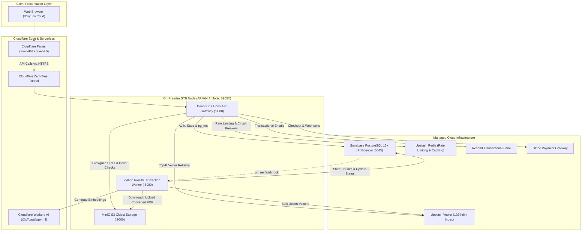
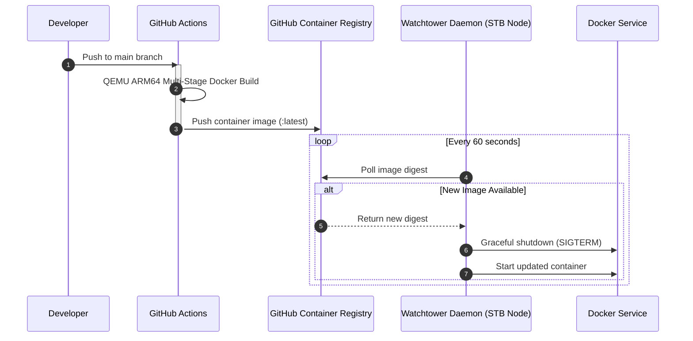

# Dokyudo

**Dokyudo** is an enterprise-grade, multi-tenant SaaS platform engineered for high-precision semantic document search and contextual Question and Answering (RAG). Built to handle dense technical documentation, academic papers, and financial reports, Dokyudo demonstrates a zero-cost, high-performance distributed architecture that pairs sovereign on-premise hardware with serverless edge infrastructure.

The platform is structured as a monorepo consisting of a SvelteKit client layer, a modular Deno API gateway, an on-premise Python extraction worker, and polyglot storage backends.

---

## Architecture Overview

Dokyudo operates on a hybrid cloud deployment topology. Computationally intensive document extraction and local storage run on self-hosted ARM64 hardware behind Cloudflare Zero Trust Tunnels, while web routing, vector search, relational state, and edge caching run across serverless providers.



---

## Monorepo Structure

```text
Dokyudo/
├── apps/
│   ├── backend/               # Deno 2.x + Hono modular monolith API gateway
│   │   ├── src/
│   │   │   ├── api/           # OpenAPI routing and endpoint aggregation
│   │   │   ├── config/        # Environment, Drizzle ORM, and Redis setup
│   │   │   ├── infra/         # Circuit breakers and external client adapters
│   │   │   ├── modules/       # Domain modules (auth, documents, rag, search, etc.)
│   │   │   └── shared/        # Middlewares, types, validation schemas, and utilities
│   │   ├── benchmark/         # Search and vectorization performance benchmarks
│   │   ├── drizzle/           # SQL migration files generated by Drizzle Kit
│   │   ├── deno.json          # Deno task runners and import maps
│   │   └── Dockerfile         # Multi-stage ARM64 Docker build configuration
│   │
│   ├── frontend/              # SvelteKit (Svelte 5 runes) web application
│   │   ├── src/
│   │   │   ├── lib/           # Components, stores, PDF viewer, and UI primitives
│   │   │   └── routes/        # App routing, auth flows, chat, document library, and shared links
│   │   ├── static/            # Static assets and fonts
│   │   ├── svelte.config.js   # SvelteKit configuration with Cloudflare adapter and CSP
│   │   └── package.json       # Frontend scripts and dependencies
│   │
│   └── stb-worker/            # Python 3.12 + FastAPI extraction and embedding worker
│       ├── api/               # Ingestion webhook and job cancellation endpoints
│       ├── core/              # Configuration, structured logging, and exceptions
│       ├── services/          # Multi-format extractors, chunkers, and embedding pipelines
│       ├── requirements.txt   # Python dependencies (PyMuPDF, python-docx, tiktoken, etc.)
│       └── Dockerfile         # ARM64 Docker build with headless LibreOffice Writer and Math
│
├── api-collections/           # Bruno API Client collection covering all endpoints
├── docs/                      # Architectural specifications and feature documentation
├── tests/                     # k6 performance scripts, smoke tests, and contract checks
└── LICENSE                    # Project license
```

---

## Key Capabilities

### 1. Two-Phase Staged Ingestion and Dual-File Storage
- **Direct-to-Object-Storage Uploads**: Files are selected and staged client-side. The API validates tenant quotas atomically and generates pre-signed S3 PUT URLs directly to the self-hosted MinIO storage node.
- **HeadObject Verification**: The client uploads directly to MinIO. Upon completion, the client triggers `POST /api/documents/confirm-upload`. The backend performs a LAN-level S3 `HeadObject` check to verify physical byte persistence before marking the document as `confirmed`.
- **Dual-File Lifecycle**: Non-PDF uploads (DOCX, TXT, Markdown) maintain their original raw files for download, while the worker automatically compiles a converted PDF counterpart for previewing inside `@embedpdf/svelte-pdf-viewer`.

### 2. Multi-Format Extraction Pipeline
The `stb-worker` processes documents using format-specific extraction engines:
- **PDF**: Page-by-page text extraction via PyMuPDF with `tiktoken` tokenization (`cl100k_base`, 1000 tokens per chunk, 150 token overlap). Page mappings are preserved inside chunk metadata.
- **DOCX**: Visual order extraction of paragraphs, tables, and floating text boxes via `python-docx`. Mathematical OMML markup is extracted and converted into standard LaTeX (`$...$` inline, `$$...$$` display). Headless LibreOffice converts the document to PDF for viewing, using `libreoffice-math` to render formulas. A rare n-gram alignment window (25-character windows appearing <=3 times) maps extracted DOCX chunks back to PDF page numbers.
- **TXT**: Encoding-chain reader (UTF-8-BOM -> UTF-16-BOM -> UTF-8 -> CP1252) with binary file rejection. Converted to PDF via LibreOffice.
- **Markdown**: Styled HTML+CSS rendering with tables and syntax highlighting, compiled to PDF. Embedding chunks are extracted from tag-stripped HTML to avoid markdown syntax noise.

### 3. Application-Layer Scatter-Gather RRF Search
- **Parallel Dispatch**: Search queries generate 1024-dimensional query embeddings via Cloudflare Workers AI (`@cf/baai/bge-m3`) with Redis circuit breaker protection. Queries are executed concurrently against Upstash Vector (semantic similarity) and Supabase PostgreSQL (Full-Text Search via `websearch_to_tsquery`).
- **Reciprocal Rank Fusion (RRF)**: Ranked lists from both sources are fused in-memory in the Deno runtime:
  $$\text{RRF Score}(d) = \sum_{m \in \{\text{Vector}, \text{FTS}\}} \frac{1}{60 + \text{Rank}_m(d)}$$
- **Lazy Hydration and Deduplication**: Chunks are hydrated from PostgreSQL in a single targeted query, grouped by `documentId`, and returned with aggregated page reference arrays.

### 4. RAG Lifecycle, Turn State Machine, and Variants
- **Write-Ahead State Machine**: Turns are inserted into `conversation_turns` prior to LLM dispatch with `status = 'processing'`. Terminal states include `complete`, `stopped`, `failed`, `blocked`, and `awaiting_indexing`.
- **Explicit Stop vs. Disconnect Continuation**:
  - Clicking the Stop button calls `POST /api/rag/turns/:id/stop`, halting LLM generation and persisting the partial answer as `status = 'stopped'`.
  - Client disconnection (navigating away or closing tab) transitions the turn to `status = 'awaiting_indexing'` as a safety state, while generation continues in-process via an isolated `AbortController`. Once complete, the full answer is recorded. An automatic `Deno.cron` sweep recovers turns if the serverless isolate suspends prematurely.
- **Retry Alternative Response Trees**: Re-generating an answer records new candidate responses into `turn_alternatives`. Users browse variants via `◀ N/M ▶` controls. Sending a follow-up prompt promotes the chosen variant to the canonical turn and purges alternatives.
- **Inline Document Mentions**: Typing `@` opens a document selector, embedding `@[title](doc_id)` tokens inline. The backend scopes retrieval strictly to mentioned documents while stripping mention syntax from model prompts.
- **Formula and Citation Contracts**: Responses render mathematical formulas via KaTeX and enforce strict citation formats (`[Doc N: Page X]`). Unreferenced context documents are automatically pruned prior to persistence.

### 5. Multi-Provider Fallback Routing and BYOK
- **Intelligent Fallback Pool**: Queries on the free tier route through three token-complexity tiers (`LIGHT_POOL`, `MEDIUM_POOL`, `HEAVY_POOL`) spanning Gemini, Groq, Mistral, SambaNova, and Cohere. Includes automatic circuit breaking, 15-second time-to-first-token timeouts, and `<think>` tag stripping.
- **Bring Your Own Key (BYOK)**: Users can supply API keys for Google AI, Mistral, or OpenRouter. Keys are encrypted at rest using AES-256-GCM via the Web Crypto API, decrypted only in ephemeral memory during request execution, and never leaked in logs.

### 6. Public and Private Conversation Sharing
- **Immutable Snapshot Architecture**: Generating a share link creates an immutable JSONB snapshot of conversation turns and attachment titles. Subsequent edits or turn deletions on the original conversation do not alter the shared link.
- **Access Control and Distribution**: Shares are generated with randomized Base62 codes or vanity aliases. Private shares require an unguessable 32-hex `access_token` and can be emailed directly to invitees via Resend.
- **Continue Chat**: Authenticated users viewing a shared conversation can clone the snapshot into their own active conversation workspace.
- **Server-Side Rendered Open Graph**: Dynamic SVG Open Graph previews are rendered for social crawlers via `/s/:code/opengraph-image.svg`.

### 7. Monetization and Lazy Quota Evaluation
- **Dual-Mode Stripe Billing**: Supports one-time payments (`SIMULATE`, `OIL_INVESTOR`) and recurring monthly subscriptions (`PRO`) via Stripe Checkout and the Stripe Customer Portal.
- **Lazy Downgrade Evaluation**: Rather than maintaining heavy background polling jobs, subscription expiration is evaluated lazily during profile requests (`GET /api/me`). Expired subscriptions are silently transitioned back to the `FREE` tier.
- **Usage Tracking**: Dedicated `/api/me/usage` endpoints provide isolated, atomic usage metrics (`uploadsCount`, `searchesCount`, `qaCount`, `storageUsedBytes`).

### 8. Security and Defense-in-Depth
- **Cross-Subdomain httpOnly Cookies**: Authenticated sessions rely on `dokyudo_access_token` (1 hour) and `dokyudo_refresh_token` (30 days) set with `HttpOnly`, `Secure`, and `SameSite=Lax` across `.dokyudo.my.id`. Features automatic per-request silent refresh, eliminating token exposure in `localStorage` or URL query strings.
- **Client Proof-of-Work (PoW)**: Production requests require an `X-Dokyudo-Puzzle` header solved via a client-side WebAssembly challenge to deter automated scrapers and bots. Solved tokens are stored in Redis with a 1-hour TTL to prevent replay attacks.
- **Redis Gatekeeper**: Sliding-window rate limiter enforcing 300 req/min for standard clients and 20 req/min for suspicious user agents. Failed attempts on `/api/auth/*` incur dynamic penalties, escalating to a strict 1 req/hour block.
- **Anti-Bruteforce Protection**: Google reCAPTCHA v3 verification paired with PostgreSQL account lockouts (5 failed attempts within 15 minutes trigger a 15-minute lock).
- **PgBouncer Compatibility**: The backend Drizzle driver (`postgres.js`) explicitly disables prepared statements (`prepare: false`), preventing silent rollbacks under high concurrency in PgBouncer Transaction Mode.

---

## Technology Stack

| Layer | Technologies |
|---|---|
| **Frontend Application** | SvelteKit, Svelte 5 (Runes), TypeScript, Vite, Tailwind CSS v4, shadcn-svelte, bits-ui, Paneforge |
| **Document Viewing & Math** | `@embedpdf/svelte-pdf-viewer` (PDFium WASM), KaTeX, marked |
| **Backend API Gateway** | Deno 2.x, TypeScript, Hono, `@hono/zod-openapi`, `@scalar/hono-api-reference`, Drizzle ORM |
| **Document Processing Worker** | Python 3.12, FastAPI, Uvicorn, LibreOffice Headless (`libreoffice-writer`, `libreoffice-math`), PyMuPDF, python-docx, python-markdown, tiktoken |
| **Databases & Stores** | Supabase PostgreSQL 15+ (with PgBouncer transaction mode), Upstash Vector (1024-dim), Upstash Redis |
| **Storage & Networking** | Self-Hosted MinIO (ARM64 S3), Cloudflare Pages, Cloudflare Zero Trust Tunnels (`cloudflared`) |
| **AI & Inference** | Cloudflare Workers AI (`@cf/baai/bge-m3`), Google Gemini API, Groq, Mistral AI, SambaNova, Cohere |
| **Third-Party Services** | Resend (Transactional Email), Stripe (Checkout & Billing Portal), Google reCAPTCHA v3 |
| **DevOps & Containers** | Docker, Docker Buildx (QEMU ARM64 cross-compilation), GitHub Actions, Watchtower |

---

## Prerequisites

Before setting up the project locally, ensure you have the following installed:

- **Deno**: Version 2.0 or higher
- **Node.js**: Version 20.x or higher, with `npm`
- **Python**: Version 3.11 or 3.12
- **LibreOffice**: Required for DOCX/TXT/MD conversion (`libreoffice-writer` and `libreoffice-math`)
- **Docker**: For containerized deployment or running MinIO locally
- **dotenvx**: For environment variable injection (`npm install -g @dotenvx/dotenvx`)

---

## Getting Started

### 1. Repository Setup

Clone the repository and inspect the workspace:

```bash
git clone https://github.com/kanzhamada/Dokyudo.git
cd Dokyudo
```

---

### 2. Backend Setup (`apps/backend`)

1. Navigate to the backend directory:
   ```bash
   cd apps/backend
   ```

2. Create and configure your environment file:
   ```bash
   cp .env.example .env
   ```
   Fill in the necessary values:
   - `DATABASE_URL`: Supabase connection string (transaction pooler port 6543 recommended).
   - `SUPABASE_URL`, `SUPABASE_SERVICE_ROLE_KEY`, `SUPABASE_ANON_KEY`: Supabase credentials.
   - `UPSTASH_REDIS_REST_URL`, `UPSTASH_REDIS_REST_TOKEN`: Upstash Redis instance.
   - `UPSTASH_VECTOR_REST_URL`, `UPSTASH_VECTOR_REST_TOKEN`: Upstash Vector index.
   - `S3_ENDPOINT`, `S3_ACCESS_KEY`, `S3_SECRET_KEY`, `S3_BUCKET_NAME`: MinIO / S3 credentials.
   - `GOOGLE_API_KEY`: Primary Google AI API key.
   - `STRIPE_SECRET_KEY`, `STRIPE_WEBHOOK_SECRET`: Stripe API configuration.
   - `RESEND_API_KEY`: Resend email delivery key.

3. Run database migrations:
   ```bash
   npx drizzle-kit migrate
   ```

4. Start the backend development server:
   ```bash
   deno task dev
   ```
   The backend server boots on `http://localhost:8000`. You can access:
   - Health check: `http://localhost:8000/health`
   - OpenAPI Specification: `http://localhost:8000/doc`
   - Interactive Scalar API Reference: `http://localhost:8000/reference`

---

### 3. STB Worker Setup (`apps/stb-worker`)

1. Navigate to the worker directory:
   ```bash
   cd apps/stb-worker
   ```

2. Configure environment variables:
   ```bash
   cp .env.example .env
   ```

3. Set up a Python virtual environment and install dependencies:
   ```bash
   python3 -m venv .venv
   source .venv/bin/activate
   pip install -r requirements.txt
   ```

4. Ensure LibreOffice headless tools are available:
   ```bash
   # Debian / Ubuntu / Armbian
   sudo apt-get update && sudo apt-get install -y libreoffice-writer libreoffice-math fonts-liberation
   ```

5. Start the worker:
   ```bash
   python3 main.py
   ```
   The extraction service listens on `http://localhost:8080`. Verify status via `http://localhost:8080/api/health`.

---

### 4. Frontend Setup (`apps/frontend`)

1. Navigate to the frontend directory:
   ```bash
   cd apps/frontend
   ```

2. Configure environment variables:
   ```bash
   cp .env.example .env
   ```
   Set `PUBLIC_API_URL` to point to your backend (e.g., `http://localhost:8000`) and set `PUBLIC_RECAPTCHA_SITE_KEY`.

3. Install npm dependencies:
   ```bash
   npm install
   ```

4. Launch the Vite development server:
   ```bash
   npm run dev
   ```
   Open `http://localhost:5173` in your browser.

---

## API Documentation and Testing

### Interactive API Explorer
When running `apps/backend`, an interactive Scalar API documentation UI is accessible at:
- `http://localhost:8000/reference` (Local)
- `https://api.dokyudo.my.id/reference` (Production)

Raw OpenAPI 3.1.0 specifications can be viewed at `/doc`.

### Bruno API Collection
Dokyudo includes an extensive, pre-configured [Bruno](https://www.usebruno.com/) collection inside the `api-collections/` directory.

To use the collection:
1. Open Bruno and select **Open Collection**.
2. Select the `api-collections` directory.
3. Choose the appropriate environment (`Local` or `Production`) from the environments dropdown.
4. Execute authenticated requests across all system endpoints (Auth, Documents, RAG, Search, Payments, Activities, etc.).

---

## Continuous Integration & Deployment

The platform implements an automated GitOps deployment pipeline for on-premise hardware:



- **Backend CI/CD (`.github/workflows/deploy-backend.yml`)**: Triggered on changes to `apps/backend/**`. Compiles an ARM64 image with pre-cached `$DENO_DIR` layers and publishes to `ghcr.io/kanzhamada/dokyudo-backend:latest`.
- **Worker CI/CD (`.github/workflows/deploy-stb-worker.yml`)**: Triggered on changes to `apps/stb-worker/**`. Multi-stage Python build compiling dependencies and bundling LibreOffice Writer/Math into `ghcr.io/kanzhamada/dokyudo-stb-worker:latest`.
- **Edge Deployment**: An automated Watchtower agent running on the ARM64 STB polls GHCR every 60 seconds, performing zero-downtime rolling container updates. Public ingress is established using outbound-only Cloudflare Zero Trust Tunnels.
- **Frontend Deployment**: Deployed natively to Cloudflare Pages via `@sveltejs/adapter-cloudflare`.

---

## Testing & Quality Assurance

Dokyudo maintains strict test coverage across modules:

- **Backend Unit & Route Tests**:
  ```bash
  cd apps/backend
  deno task test
  ```
- **Type Checking & Linting**:
  ```bash
  cd apps/frontend
  npm run check
  npm run lint
  ```
- **Performance Benchmarks**:
  ```bash
  cd apps/backend
  deno task benchmark
  ```
- **k6 Load Testing**:
  ```bash
  k6 run tests/k6/load_test_supabase.js
  ```

---

## Security Policy

- **Vulnerability Reporting**: If you discover a security vulnerability in Dokyudo, please refrain from opening public issues. Submit reports directly to `security@dokyudo.my.id`.
- **Data Isolation**: All database operations must enforce tenant context isolation (`tenant_id`). Direct relational access from client applications is strictly prevented.
- **Secret Encryption**: All sensitive user credentials (such as BYOK API tokens) are secured using AES-256-GCM authenticated encryption.

---

## License

This project is licensed under the terms defined in the [LICENSE](LICENSE) file.
