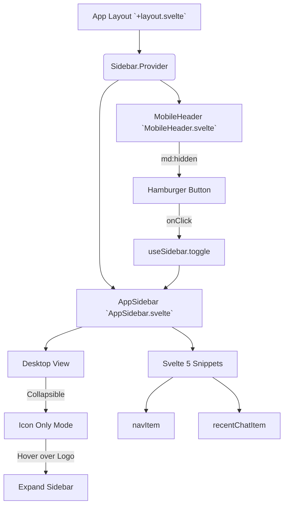

# App Sidebar UI Architecture

## Core Logic
The App Sidebar feature provides the primary navigation structure for the Dokyudo application. It features a responsive, collapsible sidebar built with Svelte 5 and shadcn-svelte. The sidebar intelligently switches to a hidden state on mobile devices, relying on a dedicated `MobileHeader` with a hamburger menu to trigger its visibility. It includes interactive elements like truncated tooltips for long chat titles, icon-only collapsible modes, and hover-triggered dropdown actions.

## Flow Diagram

## Completion Timestamp
**Completed At:** 2026-06-21T21:25:35+07:00

## File Mapping
* **`apps/frontend/src/routes/app/+layout.svelte`**
  * Serves as the main layout wrapper, rendering the `Sidebar.Provider`, the `AppSidebar`, and the new `MobileHeader`.
* **`apps/frontend/src/lib/components/app/AppSidebar.svelte`**
  * The core navigation component. Extensively refactored to use Svelte 5 snippets (`#snippet navItem`, `#snippet recentChatItem`) for DRY architecture. Uses Tailwind classes mapped to central CSS variables.
* **`apps/frontend/src/lib/components/app/MobileHeader.svelte`**
  * [NEW] A mobile-exclusive (`md:hidden`) top navigation bar that contains a hamburger menu (triggering `sidebar.toggle()`) and the Dokyudo logo.
* **`apps/frontend/src/routes/layout.css`**
  * Modified to include global design tokens for the sidebar: `--sidebar-muted`, `--sidebar-muted-foreground`, and `--sidebar-avatar`, ensuring cohesive theming.

## Connections
This feature is entirely isolated to the SvelteKit **Frontend Layer**. It acts as the presentation shell for the application routes. Currently, the data (e.g., `recentChats`, `navItems`) is mocked locally within the component, but it is architected to eventually accept state from a backend store or SvelteKit `load()` function.

## Architectural Decisions
1. **Svelte 5 Snippets (`#snippet`)**: To resolve repetition in rendering navigation links and recent chats, Svelte 5 snippets were used instead of creating multiple small file components. This keeps the logic co-located while maintaining a clean, readable main HTML template.
2. **Tailwind v4 Design Tokens**: Arbitrary hex colors (e.g., `#1C1B1B`, `#C5937B`) were completely stripped from the markup. They were promoted to `--sidebar-*` custom CSS properties in `layout.css` and mapped via `@theme inline`. This enforces design consistency and allows for seamless dark/light mode scaling.
3. **Responsive Strategy**: Instead of forcing the `Sidebar.Trigger` into the main content slot, a dedicated `MobileHeader` component was created. This allows the mobile navbar to maintain a distinct layout (hamburger on left, logo on right) without cluttering desktop UI components.
4. **Strict Type-Safety**: The Svelte snippets were explicitly typed (e.g., `item: typeof navItems[0]`) to ensure the strict `svelte-check` compiler passed without implicit `any` errors.
