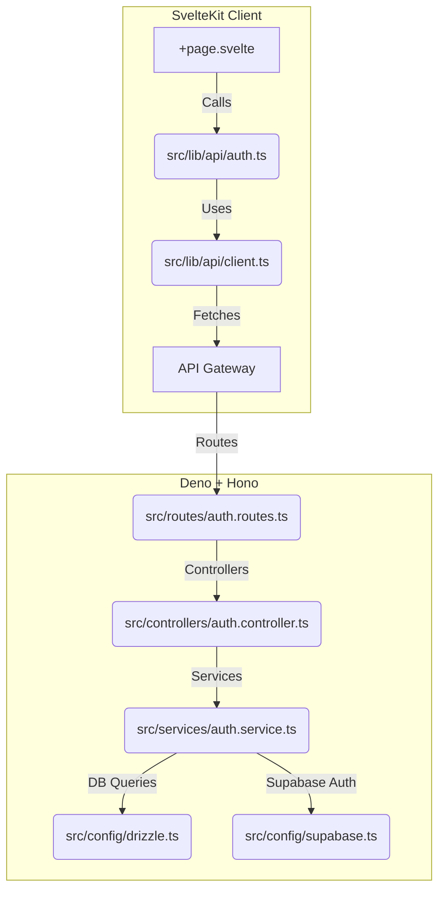

# Architecture Refactoring & Setup

## Overview

This document captures the structural refactoring done to enforce Clean Architecture in the backend and modularity in the frontend, along with the setup of Drizzle ORM and Supabase clients.

## Flow Diagram

## Completion Timestamp
**Date**: 2026-06-16T23:15:00+07:00

## Key Changes & File Mapping

### Backend (Deno)
1. **Clean Architecture Enforcement**:
   - Split `main.ts` into layered structures: `routes/`, `controllers/`, `services/`, `middlewares/`.
   - Extracted shared logic to `utils/`.
   - Defined Hono environment types in `config/hono.ts`.

2. **Database configuration**:
   - `models/db.ts` renamed and moved to `config/supabase.ts`.
   - **[NEW]** `src/models/schema.ts`: Drizzle ORM schema defining `tenants`, `users`, and `login_attempts` with `inet` types and composite indexes for brute-force protection.
   - **[NEW]** `src/config/drizzle.ts`: Configures `drizzle-orm` and exposes 3 wrappers: `db` (superuser), `withAnonDb`, and `withAuthDb` (RLS injected).
   - **[NEW]** `drizzle.config.ts`: Added for migration handling via `drizzle-kit`.
   - `services/auth.service.ts` updated to strictly use `db.insert` via Drizzle for tracking login attempts, replacing the Supabase client wrapper.

### Frontend (SvelteKit)
1. **API Client Modularization**:
   - Broken down `api.ts` into a base `client.ts` (`src/lib/api/client.ts`) and specific module `auth.ts` (`src/lib/api/auth.ts`).
   - `client.ts` implements a flexible wrapper `apiRequest` supporting dynamic methods and custom headers.

2. **Types & Utils Extraction**:
   - `src/lib/types/api.types.ts`: Standard error envelope.
   - `src/lib/types/auth.types.ts`: Auth response models.
   - `src/lib/types/recaptcha.types.ts`: Global Window interfaces.
   - `src/lib/utils/recaptcha.util.ts`: Extracted logic for loading and executing reCAPTCHA scripts.

## Architectural Decisions

- **Drizzle for RLS**: RLS is strictly enforced at the Postgres level. We implemented `withAuthDb` which runs a `set local role authenticated; select set_config('request.jwt.claims', ...);` in a database transaction wrapper before performing any Drizzle queries.
- **Base API Client (Frontend)**: Extracted `apiRequest` into its own file (`client.ts`) to serve as a unified entry point for all frontend fetch requests. This ensures standard error handling conforming to `ApiResult` and provides an easy injection point for future logic like Auth bearer tokens.
