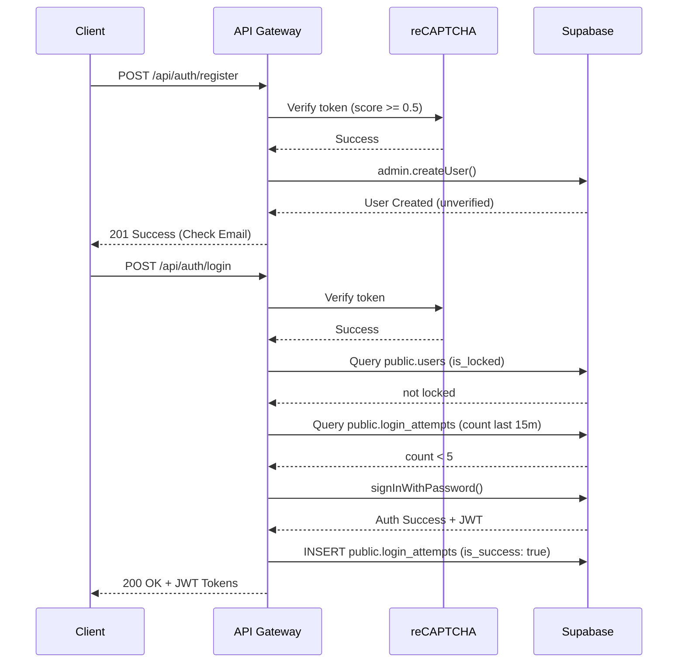

# Auth API & Anti-Bruteforce

**Completion Timestamp**: 2026-06-16T02:25:00Z

## Core Logic
This feature provides secure registration and login endpoints for Dokyudo. It implements Google reCAPTCHA v3 on the backend for bot prevention, and a strict database-level rate limiting and lockout mechanism to prevent credential stuffing and bruteforce attacks.

## Flow Diagram

## File Mapping
- `apps/backend/main.ts`: App boot, env validation, OpenAPI config.
- `apps/backend/src/auth/auth.routes.ts`: Core handlers for register and login.
- `apps/backend/src/auth/auth.schemas.ts`: Zod schema definitions (`@hono/zod-openapi`).
- `apps/backend/src/recaptcha.ts`: Google reCAPTCHA v3 verification logic.
- `apps/backend/src/supabase.ts`: Supabase admin and auth clients.
- `apps/backend/src/errors.ts`: Standard `AppError` envelope.
- `apps/backend/src/middleware.ts`: Request ID and IP extraction.
- `apps/backend/src/types.ts`: Hono context types and app factory.

## Connections
- **Frontend/Client**: Calls endpoints with `recaptchaToken` obtained via `grecaptcha.execute`.
- **Database**: 
  - Direct queries to `public.users` using Service Role to check/set lockouts.
  - Inserts/Queries on `public.login_attempts` to track attempts and rate limit.
  - Registration relies on a DB trigger to populate `public.users` after email confirmation.

## Architectural Decisions
- **reCAPTCHA v3**: Chosen to prevent bots without interrupting the user UX. Score threshold set to `0.5`. Token verified before database hits to save resources.
- **Service Role Key usage**: The API needs to check `public.users.is_locked` before the user is authenticated, so it uses the Supabase Admin client to bypass RLS.
- **Lockout Mechanism**: Standard rate limiting isn't enough; we need to lock the account itself to prevent distributed bruteforce. If 5 failed attempts occur from the same IP/Email within 15 minutes, the account locks for 15 minutes.
- **AppError Envelope**: Adheres strictly to the PRD error standard, hooked directly into Zod validations using `defaultHook`.
