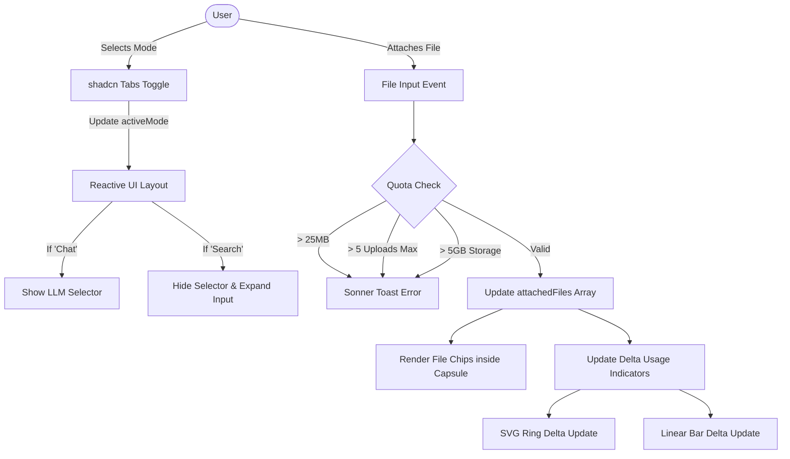

# Chat Assistant Interface (`/app/chat`)

## Core Logic
The `/app/chat` route houses the core chat and semantic search interface for the Dokyudo platform. It provides a highly responsive, glassmorphic UI where users can toggle between conversing with language models ("Chat" mode) and searching their knowledge base ("Search" mode). 

Key features implemented include:
- **Glassmorphic Aesthetics**: Frosted glass capsules (`backdrop-blur-[42px]`) with transparent borders and subtle white opacities.
- **Dynamic File Attachment**: Users can attach documents (PDF, TXT, DOCX), which render as dynamic, removable chips inside the capsule.
- **Strict Client-Side Quota Enforcement**: Real-time validation preventing users from exceeding the 5-file upload limit, 5GB storage limit, and the 25MB per-file size limit via `svelte-sonner` toast error messages.
- **Layered Delta Usage Trackers**: Visual progress indicators (circular SVGs on desktop, linear bars on mobile) that use a 3-layer approach (Background, Amber Delta, White Base) to instantly preview how much storage/quota the currently attached files will consume before sending.
- **Container-Query Responsiveness**: Replaced standard viewport breakpoints (`md:`) with native Tailwind v4 Container Queries (`@container`, `@3xl`), allowing the massive Desktop Usage Capsule to flawlessly downgrade to a sleek mobile dropdown strictly based on the container's available width—elegantly handling dynamic space stealing from the collapsible `AppSidebar`.
- **Mode Toggle & Reactivity**: The entire bottom control row utilizes a heavily customized `shadcn-svelte` Tabs component mapped directly to `activeMode`. Selecting "Search" automatically hides unnecessary components (like the LLM model selector) to maximize input real estate.

## Flow Diagram

## Completion Timestamp
**Date Completed**: 2026-06-21T20:27:00+07:00

## File Mapping
- **`apps/frontend/src/routes/app/chat/+page.svelte`**: The monolithic view housing the Chat Interface container, glassmorphic capsule, dynamic usage indicators, Svelte 5 `$derived` state, and Svelte-Sonner integration.
- **`apps/frontend/src/lib/components/ui/tabs/*`**: Added `shadcn-svelte` Tabs component.
- **`apps/frontend/src/lib/components/ui/sonner/*`**: Added `shadcn-svelte` Sonner toast component.

## Connections
- **Sidebar Integration**: The UI responds intrinsically to the `AppSidebar` width via `@container`. No direct prop drilling of sidebar state is needed.
- **Backend Coupling (Future)**: The state variables (`baseUploads`, `baseStorageBytes`, `maxUploads`, `maxStorage`) are currently hardcoded mock data, but they are deliberately isolated inside `$derived` reactivity blocks so they can seamlessly bind to real API data coming from the user's `@hono/zod-openapi` session context.

## Architectural Decisions
1. **SVG Layering vs. JS Math**: Instead of calculating the exact pixel gap for the amber progress bar, we stacked three separate SVG tracks (or HTML div bars for mobile) via Z-index. The white "base usage" ring is painted on top of the amber "total usage" ring. Because the amber ring is strictly larger, the delta logically sticks out—creating a brilliant visual effect without complex math.
2. **Container Queries over Sidebar State**: Relying on the `AppSidebar`'s `useSidebar().state` to manually toggle CSS classes is brittle. By wrapping the chat bottom row in `@container`, the layout relies purely on the browser's rendering engine to detect if the desktop capsule will fit (`@3xl`), allowing flawless scaling on any device or sidebar state.
3. **Data Attributes for Tabs**: Rather than fighting the default shadcn-svelte classes, the `Tabs.Trigger` components use `data-[state=active]` and `data-[state=inactive]` to precisely inject the complex glassmorphic Tailwind classes.
