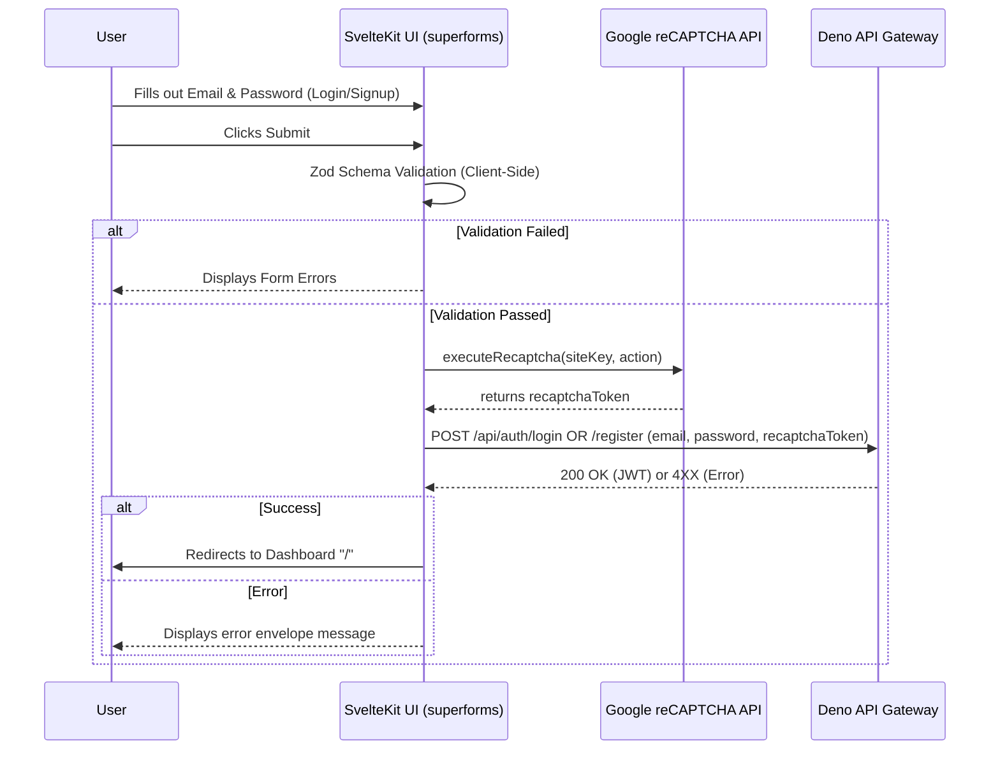

# Frontend Auth UI

## Core Logic
The frontend authentication system handles user sign-in and registration using SvelteKit, `superforms`, and Zod v4 validation. It implements a premium visual aesthetic matching the design specs (vintage floral background, translucent overlays, bespoke fonts) and integrates Google reCAPTCHA v3 on the client side before delegating form submission to the Deno API Gateway.

## Flow Diagram

## Completion Timestamp
**Date**: June 16, 2026, 18:10:00 UTC+7

## File Mapping

**New Files:**
- `apps/frontend/src/routes/(auth)/+layout.svelte` - Shared structural layout for auth routes with styling.
- `apps/frontend/src/routes/(auth)/login/+page.svelte` - Sign-in component.
- `apps/frontend/src/routes/(auth)/login/+page.ts` - Login `superforms` initialization.
- `apps/frontend/src/routes/(auth)/signup/+page.svelte` - Sign-up component.
- `apps/frontend/src/routes/(auth)/signup/+page.ts` - Signup `superforms` initialization.
- `apps/frontend/src/lib/schemas/auth.ts` - Zod validation schemas for forms.
- `apps/frontend/src/lib/recaptcha.ts` - Client-side reCAPTCHA wrapper.
- `apps/frontend/src/lib/api.ts` - Unified API Gateway client utility.

**Modified Files:**
- `apps/frontend/src/routes/layout.css` - Injected custom font stacks (Playfair Display) and Tailwind color tokens (`#E8DEC8`, `#1C1B1B`).

## Connections
- **Backend API Gateway**: The frontend communicates via `fetch` inside `apps/frontend/src/lib/api.ts` directly targeting the `PUBLIC_API_URL` specified in `.env`.
- **Google API**: Uses `https://www.google.com/recaptcha/api.js` to execute reCAPTCHA silently.

## Architectural Decisions
- **`sveltekit-superforms` & Zod v4**: Chosen for robust state management. Note that `zod4` adapters are explicitly imported from `sveltekit-superforms/adapters` because Zod v4 is used in this repository.
- **Client-Side SPA Forms**: The forms use `SPA: true` and a custom `onUpdate` handler instead of standard SvelteKit actions. This is to cleanly integrate client-side reCAPTCHA execution *before* hitting the API backend, as standard actions would require a round-trip to the SvelteKit `+page.server.ts` before pinging Deno.
- **`shadcn-svelte`**: Handled via `npx shadcn-svelte@latest`. Svelte 5 `#snippet child({ props })` overrides are used inside component wrappers like `Tooltip.Trigger`.
- **Aesthetics**: Avoided standard generic borders; utilized shadow drops and exact hex codes to match high-end visual design rules.
