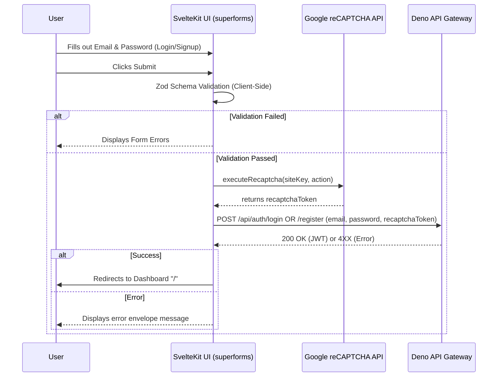

# Frontend Auth UI

## Core Logic
The frontend authentication system handles user sign-in and registration using SvelteKit, `superforms`, and Zod v4 validation. It implements a premium visual aesthetic matching the design specs (vintage floral background, translucent overlays, bespoke fonts) and integrates Google reCAPTCHA v3 on the client side before delegating form submission to the Deno API Gateway.

Recently refactored to fully comply with Svelte 5 runes (`$state`, `$props`), Tailwind CSS v4 `@theme inline` variables, and strictly enforced `shadcn-svelte` variant encapsulation for cleaner CSS structure.

## Flow Diagram

## Completion Timestamp
**Date**: June 18, 2026, 22:55:00 UTC+7

## File Mapping

**Core UI Files:**
- `apps/frontend/src/routes/(auth)/+layout.svelte` - Shared structural layout for auth routes with styling.
- `apps/frontend/src/routes/(auth)/login/+page.svelte` - Sign-in component.
- `apps/frontend/src/routes/(auth)/register/+page.svelte` - Sign-up component.
- `apps/frontend/src/routes/layout.css` - Injected custom font stacks (Playfair Display) and Tailwind v4 OKLCH color variables (`--color-auth-*`). Retains generic layout/spacing utilities (`.auth-error-box`).

**Component Variants (Shadcn-Svelte):**
- `apps/frontend/src/lib/components/ui/button/button.svelte` - Added `authPrimary` and `authOauth` variants.
- `apps/frontend/src/lib/components/ui/input/input.svelte` - Migrated to `tailwind-variants` (tv) and added `auth` variant.

**Logic & Utilities:**
- `apps/frontend/src/lib/schemas/auth.schema.ts` - Zod validation schemas for forms.
- `apps/frontend/src/lib/utils/recaptcha.util.ts` - Client-side reCAPTCHA wrapper.
- `apps/frontend/src/lib/types/api.types.ts` - Shared types for API communication.

## Connections
- **Backend API Gateway**: The frontend communicates via `fetch` directly targeting the backend API routes.
- **Google API**: Uses `https://www.google.com/recaptcha/api.js` to execute reCAPTCHA silently.

## Architectural Decisions
- **`sveltekit-superforms` & Zod v4**: Chosen for robust state management. Note that `superForm(data.form)` is used without closures to preserve `sveltekit-superforms` TypeScript static types, intentionally bypassing a minor Svelte 5 AST warning for stability.
- **Client-Side SPA Forms**: The forms use `SPA: true` and a custom `onUpdate` handler to cleanly integrate client-side reCAPTCHA execution *before* hitting the API backend.
- **Tailwind CSS v4 Engine**: Hardcoded hex values inside `@apply` were problematic due to the strict JIT compilation in CSS files. The architecture was refactored to define semantic `--color-auth-*` variables mapped to precise `oklch()` formats within the `@theme inline` block to guarantee native CSS compilation and support for automatic opacity modifiers (e.g. `/40`).
- **Shadcn-Svelte Variant Encapsulation**: Component stylings (colors, borders, shadows) are safely encapsulated inside their respective `shadcn-svelte` files via `tailwind-variants` (`tv`), leaving `layout.css` to solely handle layout dimensions, typography, and utility structures. This perfectly honors separation of concerns.
