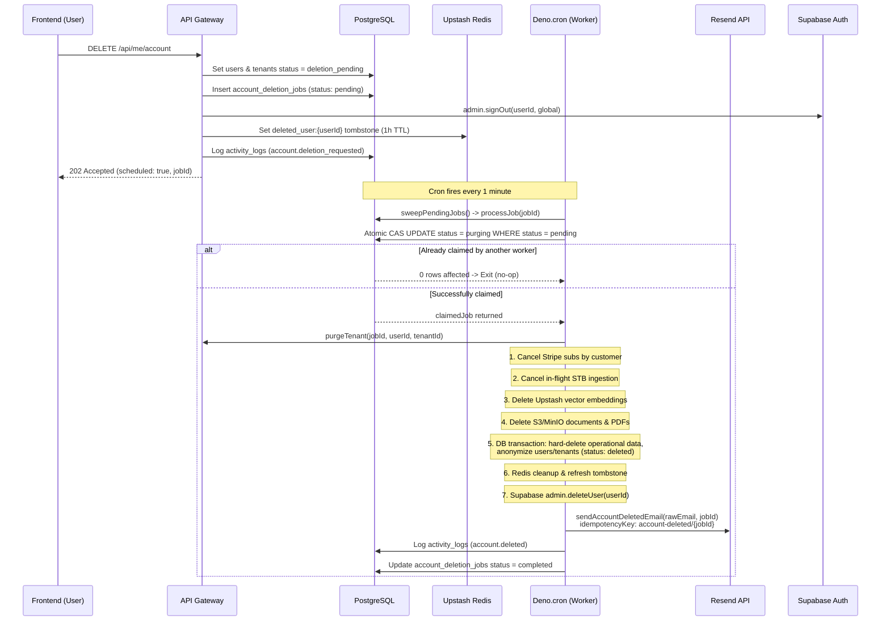

# Account Deletion (Async Purge) Documentation

**Completion Timestamp**: 2026-08-28T14:12:00+07:00 (WIB)

## Core Logic

The account deletion feature lets an authenticated user permanently delete their account. It uses a **soft-delete identity + hard-delete data + async purge** architecture:

1. **Request (`DELETE /api/me/account`)** — validates the session via `authMiddleware`, then atomically: marks `users` + `tenants` as `deletion_pending`, inserts an `account_deletion_jobs` row (`pending`), revokes all sessions (Supabase global sign-out), and writes a Redis tombstone `deleted_user:{userId}` (1h TTL) to immediately block subsequent auth middleware checks. Returns `202 Accepted` and enqueues nothing else — the sweep cron picks the job up.
2. **Async purge (`processJob`)** — a `Deno.cron("sweep-account-deletions")` runs every minute and calls `sweepPendingJobs`. Each job is atomically claimed using an optimistic Compare-And-Swap (CAS) state update, executes `purgeTenant` in stages, transitions to `purging` → `completed`, dispatches a confirmation email via Resend, and logs a single audit entry. External calls (Stripe, STB worker, S3, Supabase) are best-effort; the **DB purge is the authoritative, transactional final step**.
3. **Re-registration** — logging in / verifying email / OAuth with the same email afterwards creates a **brand-new** auth user, public user, and tenant (via `provisionTenantForUser`). The old tenant is never reused, so historical billing (`payment_transactions`, `tenant_subscriptions`) and `activity_logs` remain intact and isolated from the new account.

## Flow Diagram

## Purge Stages (`purgeTenant`)

1. **Stripe cleanup** — cancel the stored `stripeSubscriptionId`, then sweep ALL active/trialing/past_due/unpaid subscriptions for the tenant's `stripeCustomerId`. The customer sweep closes the checkout-vs-delete race: a subscription created by a checkout completed *after* the deletion request never has its ID stored (provisioning is skipped for non-active tenants), yet is still canceled. Payment *history* is retained.
2. **STB worker cancel** — fire-and-forget cancel of any in-flight ingestion for the tenant.
3. **Upstash Vector cleanup** — delete all tenant embeddings (partition keyed by tenant).
4. **MinIO / S3** — delete original + converted PDFs for the tenant.
5. **DB purge (authoritative)** — hard-delete documents, document_chunks, conversations, turns, alternatives, shares + share invitees, tenant_keys, outbox_events, login_attempts; anonymize user email → `deleted:{userId}` and tenant name → `Deleted Account`.
6. **Redis cleanup** — remove tenant caches/gatekeeper keys and the tombstone.
7. **Supabase admin.deleteUser** — delete the auth user (identity). If this fails, the DB state remains the source of truth; the job retries.
8. **Confirmation Email (`sendAccountDeletedEmail`)** — sends a confirmation email to the user's pre-anonymized email address via Resend, including the Deletion Reference ID (`jobId`) and an idempotency key (`account-deleted/${jobId}`).
9. **Audit Completion** — writes an authoritative `account.deleted` entry into `activity_logs`.

Retained data: `payment_transactions` (contains pseudonymized `user_email_hash` for promo/SIMULATE abuse rate-limiting across account lifecycles), `tenant_subscriptions`, `activity_logs` (billing/audit trail). `users.deleted_at` is set; `idx_users_active_email` (partial unique index `WHERE deleted_at IS NULL`) lets the same email be re-registered immediately.

## Deletion State Machine

`users.deletion_status` / `tenants.deletion_status`: `active` → `deletion_pending` → `deleted`. Jobs: `pending` → `purging` → `completed` (or `failed` with `lastError` + `attemptCount`, max 20 attempts, then terminal).

## Guards & Consistency

- `authMiddleware`: rejects any request for a tombstoned user (Redis) or any user whose `deletionStatus != 'active'` (DB fallback) — a deletion-pending account can no longer call APIs.
- Login & OAuth: after Supabase auth success, `isUserActive` is checked; a deleted account gets a revoked session + `403` ("This account has been deleted. Please register a new account.").
- Payments: checkout refuses non-active tenants; the Stripe webhook still records the payment as `SUCCEEDED` for the immutable ledger but skips provisioning, and now writes a billing trail (`webhookPayload.provisionSkipped` + `stripeSubscriptionId`) for reconciliation.
- **Concurrency & CAS Locking**: `processJob` uses an atomic `UPDATE account_deletion_jobs SET status = 'purging' WHERE id = jobId AND (status = 'pending' OR (status = 'purging' AND updated_at < NOW() - 5m)) RETURNING *`. If multiple cron runners or Deno worker nodes fire simultaneously, exactly one worker claims the job while all others exit cleanly without duplicating work or audit logs.

## File Mapping

- `apps/backend/src/modules/me/me.service.ts`: `requestAccountDeletion`, `processJob` (with CAS claim), `purgeTenant`, `sweepPendingJobs`, `isUserActive` (lives alongside `getProfile` / `getUsage` in `MeService`).
- `apps/backend/src/modules/me/me.routes.ts` / `me.controller.ts` / `me.schema.ts`: `DELETE /api/me/account`.
- `apps/backend/src/shared/utils/email.util.ts`: `sendAccountDeletedEmail` with Resend idempotency key.
- `apps/backend/src/shared/utils/email.util.test.ts`: Unit tests for `sendAccountDeletedEmail`.
- `apps/backend/src/modules/me/me.account-deletion.test.ts`: Comprehensive purge lifecycle, concurrency, and re-registration tests.
- `apps/backend/src/modules/auth/auth.service.ts`: login guard, `email_not_confirmed` → clear 400, registration resend-verification path.
- `apps/backend/src/modules/auth/oauth/oauth.service.ts`: OAuth callback guard + fallback provisioning.
- `apps/backend/src/modules/auth/user_provision.util.ts`: `provisionTenantForUser`.
- `apps/backend/src/shared/middlewares/auth.middleware.ts`: tombstone + active-status filter.
- `apps/backend/src/modules/payments/payments.service.ts`: checkout/webhook non-active-tenant guards + billing trail.
- `apps/backend/src/main.ts`: cron registration.
- `apps/backend/src/shared/models/db.model.ts`: `deletion_status` enums, `account_deletion_jobs`, partial unique email index.
- `apps/backend/drizzle/migrations/0029_account_deletion.sql`: migration (enums, columns, dropped `users.id`→`auth.users` FK, index, jobs table).

## Architectural Decisions

1. **Soft identity + hard data**: identity must be relocatable to a new clean tenant on re-registration, but operational data is genuinely destroyed for privacy/right-to-be-forgotten. The FK from `users.id` to `auth.users` was dropped so Supabase user deletion doesn't cascade into the billing ledger.
2. **Partial unique email index** instead of a global one: `deleted:{userId}`-anonymized rows no longer block re-registration of the same email.
3. **DB is the last word**: every external delete is best-effort and idempotent; only when the DB purge commits is the job `completed`. This keeps a crash mid-purge retryable without duplicating side effects.
4. **Optimistic CAS Job Claiming**: Prevents concurrent duplicate purges across multiple server nodes/cron ticks without requiring complex external distributed lock managers.
5. **Cron sweep over inline execution**: the request returns 202 immediately (UX + Stripe webhook timeouts); the 1-minute sweep adds a bounded delay in exchange for crash-safe retries.
6. **Checkout-vs-delete race**: the webhook skips provisioning for non-active tenants but records the billing reference; purge cancels **by customer**, catching subscriptions whose IDs were never stored.
7. **Idempotent Deletion Confirmation Email**: Dispatched with `idempotencyKey: account-deleted/${jobId}` to guarantee a single notification delivery even if a retry occurs.

## Connections

- **Frontend**: `apps/frontend/src/lib/api/auth.ts` (`authDeleteAccount`), `apps/frontend/src/lib/components/app/AccountPanelDialog.svelte` (danger zone requiring typed "delete" confirmation → `sessionStore.clear()` + redirect to `/login`).
- **Database**: `users`, `tenants`, `account_deletion_jobs`, `tenant_subscriptions`, `payment_transactions`, `activity_logs` (actions `account.deletion_requested` / `account.deleted`), `outbox_events`.
- **External**: Stripe (cancel subscriptions by customer), STB worker (cancel ingestion), Upstash Vector (delete embeddings), Upstash Redis (tombstone + cache cleanup), MinIO/S3 (delete files), Supabase (revoke sessions, admin.deleteUser), Resend (confirmation email).