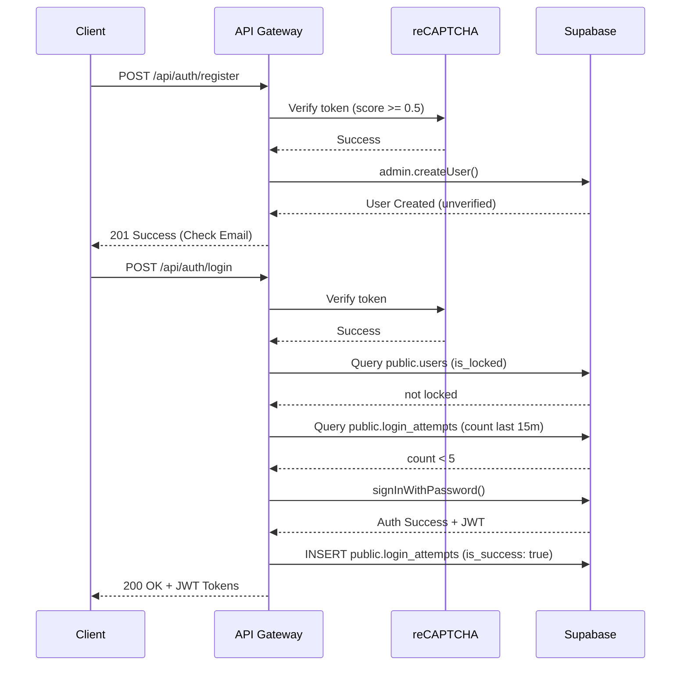

# Auth API & Anti-Bruteforce

**Completion Timestamp**: 2026-06-16T02:25:00Z

## Core Logic
This feature provides secure registration and login endpoints for Dokyudo. It implements Google reCAPTCHA v3 on the backend for bot prevention, and a strict database-level rate limiting and lockout mechanism to prevent credential stuffing and bruteforce attacks.

## Flow Diagram

## File Mapping
- `apps/backend/src/main.ts`: App boot, env validation, OpenAPI config.
- `apps/backend/src/modules/auth/auth.routes.ts`: Core route definitions.
- `apps/backend/src/modules/auth/auth.controller.ts`: Core handlers for register and login.
- `apps/backend/src/modules/auth/auth.service.ts`: Business logic for auth, lockouts, and reCAPTCHA.
- `apps/backend/src/modules/auth/auth.schema.ts`: Zod schema definitions (`@hono/zod-openapi`).
- `apps/backend/src/shared/utils/recaptcha.util.ts`: Google reCAPTCHA v3 verification logic.
- `apps/backend/src/config/supabase.ts`: Supabase admin and auth clients.
- `apps/backend/src/shared/utils/errors.util.ts`: Standard `AppError` envelope.
- `apps/backend/src/shared/middlewares/request.middleware.ts`: Request ID and IP extraction.
- `apps/backend/src/shared/types/app.types.ts` & `apps/backend/src/config/hono.ts`: Hono context types and app factory.
- `apps/backend/src/modules/me/me.service.ts`: Async account purge (documents, chunks, vectors, files, conversations, Stripe cancellation, Supabase admin delete).
- `apps/backend/src/modules/auth/user_provision.util.ts`: `provisionTenantForUser` — re-provisions a brand-new tenant on login/verify-email/OAuth when none exists (re-registration path).
- `apps/backend/src/main.ts`: `Deno.cron("sweep-account-deletions", "* * * * *")`.

## Endpoints

### DELETE /api/me/account (auth required)

Schedules permanent account deletion. Lives in the `Me` module (`me.routes.ts` / `me.service.ts`). Marks the user and tenant `deletion_pending`, revokes all sessions, and enqueues an async purge job. Returns `202` with `{ message, deletionScheduledAt }`. Idempotent — a second call returns `404` if the account is already deleted. Re-registering with the same email later creates a brand-new clean account (old tenant is never reused, so billing/audit history stays isolated).

## Login Guards for Deleted Accounts

- **Login** (`POST /api/auth/login`): after Supabase `signInWithPassword` succeeds, `isUserActive` is checked. If the account is `deletion_pending`/`deleted`, the session is revoked (global sign-out) and `403` is returned with `This account has been deleted. Please register a new account.` — prevents a deleted account from resurrecting itself.
- **OAuth callback**: same guard after userinfo fetch.
- **Unverified email** (`email_not_confirmed`): GoTrue blocks login until email verification; the error is mapped to a clear `400` message instructing the user to check their inbox / resend the verification email. Registration retry re-sends the verification email and (re-)provisions the tenant.

## Connections
- **Frontend/Client**: Calls endpoints with `recaptchaToken` obtained via `grecaptcha.execute`.
- **Database**: 
  - Direct queries to `public.users` using Service Role to check/set lockouts.
  - Inserts/Queries on `public.login_attempts` to track attempts and rate limit.
  - Registration relies on a DB trigger to populate `public.users` after email confirmation.

## Architectural Decisions
- **reCAPTCHA v3**: Chosen to prevent bots without interrupting the user UX. Score threshold set to `0.5`. Token verified before database hits to save resources.
- **Service Role Key usage**: The API needs to check `public.users.is_locked` before the user is authenticated, so it uses the Supabase Admin client to bypass RLS.
- **Lockout Mechanism**: Standard rate limiting isn't enough; we need to lock the account itself to prevent distributed bruteforce. If 5 failed attempts occur from the same IP/Email within 15 minutes, the account locks for 15 minutes.
- **AppError Envelope**: Adheres strictly to the PRD error standard, hooked directly into Zod validations using `defaultHook`.
