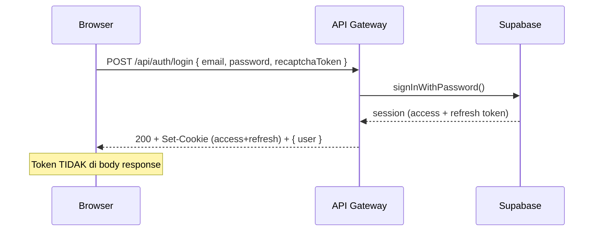

# Auth: Cookie-Based Session Migration

**Completion Timestamp**: 2026-08-17T13:00:00Z

## Summary
Migrasi autentikasi dari JWT-in-localStorage + `Authorization: Bearer` menjadi **httpOnly session cookie** (same-site cross-subdomain). Token tidak lagi pernah disimpan di localStorage atau JS, tidak lagi muncul di body response, dan tidak lagi lewat query string pada alur OAuth.

**Alasan**: localStorage rentan terhadap XSS (JS dapat membaca token); token di URL rentan bocor lewat history/referrer. Cookie httpOnly kebal XSS, dan SameSite=Lax memblokir CSRF.

## Arsitektur

```
Browser (dokyudo.my.id)                    Hono API (api.dokyudo.my.id)
        │  fetch(..., { credentials:'include' })   │
        │──────────────────────────────────────────►│
        │  Cookie otomatis terkirim (same-site:     │
        │  Domain=dokyudo.my.id berlaku utk keduanya)│
        │◄──────────────────────────────────────────│
        │  Set-Cookie (login/refresh) / 401
```

Pendekatan ini dipilih karena `dokyudo.my.id` (SPA) dan `api.dokyudo.my.id` (API) berbagi registrable domain — cookie dengan `Domain=dokyudo.my.id` otomatis dikirim browser ke kedua subdomain. Tidak perlu BFF proxy.

## Cookie Attributes

| Cookie | TTL | Atribut |
|---|---|---|
| `dokyudo_access_token` | 1 jam | `HttpOnly; Secure; SameSite=Lax; Path=/; Domain=dokyudo.my.id (prod)` |
| `dokyudo_refresh_token` | 30 hari | sama (refresh token Supabase) |

- `HttpOnly` → JS tidak bisa baca (proteksi XSS).
- `Secure` → hanya dikirim via HTTPS (prod). Di dev (localhost) dinonaktifkan agar berfungsi di HTTP.
- `SameSite=Lax` → cookie dikirim pada request same-site & navigasi top-level; TIDAK dikirim pada request cross-site (blokir CSRF). `Lax` (bukan `Strict`) agar redirect OAuth tetap membawa session.
- `Domain` diambil dari env `COOKIE_DOMAIN`; kosong di dev → host-only (localhost:8000).

## Silent Refresh

Middleware auth (`auth.middleware.ts`) membaca `dokyudo_access_token` dari cookie. Jika access token **expired** tetapi `dokyudo_refresh_token` masih valid:

```
verify access token  →  expired?
  ├─ ya + ada refresh cookie → Supabase.refreshSession(refresh_token)
  │      └─ sukses → Set-Cookie baru (access+refresh) → lanjut request
  │      └─ gagal  → 401
  └─ tidak → lanjut request
```

User tidak perlu login ulang tiap jam; refresh terjadi transparan per-request.

## Alur Utama

### Login (email/password)


### Guard halaman auth (login/register/forget-password)
```
Browser → /login
  → (auth)/+layout.ts → GET /api/auth/session (cookie ikut)
      ├─ authenticated:true  → redirect 307 ke /app/chat
      └─ authenticated:false → tampilkan halaman
```

### OAuth Google/GitHub (tanpa token di URL)
```mermaid
sequenceDiagram
    participant Browser
    participant API as API Gateway
    participant Provider as Google/GitHub

    Browser->>API: GET /api/auth/oauth/{provider}
    API-->>Provider: 302 ke consent screen (PKCE, redirect_to = callback API)
    Provider-->>API: 302 ke /api/auth/oauth/{provider}/callback?code=...
    API->>Provider: exchangeCodeForSession(code)
    Provider-->>API: session
    API-->>Browser: Set-Cookie (access+refresh) + 302 ke {FRONTEND_URL}/app/chat
    Note over Browser: Redirect langsung ke app; tidak ada token di URL
```

### Session expired (access + refresh keduanya tidak valid)
- Frontend poll `GET /api/auth/session` (tiap 30s + saat tab fokus) atau mendeteksi 401 dari request lain.
- Muncul `SessionExpiredDialog` (non-dismissable) → tombol "Go to Login" → `POST /api/auth/logout` (clear cookie) → redirect `/login`.

### Logout
```
POST /api/auth/logout (cookie ikut)
  → revoke session Supabase (global) + Set-Cookie Max-Age=0 (hapus)
  → idempotent: tetap 200 walau tanpa token
```

## Endpoint Baru: GET /api/auth/session

Lightweight session check untuk SPA hydrate state. Selalu 200 (bukan 401) agar "belum login" bukan error:

```json
{ "authenticated": true,  "user": { "id": "…", "email": "…" } }
{ "authenticated": false, "user": null }
```

## Perubahan Response API

- `POST /api/auth/login` → body hanya `{ user: { id, email } }` (dulu menyertakan accessToken/refreshToken).
- `POST /api/auth/verify-email` → sama; token dikirim via cookie.
- `POST /api/auth/logout` → tetap `{ message }`, cookie di-clear.
- `POST /api/auth/update-password` → token dibaca dari cookie; cookie di-clear setelah sukses.
- Auth middleware tetap mendukung header `Authorization: Bearer` sebagai fallback (kompatibilitas).

## Keamanan

- **XSS**: token hanya di httpOnly cookie → JS tidak bisa membaca.
- **CSRF**: `SameSite=Lax` + origin-check di backend untuk request non-GET (non-OAuth/non-webhook).
- **Token leak**: tidak ada token di URL (OAuth), body, atau localStorage.
- **CORS**: dikunci ke `FRONTEND_URL` + `credentials: true` (bukan `*`).
- **Crypto puzzle** di-skip untuk `/api/auth/*` dan `/api/payments/webhook` (endpoint yang dipicu navigasi browser / Stripe, tidak bisa menyelesaikan PoW).

## File Mapping

### Backend
- `apps/backend/src/config/cookie.ts` (baru) — helper `setSessionCookies` / `clearSessionCookies`.
- `apps/backend/src/config/env.ts` — tambah env opsional `COOKIE_DOMAIN`.
- `apps/backend/src/shared/middlewares/auth.middleware.ts` — baca cookie dulu, silent refresh, expose `resolveSession`.
- `apps/backend/src/modules/auth/auth.controller.ts` — login/verify/logout/update-password pakai cookie; tambah `handleSession`.
- `apps/backend/src/modules/auth/oauth/oauth.controller.ts` — callback set cookie + redirect `/app/chat`.
- `apps/backend/src/modules/auth/auth.routes.ts` — tambah `GET /api/auth/session`.
- `apps/backend/src/modules/auth/auth.schema.ts` — response schema login/verify tanpa token.
- `apps/backend/src/main.ts` — CORS credentials + origin-check CSRF.
- `apps/backend/src/shared/middlewares/crypto_puzzle.middleware.ts` — exempt auth/webhook.

### Frontend
- `apps/frontend/src/lib/apiClient.ts` — `dokyudoFetch` selalu `credentials: 'include'`.
- `apps/frontend/src/lib/api/client.ts` — hapus header Authorization manual; 401 trigger dialog session-expired.
- `apps/frontend/src/lib/state/session.store.svelte.ts` — simpan `{ user }` + `hydrate()` via `/api/auth/session`; tidak ada token di JS/localStorage.
- `apps/frontend/src/routes/(auth)/+layout.ts` — guard via `hydrate()` (auth user → redirect /app/chat).
- `apps/frontend/src/routes/app/+layout.ts` — guard via `hydrate()` (tanpa auth → redirect /login).
- `apps/frontend/src/routes/app/+layout.svelte` — poll session + `SessionExpiredDialog`.
- `apps/frontend/src/lib/components/app/SessionExpiredDialog.svelte` — dialog + logout best-effort.
- `apps/frontend/src/routes/(auth)/login/+page.svelte` & `auth/verify/+page.svelte` — set user; tampilkan `oauth_error`.
- Hapus: `src/routes/(auth)/oauth-callback/+page.svelte`, `src/lib/utils/jwt.ts`.

## Env yang Harus Di-set (Production)

```
FRONTEND_URL=https://dokyudo.my.id
API_URL=https://api.dokyudo.my.id
COOKIE_DOMAIN=dokyudo.my.id
NODE_ENV=prod
```

Supabase Dashboard: redirect URL callback tetap `https://api.dokyudo.my.id/api/auth/oauth/{provider}/callback` (tidak berubah).

## API Collection (Bruno)

- Semua request yang butuh auth kini `auth: none` — otentikasi lewat **Cookie Jar** Bruno (aktifkan Settings > Cookies). Jalankan Login sekali, lalu cookie otomatis terkirim.
- Semua header `Authorization: Bearer {{accessToken}}` dan block `auth:bearer` dihapus.
- Tambah request `Auth/15_Get Session.bru`.
- Env `accessToken` / `refreshToken` dihapus dari `environments/Local.bru` & `Production.bru`.