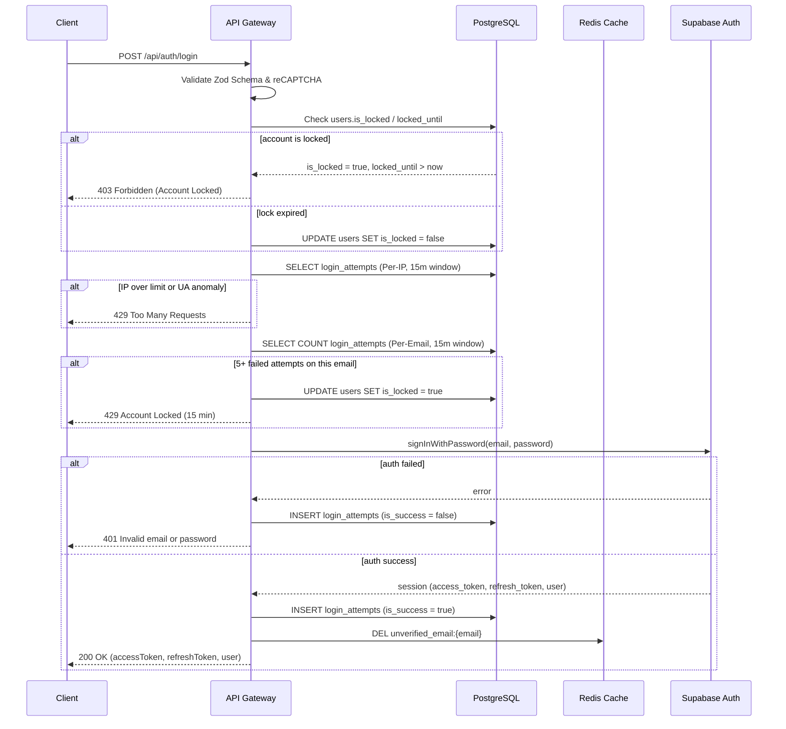
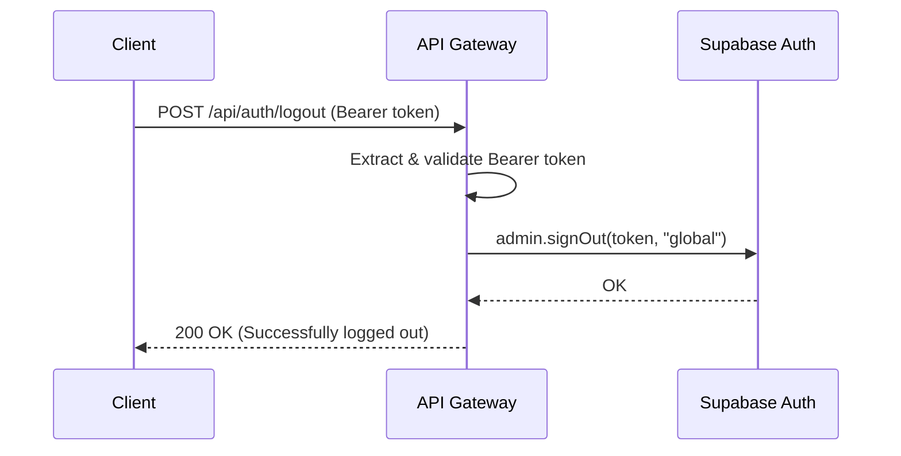

# User Login & Session Issuance (dky-005)

**Completion Timestamp:** 2026-06-26 19:50:00 UTC+7

## Core Logic

The login flow (`POST /api/auth/login`) enforces multi-layered anti-bruteforce defenses before authenticating users against Supabase Auth:

1. Validates the reCAPTCHA v3 token to filter automated bots.
2. Checks the `public.users` table for an active account lockout (`is_locked` + `locked_until`). If the lock has expired, it auto-releases.
3. Queries `public.login_attempts` for **Per-IP Rate Limiting** with **User-Agent Anomaly Detection** — if an IP rotates > 3 distinct User-Agents within 15 minutes, the threshold drops from 20 to 3 (botnet detection).
4. Queries `public.login_attempts` for **Per-Email Password Spraying Lockout** — if 5+ failed attempts target the same email (from any IP), the account is locked for 15 minutes.
5. Authenticates via `supabase.auth.signInWithPassword()`. On failure, logs the attempt and returns a generic `401 Unauthorized`.
6. On success, returns `accessToken`, `refreshToken`, and basic user info (`id`, `email`).
7. **Redis Cleanup:** Deletes the `unverified_email:{email}` cache key from registration, freeing Redis memory now that the user has verified and logged in.

The logout flow (`POST /api/auth/logout`) uses Supabase Admin API `signOut` with `"global"` scope to invalidate the session across all devices.

## Flow Diagram

## Logout Flow Diagram

## File Mapping

- **[EXISTING]** `apps/backend/src/modules/auth/auth.routes.ts`: OpenAPI routes for `/login` (POST) and `/logout` (POST) with full response schemas.
- **[EXISTING]** `apps/backend/src/modules/auth/auth.controller.ts`: `handleLogin` extracts body/IP/UA, calls service, returns tokens. `handleLogout` extracts Bearer token, calls service.
- **[MODIFY]** `apps/backend/src/modules/auth/auth.service.ts`: Added `redis.del()` cleanup of `unverified_email:{email}` on successful login.
- **[EXISTING]** `apps/backend/src/modules/auth/auth.schema.ts`: `LoginBodySchema`, `LoginResponseSchema`, `LogoutResponseSchema` Zod schemas.
- **[EXISTING]** `apps/backend/src/modules/auth/auth.routes.test.ts`: 10 login/logout tests covering positive flow, wrong password, missing fields, UA anomaly, password spraying lockout, and error envelope compliance.

## Connections

- **API Gateway → PostgreSQL:** Reads `users.is_locked` for lockout state, reads/writes `login_attempts` for rate limiting and logging.
- **API Gateway → Supabase Auth:** Uses `signInWithPassword` for authentication and `admin.signOut` for global session invalidation.
- **API Gateway → Upstash Redis:** Cleans up the `unverified_email:{email}` key on successful login to free memory.

## Architectural Decisions

1. **Database-Backed Lockout (Not Redis):** Account lockout state (`is_locked`, `locked_until`) lives in PostgreSQL rather than Redis because lockout is a durable security state that must survive Redis evictions and restarts. The `login_attempts` table provides a full audit trail for security analysis.
2. **Dual Rate-Limiting (IP + Email):** Per-IP limits prevent volumetric attacks. Per-email limits prevent distributed password spraying where attackers rotate IPs. The combination provides defense-in-depth.
3. **User-Agent Anomaly Detection:** Botnets often rotate User-Agents to bypass simple rate limits. Detecting > 3 distinct UAs from the same IP within the lockout window dynamically reduces the IP's allowed attempts from 20 to 3.
4. **Redis Cleanup on Login:** The `unverified_email:{email}` key (set during registration with 24h TTL) is proactively deleted on successful login to free Redis memory immediately rather than waiting for TTL expiry. This is a fire-and-forget operation wrapped in try/catch to never block the login response.
5. **Generic Error Messages:** Failed logins always return "Invalid email or password" regardless of whether the email exists, preventing user enumeration attacks.
