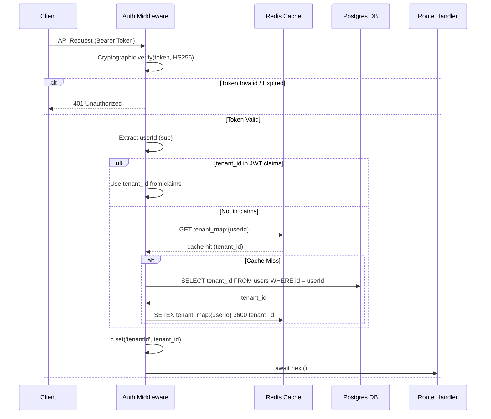

# Auth Middleware: JWT Validation & Tenant Context

**Completion Timestamp:** 2026-06-26 18:35:00 UTC+7

## Core Logic

The **Auth Middleware** (`auth.middleware.ts`) is a global Hono middleware that protects internal API routes by enforcing valid Supabase JWT authentication. It acts as the gateway for multi-tenancy by strictly injecting the isolated `tenantId` into the Hono Context (`c.set('tenantId')`).

Since the current database trigger (`handle_verified_user`) creates the tenant mapping in the Postgres `public.users` table but *does not* inject it into the Supabase JWT claims, this middleware employs an ultra-fast caching mechanism:
1. Validates the `Authorization: Bearer <TOKEN>` using `hono/jwt` and the `SUPABASE_JWT_SECRET` (Cryptographic verification).
2. Extracts the `userId` (`sub` claim).
3. First checks the JWT claims for `tenant_id` (future-proofing if we ever inject it via Auth Hooks).
4. If missing, it checks Upstash Redis for a cached `tenant_map:{userId}`.
5. If there's a cache miss, it queries the Drizzle `users` table for the `tenant_id`, and immediately caches the result in Redis for 1 hour.
6. Injects the resolved `tenantId` and `userId` into the request context.

## Flow Diagram

## File Mapping

- **[MODIFY]** `apps/backend/src/shared/types/app.types.ts`: Extended `AppEnv` with `tenantId` and `userId` context bindings.
- **[MODIFY]** `apps/backend/src/config/env.ts`: Added `SUPABASE_JWT_SECRET` to strict validation.
- **[NEW]** `apps/backend/src/shared/middlewares/auth.middleware.ts`: Implemented JWT validation, database fallback, and Redis caching.
- **[NEW]** `apps/backend/src/shared/middlewares/auth.middleware.test.ts`: Added automated unit tests using mocked JWT signatures.
- **[MODIFY]** `apps/backend/src/api/router.ts`: Registered `authMiddleware` globally using a path-exclusion rule (`!path.startsWith("/api/auth")`).

## Connections

- **Client to API Gateway:** Rejects invalid/missing tokens with `401 Unauthorized`.
- **API Gateway to Upstash Redis:** Caches tenant resolution to achieve sub-millisecond lookups on repeated requests.
- **API Gateway to Postgres (Drizzle):** Lookups `tenant_id` from the `users` table only on initial authentication or cache expiration.
- **Downstream Route Handlers:** All protected API routes can confidently call `c.get("tenantId")` knowing it has been cryptographically secured and validated.

## Architectural Decisions

1. **Redis Tenant Caching:** Hitting a Serverless Postgres database on every single API request just to resolve the `tenant_id` introduces unacceptable latency. Caching this mapping in Redis satisfies the Expert Performance Policy (P95 latency optimization) while maintaining strict tenant isolation.
2. **Path Exclusion vs Global Wrapper:** The middleware is applied globally on `/api/*` within `router.ts` but dynamically yields (`await next()`) if the path targets the `/api/auth` module. This keeps the middleware stack clean and ensures we don't accidentally expose new protected routes in the future (Secure by Default).
3. **Cryptographic Validation over Network Call:** Using `hono/jwt` with `HS256` and the `SUPABASE_JWT_SECRET` allows the Edge runtime to validate the token natively. This eliminates the need to make an HTTP request to the Supabase Auth server on every API call.
