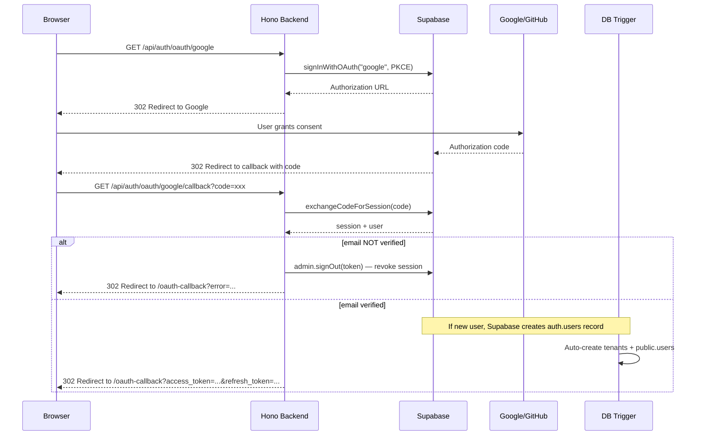

# OAuth 2.0 (Google/GitHub) Integration (dky-006)

**Completion Timestamp:** 2026-06-26 20:05:00 UTC+7

## Core Logic

The OAuth flow uses **Supabase's built-in Server-Side PKCE** rather than manually implementing the full OAuth dance (state management, code exchange, userinfo fetch). This eliminates the need for `GOOGLE_CLIENT_SECRET` / `GITHUB_CLIENT_SECRET` in the backend environment — they're configured once in the Supabase Dashboard.

**Initiate Flow** (`GET /api/auth/oauth/google` or `/github`):
1. Calls `supabase.auth.signInWithOAuth({ provider, options: { flowType: "pkce", redirectTo: "{API_URL}/api/auth/oauth/{provider}/callback", skipBrowserRedirect: true } })`.
2. Returns the Supabase-generated PKCE authorization URL (with `code_challenge`).
3. Issues a `302 Redirect` to the user's browser.

**Callback Flow** (`GET /api/auth/oauth/google/callback` or `/github/callback`):
1. Receives the authorization `code` from the provider via Supabase's redirect to the **backend callback** (not the frontend).
2. Exchanges the code for a Supabase session via `exchangeCodeForSession(code)`. The PKCE verifier lives in the backend process's singleton Supabase client.
3. **Email Verification Gate (PRD §5.1)**: Checks `user.email_confirmed_at` or `identities[0].identity_data.email_verified`. If unverified, the session is immediately revoked via `admin.signOut()` and a `401 UNAUTHORIZED` is returned.
4. On success, redirects to `{FRONTEND_URL}/oauth-callback?access_token=...&refresh_token=...`.
5. Cleans up the Redis `unverified_email:{email}` cache if present.

**Tenant Provisioning**: New OAuth users get a tenant automatically via the existing Supabase database trigger `handle_verified_user`. If the trigger has not fired by the time the callback runs (or it does not support OAuth users, whose emails are confirmed at insert time), the backend retries the lookup briefly and then provisions `tenants` + `public.users` + a FREE `tenant_subscriptions` row from the app as a fallback, so the session stays usable and `auth.login` is recorded in `activity_logs`.

**Error Handling**: Since this is a browser redirect flow (not an API call), errors redirect to `{FRONTEND_URL}/oauth-callback?error=...` rather than returning JSON.

## Flow Diagram

## File Mapping

- **[NEW]** `apps/backend/src/modules/auth/oauth.service.ts`: Core OAuth business logic — `initiateOAuth()` and `handleOAuthCallback()`.
- **[NEW]** `apps/backend/src/modules/auth/oauth.controller.ts`: HTTP handlers for 4 endpoints (Google/GitHub × redirect/callback).
- **[NEW]** `apps/backend/src/modules/auth/oauth.routes.ts`: OpenAPI route definitions with full request/response documentation.
- **[MODIFY]** `apps/backend/src/modules/auth/auth.routes.ts`: Mounted `oauthRoutes` via `authRoutes.route("/", oauthRoutes)`.
- **[MODIFY]** `apps/backend/src/config/env.ts`: Added `FRONTEND_URL` (default `http://localhost:5173`) + `API_URL` (default `http://localhost:8000`, the backend's own public URL used as the PKCE callback target) + `getEnv()` helper.
- **[SYNC]** `api-collections/Auth/06-09_OAuth*.bru`: Updated docs to reflect Supabase PKCE flow.

## Connections

- **Backend → Supabase Auth**: Uses `signInWithOAuth` (initiate) and `exchangeCodeForSession` (callback). Supabase internally manages state/PKCE, token exchange, and provider identity linking via `auth.identities`.
- **Supabase → Google/GitHub**: Supabase handles the provider communication. Client ID/Secret are configured in the Supabase Dashboard.
- **Supabase DB Trigger → PostgreSQL**: `handle_verified_user` trigger auto-creates `tenants` + `users` records for new OAuth users.
- **Backend → Redis**: Cleans up `unverified_email:{email}` cache on successful OAuth login.
- **Backend → Frontend**: Redirects to `{FRONTEND_URL}/oauth-callback` with tokens or error.

## Architectural Decisions

1. **Supabase-Managed PKCE (Not Manual OAuth)**: Instead of manually implementing state storage, code exchange, and userinfo fetch for each provider, we delegate entirely to Supabase's built-in OAuth. This eliminates 4 environment variables, removes the need for an `oauth_providers` table, and reduces the attack surface (no client secrets in our backend). Supabase's `auth.identities` table handles account linking natively.
2. **Browser Redirect Error Handling**: Since OAuth callbacks are browser redirects (not API calls), errors are communicated via query parameters (`?error=...`) rather than JSON responses. The frontend SvelteKit app will parse these on the `/oauth-callback` route.
3. **FRONTEND_URL with Fallback**: Added as an optional env var with a `localhost:5173` default. This allows the OAuth flow to work in local development without any `.env` configuration, while being overridable in production.
4. **No New Database Tables**: The existing `handle_verified_user` trigger and Supabase's `auth.identities` table handle everything — no `oauth_providers` table needed. This keeps the schema minimal and avoids migration churn.
