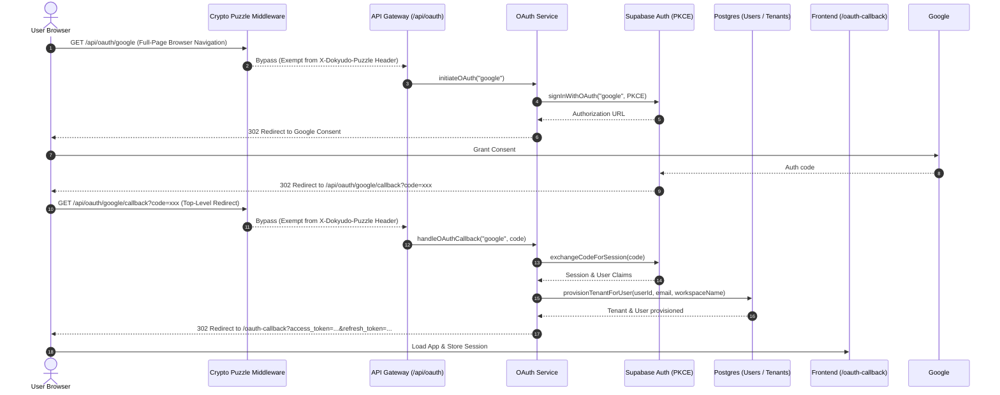

# Standalone OAuth 2.0 Module (`/api/oauth`)

**Completion Timestamp:** 2026-08-20T15:12:00+07:00

## Core Logic

The OAuth module is decoupled into a standalone modular monolith module located at `apps/backend/src/modules/oauth/` and mounted under the dedicated route prefix `/api/oauth` (`/api/oauth/google`, `/api/oauth/google/callback`, `/api/oauth/github`, `/api/oauth/github/callback`).

This decoupling ensures that authentication mechanisms remain modular: the standard credential-based auth module (`/api/auth`) and the third-party OAuth module (`/api/oauth`) can operate or be refactored independently.

**Initiate Flow** (`GET /api/oauth/google` or `/github`):
1. Calls `supabase.auth.signInWithOAuth({ provider, options: { redirectTo: "{API_URL}/api/oauth/{provider}/callback", skipBrowserRedirect: true } })`.
2. Anon client uses PKCE (`flowType: "pkce"` in `config/supabase.ts`), generating the PKCE `code_challenge`.
3. Issues a `302 Redirect` to the user's browser towards the OAuth provider consent screen.

**Callback Flow** (`GET /api/oauth/google/callback` or `/github/callback`):
1. Receives the authorization `code` from the provider via Supabase's redirect to the **backend callback**.
2. Exchanges the code for a Supabase session via `exchangeCodeForSession(code)`.
3. **Email Verification Gate (PRD §5.1)**: Checks `user.email_confirmed_at` or `identities[0].identity_data.email_verified`. If unverified, the session is immediately revoked via `admin.signOut()` and redirects to frontend error.
4. **Tenant Provisioning**: Provisions tenant, user, and subscription using the shared provisioning utility `provisionTenantForUser()` (`src/shared/utils/user_provision.util.ts`).
5. On success, redirects to `{FRONTEND_URL}/oauth-callback?access_token=...&refresh_token=...`.
6. Cleans up Redis `unverified_email:{email}` cache and emits `auth.login` to `activity_logs`.

**Error Handling**: Redirects to `{FRONTEND_URL}/oauth-callback?error=...`.

---

## Flow Diagram

---

## File Mapping

| File | Purpose / Changes |
|---|---|
| `apps/backend/src/modules/oauth/mod.ts` | Module entrypoint re-exporting `oauthRoutes`, `OAuthService`, and schemas. |
| `apps/backend/src/modules/oauth/oauth.routes.ts` | Standalone OpenAPI route definitions for Google and GitHub initiate/callback under `/`. |
| `apps/backend/src/modules/oauth/oauth.controller.ts` | HTTP controller handlers for OAuth redirects and callbacks. |
| `apps/backend/src/modules/oauth/oauth.service.ts` | Static service methods `initiateOAuth` and `handleOAuthCallback`. |
| `apps/backend/src/modules/oauth/oauth.schema.ts` | Zod schemas and inferred types for query parameters and responses. |
| `apps/backend/src/modules/oauth/oauth.routes.test.ts` | Integration tests for OAuth initiate and callback endpoints. |
| `apps/backend/src/modules/oauth/oauth.service.test.ts` | Isolated unit tests for OAuth service functions. |
| `apps/backend/src/shared/middlewares/crypto_puzzle.middleware.ts` | Exempted `/api/oauth` routes from the browser WASM PoW requirement. |
| `apps/backend/src/shared/middlewares/crypto_puzzle.middleware.test.ts` | Regression unit tests verifying `/api/oauth` endpoints succeed without `X-Dokyudo-Puzzle`. |
| `apps/backend/src/shared/utils/user_provision.util.ts` | Shared idempotent tenant, user, and subscription provisioning helper. |
| `apps/backend/src/api/router.ts` | Mounted `oauthRoutes` at `/oauth` and added route bypass for public callback. |
| `apps/backend/src/main.ts` | Whitelisted `/api/oauth` in CSRF protection middleware. |
| `apps/frontend/src/lib/api/oauth.ts` | Frontend OAuth client helper methods (`initiateGoogleOAuth`, `initiateGithubOAuth`). |
| `apps/frontend/src/lib/api/auth.ts` | Re-exported OAuth initiate helpers. |
| `api-collections/OAuth/*` | Dedicated Bruno collection folder with 4 request definitions. |

---

## Connections

- **Server Gateway**: `router.ts` mounts `oauthRoutes` at `/oauth`. `/api/oauth` paths are added to public route whitelist so unauthenticated users can initiate logins and receive redirects.
- **Crypto Puzzle Exemption**: `crypto_puzzle.middleware.ts` explicitly bypasses Proof-of-Work header checks for `/api/oauth/*` because full-page browser URL navigations cannot supply custom HTTP headers.
- **CSRF Whitelist**: `main.ts` skips CSRF origin validation on `/api/oauth` to handle direct browser navigations and third-party callback redirects.
- **Shared Provisioning**: `user_provision.util.ts` centralizes tenant and user creation with race-condition handling (`onConflictDoNothing`), used by both email registration and OAuth logins.

---

## Architectural Decisions

1. **Modular Monolith Decoupling**: Extracting `/api/oauth` from `/api/auth` allows OAuth and credential auth to be toggled, refactored, or audited independently.
2. **Proof-of-Work (PoW) Bypass for Browser Redirects**: Standard API requests made via `fetch` attach the computed `X-Dokyudo-Puzzle` header. Browser address bar navigations (such as clicking an OAuth button that sets `window.location.href`) and provider redirects (Google/GitHub redirecting to `/api/oauth/:provider/callback`) cannot attach custom HTTP headers. Therefore, `/api/oauth` is exempted alongside `/api/auth` and `/api/payments/webhook`.
3. **Shared User Provisioning Helper**: Centralizing the DB provisioning logic into `shared/utils/user_provision.util.ts` eliminates code duplication across auth and oauth modules.
4. **Server-Side PKCE**: Continues leveraging Supabase Server-Side PKCE for secure code verification without exposing client secrets in the backend.
