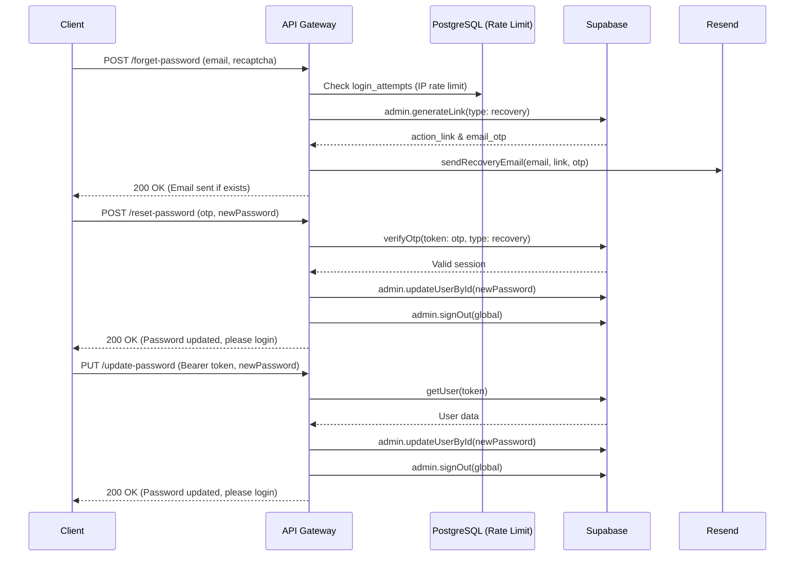

# Password Reset & Update (dky-007)

**Completion Timestamp:** 2026-07-23 13:40:00 UTC+7

## Core Logic

Fitur pemulihan kata sandi (Password Reset) dan pembaruan kata sandi (Password Update) diimplementasikan untuk mengakomodasi dua mode UX di sisi frontend: **Magic Link Click** (authenticated) dan **Manual OTP Entry** (unauthenticated). 

1. **`POST /api/auth/forget-password`**: 
   Menerima email dan reCAPTCHA token. Dilindungi oleh Rate Limiting per-IP (maks 5 request per 15 menit). Menggunakan `supabase.auth.admin.generateLink({ type: "recovery" })` untuk mendapatkan `action_link` dan `email_otp`. Link dan OTP ini kemudian dikirimkan melalui Resend API menggunakan `sendRecoveryEmail`. Error user-not-found ditangkap secara diam-diam (silent ignore) untuk mencegah *email enumeration attack*.

2. **`POST /api/auth/reset-password`**: 
   Digunakan saat Frontend tidak memiliki sesi (User memasukkan 8-digit OTP secara manual). Menerima `otp` dan `newPassword` (tanpa memerlukan `email`). Menggunakan `supabase.auth.verifyOtp({ token: params.otp, type: 'recovery' })` untuk memvalidasi token, yang jika berhasil akan mengembalikan konteks pengguna. Setelahnya, kata sandi diperbarui menggunakan Admin API, lalu semua sesi dihancurkan (`signOut` global) untuk memaksa user re-login dengan kata sandi baru.

3. **`PUT /api/auth/update-password`**: 
   Digunakan saat Frontend sudah terotentikasi (Misalnya user mengklik Magic Link dari email, atau user mengganti password dari halaman profil). Endpoint ini memvalidasi token JWT (`Bearer`), mengambil profil user yang bersangkutan, dan mengganti password mereka menggunakan Admin API. Sama seperti *reset*, seluruh sesi akan diputus secara global.

## Flow Diagram

## File Mapping

- **[MODIFY]** `apps/backend/src/modules/auth/auth.schema.ts`: Memperbarui `ResetPasswordBodySchema` untuk menghapus `email` dan memvalidasi `otp` (8 digit).
- **[MODIFY]** `apps/backend/src/modules/auth/auth.service.ts`: Memperbarui `resetPassword` untuk memanggil `supabase.auth.verifyOtp({ token: params.otp, type: 'recovery' })` tanpa `email`.
- **[MODIFY]** `apps/backend/src/modules/auth/auth.controller.ts`: Memperbarui `handleResetPassword` untuk mengekstrak `otp` dan `newPassword` tanpa `email`.
- **[MODIFY]** `apps/backend/src/modules/auth/auth.routes.ts`: Memperbarui OpenAPI schema `POST /reset-password` (tanpa `email`).
- **[MODIFY]** `apps/backend/src/modules/auth/auth.routes.test.ts`: Memperbarui test payload `reset-password` untuk menghapus `email`.
- **[MODIFY]** `api-collections/Auth/11_Reset Password.bru`: Memperbarui Bruno JSON body untuk menghapus `email`.
- **[MODIFY]** `apps/frontend/src/lib/types/auth.types.ts`: Menghapus `email` dari `ResetPasswordRequestPayload`.
- **[MODIFY]** `apps/frontend/src/lib/schemas/auth.schema.ts`: Menghapus `email` dari `updatePasswordSchema`.
- **[MODIFY]** `apps/frontend/src/routes/(auth)/forget-password/update-password/+page.svelte`: Menghapus hidden email field, memperbarui superForm submission payload, mempertahankan input value saat error, dan menata ulang InputOTP slot (`h-12`, `bg-auth-input`, `border-white/10`, `rounded-md`, `text-white text-base font-medium font-sans`).

## Connections

- **API Gateway → Supabase Auth**: Menggunakan Admin API (`generateLink` & `updateUserById`) dan Auth API (`verifyOtp` & `getUser`).
- **API Gateway → PostgreSQL**: Query ke tabel `public.login_attempts` untuk proteksi bruteforce spam IP di endpoint `/forget-password`.
- **API Gateway → Resend**: Mengirimkan transactional email via REST API (`resend.emails.send`) menggunakan `idempotencyKey: recovery-email/{email}-{requestId}`.

## Architectural Decisions

1. **Dual-Flow Recovery UX**: Backend harus mengakomodasi dua jenis pengiriman kredensial. Jika user mengklik tautan di HP/laptop yang sama, Supabase akan menelan token dan memberikan sesi yang sah (memicu `/update-password`). Namun, jika user membuka email dari perangkat lain dan hanya melihat 8-digit angka, mereka dapat memasukkannya secara langsung tanpa harus memasukkan alamat email kembali (memicu `/reset-password`).
2. **Global Session Invalidation**: Segera setelah kata sandi diubah, baik via OTP maupun Bearer Token, backend memanggil `signOut(token, 'global')` untuk memaksa pembatalan sesi (*force re-login*) di semua perangkat (laptop, HP, tablet) guna mencegah peretas yang masih memiliki JWT lama agar tidak bisa terus mengakses sistem.
3. **Anti-Enumeration Defense**: Endpoint `/forget-password` selalu mengembalikan status HTTP 200 dengan pesan sukses ("If an account exists..."), meskipun email tidak terdaftar di database. Ini merupakan praktik keamanan yang kuat (*secure-by-default*) untuk mencegah *Attacker* menebak database user.
