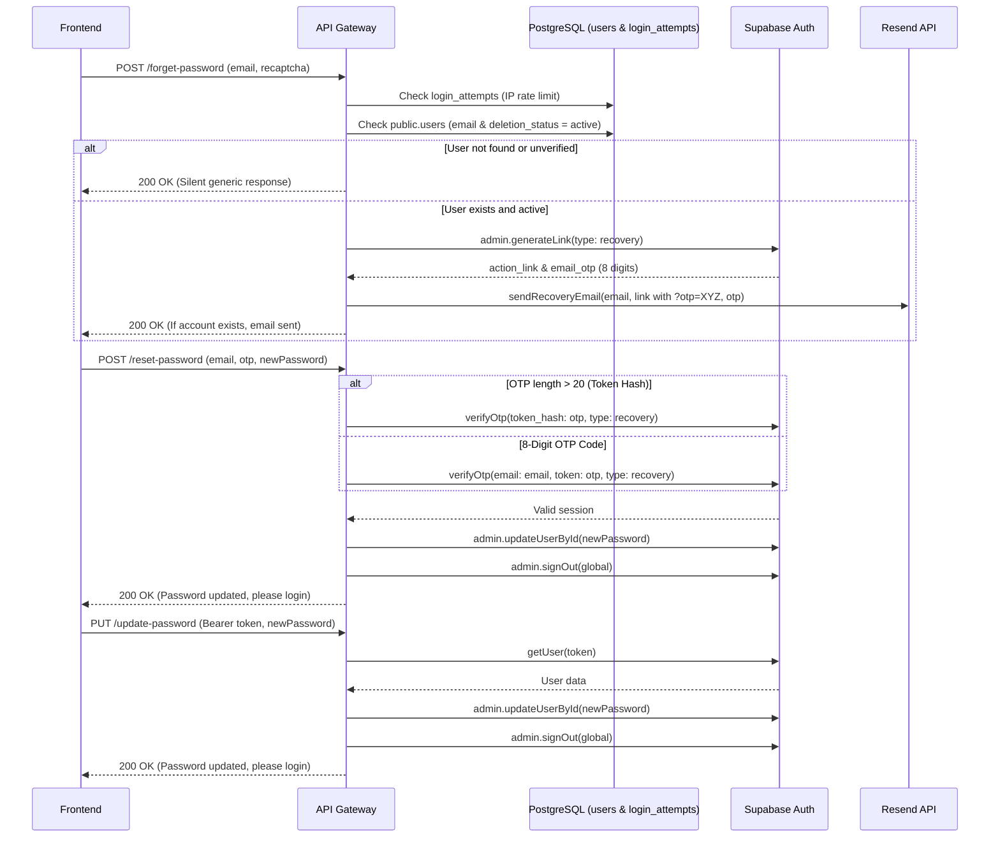

# Password Reset & Update (dky-007)

**Completion Timestamp:** 2026-08-28 13:38:00 UTC+7

## Core Logic

The Password Reset and Password Update feature accommodates two frontend UX flows: **Magic Link Click** (authenticated) and **Manual OTP Entry** (unauthenticated).

1. **`POST /api/auth/forget-password`**: 
   Receives email and reCAPTCHA v3 token. Protected by per-IP rate limiting (max 5 requests per 15 minutes). Queries `public.users` to ensure an active, verified user row exists (`deletion_status = 'active'`). 
   - If the user does not exist or is unverified, the request exits silently returning HTTP 200 (`"If an account exists, a recovery email has been sent."`) to prevent email enumeration attacks without generating unnecessary tokens or sending emails.
   - If the user exists and is active, it calls `supabase.auth.admin.generateLink({ type: "recovery" })`. The returned 8-digit `email_otp` is embedded directly into the custom frontend link (`?otp=${email_otp}&email=...`) and sent via Resend API using `sendRecoveryEmail`.

2. **`POST /api/auth/reset-password`**: 
   Receives `email`, `otp` (8-digit code or magic token_hash), and `newPassword`. Uses `supabase.auth.verifyOtp({ email, token: params.otp, type: 'recovery' })` (or `token_hash` when length > 20) to validate the recovery OTP in Supabase Auth. Once verified, updates the user password via Supabase Admin API (`admin.updateUserById`) and invalidates all active sessions globally (`signOut(..., 'global')`).

3. **`PUT /api/auth/update-password`**: 
   Used when the client is already authenticated (e.g. from the user settings/profile page). Validates the Bearer JWT, updates the password using Admin API, and globally revokes prior sessions.

## Flow Diagram

## File Mapping

- **[MODIFY]** `apps/backend/src/modules/auth/auth.service.ts`: Added database guard in `forgetPassword` and updated recovery URL construction to embed `otp=${email_otp}`.
- **[MODIFY]** `apps/backend/src/modules/auth/auth.schema.ts`: Configured `ResetPasswordBodySchema.otp` for 8-digit OTP format.
- **[MODIFY]** `apps/backend/src/shared/utils/email.util.ts`: Updated `sendRecoveryEmail` template to state `"8-digit OTP"`.
- **[MODIFY]** `apps/backend/src/modules/auth/auth.service.test.ts`: Added test cases for unverified silent ignore and verified recovery.
- **[MODIFY]** `apps/backend/src/modules/auth/auth.routes.test.ts`: Updated reset password tests to 8-digit OTP payloads.
- **[MODIFY]** `apps/frontend/src/lib/schemas/auth.schema.ts`: Configured `updatePasswordSchema.otp` to require exactly 8 numeric digits.
- **[MODIFY]** `apps/frontend/src/routes/(auth)/forget-password/update-password/+page.svelte`: Configured `<InputOTP.Root>` to 8 slots with `'01234567'` placeholder and automatic query string `otp` extraction.
- **[MODIFY]** `api-collections/Auth/10_Forget Password.bru`: Updated documentation with anti-enumeration database guard details.
- **[MODIFY]** `api-collections/Auth/11_Reset Password.bru`: Updated sample payload and documentation to 8-digit OTP.

## Connections

- **API Gateway → PostgreSQL**: Queries `public.users` for active verified status and `public.login_attempts` for IP rate limiting.
- **API Gateway → Supabase Auth**: Admin API (`generateLink`, `updateUserById`, `signOut`) and Auth API (`verifyOtp`, `getUser`).
- **API Gateway → Resend**: Dispatches recovery email with idempotency key (`recovery-email/{email}-{requestId}`).

## Architectural Decisions

1. **Anti-Enumeration Database Guard**: The endpoint `/forget-password` always returns HTTP 200 with the message `"If an account exists, a recovery email has been sent."` regardless of whether the account exists or is verified. The backend silently drops requests for non-existent or unverified users without generating Supabase recovery tokens.
2. **Supabase 8-Digit OTP Alignment**: Supabase GoTrue internally generates an 8-digit recovery code (`email_otp`). The backend embeds `?otp=${email_otp}` into the recovery URL, while the frontend UI provides an 8-slot OTP input so that magic link clicks and manual OTP typing match the email code 1:1.
3. **Global Session Invalidation**: Immediately following password resets or updates, `signOut(token, 'global')` invalidates all existing sessions across devices.
4. **Supabase `verifyOtp` Signature Alignment**: Supports both 8-digit OTP code verification (`{ email, token, type: 'recovery' }`) and direct token hash verification (`{ token_hash, type: 'recovery' }`).
