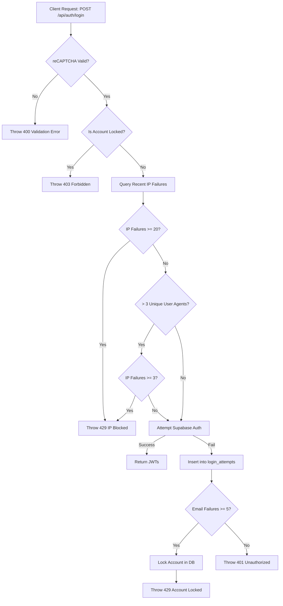

# Auth Security & Correlation Logic

## Core Logic
The authentication service incorporates multi-dimensional rate limiting and anti-brute-force correlation. The system relies on Google reCAPTCHA v3 for client-side fingerprinting and bot detection, and backend-enforced limits on IP and Email combinations to stop credential stuffing and password spraying. 

### Key Protections
1. **Google reCAPTCHA v3 Validation**: Verifies a token with Google, requiring a score of >= 0.5. Re-used tokens naturally trigger a rejection via Google's `siteverify` endpoint.
2. **Per-IP Rate Limiting**: An IP is blocked for 15 minutes after 20 failed login attempts.
3. **User-Agent Anomaly Detection**: If a single IP rotates through > 3 distinct User-Agents within the recent failure window, it is flagged as a botnet/script. Its IP limit instantly drops from 20 to 3.
4. **Per-Email Lockout (Password Spraying)**: If an email is targeted 5 times on the `/login` endpoint (regardless of the originating IPs), the user account is safely locked (`is_locked: true`) for 15 minutes. 
5. **Registration Restrictions**: To prevent fake account creation and email enumeration, the `/register` endpoint logs all attempts. An IP is blocked if it exceeds 20 total attempts (or 3 if a UA anomaly is detected). Additionally, an IP is strictly capped at **5 successful registrations** per 15-minute window.
6. **Database Bloat Prevention**: Requests to an already locked account or from an already blocked IP return `403 FORBIDDEN` or `429 RATE_LIMIT_EXCEEDED` and immediately exit *without* inserting redundant records into the `login_attempts` table.

## Flow Diagram



## Update 2026-08-31 — CSP `connect-src` Localhost Allowance

**Completion Timestamp:** 2026-08-31 16:30 UTC+7  
**Commit:** `c8ef73a`

Production `Content-Security-Policy` di `apps/frontend/svelte.config.js:58` sebelumnya hanya mengizinkan `https://api.dokyudo.my.id` + Supabase/Google/CDN/S3. Saat preview build production melawan backend lokal (`PUBLIC_API_URL=http://localhost:8000` — `apps/frontend/.env` ter-decrypt), `fetch` ke `http://localhost:8000/api/auth/session` & `.../forget-password` terblokir (`connect-src` violation — lihat `fetcher.js:67`, `+page.svelte:36`).

Fix: `connect-src` sekarang menyertakan:

```
'http://localhost:*', 'http://127.0.0.1:*',
'http://localhost:8000', 'http://localhost:8080',
'http://127.0.0.1:8000', 'http://127.0.0.1:8080',
'ws://localhost:*', 'ws://127.0.0.1:*'
```

Wildcard `:*` adalah CSP3-compliant; port eksplisit dipertahankan untuk parser lama. Tetap aman di prod (`localhost` dari browser pengguna = mesinnya sendiri, tidak menurunkan keamanan `dokyudo.my.id`). HMR `ws` juga tercakup. CSP sendiri hanya aktif di prod build (`isProduction` → `kit.csp mode: 'hash'` di `svelte.config.js:25` + `hooks.server.ts:17` untuk header hardening lainnya); rebuild frontend diperlukan (`pnpm --filter frontend build`).

## Completion Timestamp
**Date**: 2026-06-20 00:21 (Local Time) — diperbarui 2026-08-31 (CSP + emailShell)

## File Mapping
- **`apps/backend/src/modules/auth/auth.service.ts`**: Contains the core correlation queries (using Drizzle ORM), anomaly detection, and DB locking logic.
- **`apps/backend/src/modules/auth/auth.controller.ts`**: Handles routing and graceful error handling.
- **`apps/backend/src/modules/auth/auth.schema.ts`**: Zod schemas ensuring passwords meet strong complexity requirements (regex for lowercase, uppercase, number, and symbol).
- **`apps/backend/src/shared/utils/recaptcha.util.ts`**: Enforces the 0.5 score threshold and validates Google `siteverify` payload.
- **`apps/backend/src/tests/api/auth.api.test.ts`**: Houses the unit and integration tests verifying User-Agent anomalies and distributed password spraying.

## Connections
- **Frontend Layer**: Must provide the `recaptchaToken` securely retrieved via Google's `grecaptcha.execute()`.
- **Database Layer (Drizzle ORM)**: Uses `db.select()` and `db.update()` mapped to `public.login_attempts` to aggregate failures. Uses an index `idx_login_attempts_email_ip` to quickly query by `emailAttempted` and `ipAddress` without full table scans.
- **Supabase Layer (Identity only)**: Uses `supabase.auth.admin.signOut` for token revocation and `signInWithPassword` for underlying authentication, decoupled from raw table access.

## Architectural Decisions
- **Database Boundary (Drizzle vs Supabase)**: Supabase clients (`getSupabaseAdmin`, `getSupabaseAuth`) are strictly reserved for Identity Operations (`createUser`, `signInWithPassword`). All direct table queries (like counting `login_attempts` or locking `users`) were refactored to use Drizzle ORM (`db.select`, `db.update`). This prevents framework leakage and ensures strong type safety against `apps/backend/src/shared/models/db.model.ts`.
- **Relying on reCAPTCHA vs. Custom Fingerprinting**: We opted to strictly rely on Google reCAPTCHA v3's client-side checks for hardware/browser fingerprinting (fonts, screen size, Playwright defaults). Building a custom fingerprinting script creates massive GDPR liabilities and performs worse than Google's existing ML models.
- **No User-Agent Blocking**: We do not block requests globally based purely on the `User-Agent` string, as standard UAs are shared by millions of legitimate users. We only use `User-Agent` as an anomaly modifier for a *specific IP*.
- **Graceful Failure**: Non-critical background logs use `try/catch` wrappers to prevent breaking the happy path for users. Rejection paths bypass `logLoginAttempt` inserts to prevent DB bloating during a DDoS.
- **Compact Regex Validation**: Password validation strictly enforces lowercase, uppercase, numbers, and symbols through a single, compact regex `/^(?=.*[a-z])(?=.*[A-Z])(?=.*\d)(?=.*[^a-zA-Z0-9]).+$/` to unify error output to the user.
