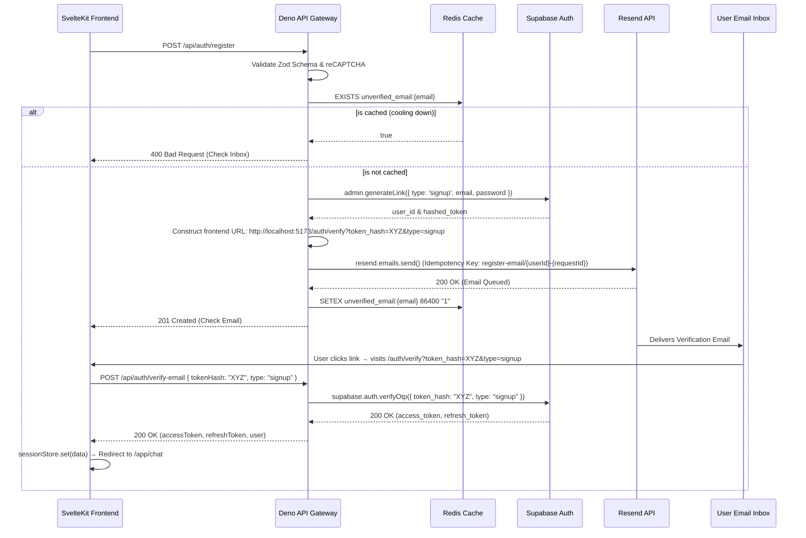

# User Registration & Custom Email Verification (dky-004)

**Completion Timestamp:** 2026-07-23 11:05:00 UTC+7

## Core Logic

The registration flow (`POST /api/auth/register`) enforces strong password policies and authenticates humans via reCAPTCHA v3 before provisioning users.

Instead of relying on Supabase's default redirect links, this system routes verification through custom branded frontend URLs:
1. Validates the reCAPTCHA token and performs Anti-Bot/Bruteforce rate limiting checks.
2. Checks Redis (`unverified_email:{email}`) to see if a verification email was recently sent. If yes, it aborts early and returns 400 Bad Request to save Resend quotas.
3. Calls Supabase Auth Admin API (`supabase.auth.admin.generateLink({ type: 'signup' })`) which silently creates the user in an unverified state and returns `hashed_token`.
4. Constructs a custom frontend verification URL: `${FRONTEND_URL}/auth/verify?token_hash=${hashed_token}&type=signup`.
5. Passes the custom URL, `userId`, and HTTP `requestId` to `sendVerificationEmail()`.
6. Generates a transactional HTML email and delivers it via the Resend SDK (`resend.emails.send`) with an Idempotency Key (`register-email/${userId}-${requestId}`).
7. When the user clicks the link, the SvelteKit frontend at `/auth/verify` extracts `token_hash` and `type` and submits them to `POST /api/auth/verify-email`.
8. The Deno API Gateway executes `supabase.auth.verifyOtp({ token_hash, type })`, returning active session tokens (`accessToken`, `refreshToken`) to the client, which stores them in `sessionStore` and redirects to `/app/chat`.

## Flow Diagram

## File Mapping

- **[MODIFY]** `apps/backend/src/modules/auth/auth.service.ts`: Updated `registerUser` to construct custom frontend verification link and added `verifyEmail` service method.
- **[MODIFY]** `apps/backend/src/modules/auth/auth.schema.ts`: Added `VerifyEmailBodySchema`, `VerifyEmailParams`, and `VerifyEmailResponseSchema`.
- **[MODIFY]** `apps/backend/src/modules/auth/auth.controller.ts`: Added `handleVerifyEmail` handler.
- **[MODIFY]** `apps/backend/src/modules/auth/auth.routes.ts`: Registered `POST /verify-email` endpoint OpenAPI contract.
- **[NEW]** `apps/frontend/src/routes/(auth)/auth/verify/+page.svelte`: Created verification page controller.
- **[MODIFY]** `apps/frontend/src/lib/api/auth.ts`: Added `authVerifyEmail` helper.
- **[MODIFY]** `apps/frontend/src/lib/types/auth.types.ts`: Added `VerifyEmailRequestPayload` and `VerifyEmailResponse`.
- **[NEW]** `api-collections/Auth/14_Verify Email.bru`: Created Bruno collection file for `POST /api/auth/verify-email`.

## Connections

- **Deno API Gateway**: Exposes `POST /api/auth/verify-email`.
- **Supabase Auth**: Executes `verifyOtp` for token validation.
- **Resend API**: Dispatches branded verification emails containing custom frontend links.
- **SvelteKit Frontend**: Serves `/auth/verify` controller page and manages session storage.

## Architectural Decisions

- **Supabase Domain Isolation**: Hides raw `supabase.co` URLs from user emails to maintain consistent branding and security isolation.
- **Single-Source Session Store**: Svelte 5 `$state`-based `session.store.svelte.ts` manages token lifecycle across client-side navigation.
