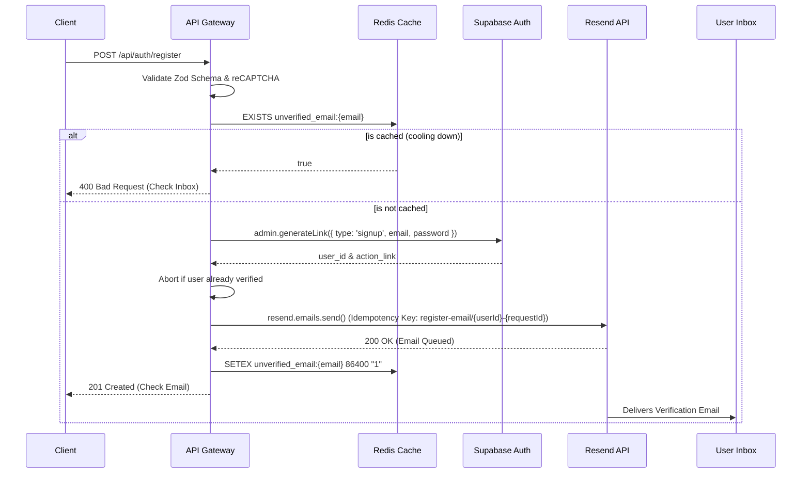

# User Registration & Email Verification (dky-004)

**Completion Timestamp:** 2026-06-26 18:52:00 UTC+7

## Core Logic

The registration flow (`POST /api/auth/register`) enforces strong password policies and authenticates humans via reCAPTCHA v3 before provisioning users. 

Instead of relying on Supabase's default, rate-limited SMTP service to dispatch email verification links, this system completely decouples user creation from email delivery:
1. Validates the reCAPTCHA token and performs Anti-Bot/Bruteforce rate limiting checks.
2. Checks Redis (`unverified_email:{email}`) to see if a verification email was recently sent. If yes, it aborts the process early and returns a 400 Bad Request to save Resend quotas.
3. Calls the Supabase Auth Admin API (`supabase.auth.admin.generateLink({ type: 'signup' })`) which silently creates the user in an unverified state and instantly returns the verification `action_link`.
4. Checks if the user is already verified via Supabase (`email_confirmed_at`). If yes, it aborts the process and returns a 400 Bad Request.
5. Passes the `action_link`, `userId`, and HTTP `requestId` to the Resend email utility.
6. Generates a transactional HTML email and pushes it via the Resend SDK (`resend.emails.send`).
7. Uses a deterministic Idempotency Key (`register-email/${userId}-${requestId}`) to ensure that if the upstream network fails and the backend retries, the user doesn't receive duplicate emails, but intentional resends (new requests) are permitted.
8. Caches the unverified email state in Redis with a 24-hour TTL (matching the Supabase link expiration).

## Flow Diagram

## File Mapping

- **[MODIFY]** `apps/backend/src/modules/auth/auth.service.ts`: Swapped `admin.createUser` with `admin.generateLink` and integrated `sendVerificationEmail`.
- **[NEW]** `apps/backend/src/config/resend.ts`: Initialized the `resend` SDK client with graceful degradation during test runs.
- **[NEW]** `apps/backend/src/shared/utils/email.util.ts`: Engineered the `sendVerificationEmail` HTML layout and idempotency logic.
- **[MODIFY]** `apps/backend/deno.json`: Added `npm:resend` dependency.

## Connections

- **API Gateway to Supabase Admin:** Generates the authentication state and verification URL without dispatching SMTP.
- **API Gateway to Resend:** Dispatches transactional HTML emails dynamically.
- **User to Supabase Auth:** Upon clicking the Resend-delivered `action_link`, the user connects directly to Supabase (`/auth/v1/verify`), skipping our API Gateway.

## Architectural Decisions

1. **Decoupled Email Delivery (Resend):** Relying on Supabase's built-in SMTP limits scaling and deliverability (frequent spam boxing on the free tier). Decoupling via `generateLink` allows us to own the HTML template, track bounces/deliveries natively via Resend webhooks in the future, and manage sender reputation through `team@dokyudo.my.id`.
2. **$0-Cost Resource Protection (Redis Caching):** Because Resend charges per email, we cache unverified registrations in Upstash Redis for exactly 24 hours (86,400 seconds) matching the Supabase default link expiration. This prevents malicious actors or confused users from spamming the registration endpoint and exhausting our free tier limits.
3. **Idempotency Keys:** Implemented specifically because Serverless functions and Edge environments can retry aggressively on timeouts. This prevents the user from receiving a barrage of duplicate welcome emails. By appending the `requestId`, we allow intentional resends but protect against automated network retries.
4. **Dummy API Key Fallback:** The Resend SDK (`new Resend()`) aggressively throws if the key is missing. Injecting a dummy key (`"re_dummy123"`) during initialization prevents the entire CI/CD test suite from crashing when environmental variables are purposely mocked.
