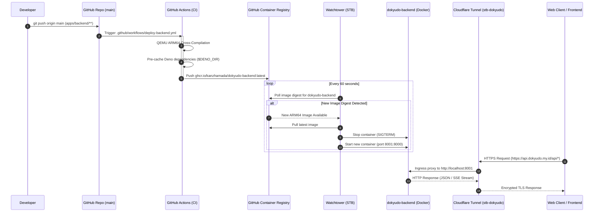

# Dokyudo Backend Server CI/CD & STB Deployment

## 1. Core Logic
Dokyudo's primary API backend web server (`apps/backend`) is deployed on an on-premise ARM64 Set-Top Box (Amlogic S905X running Armbian Linux) using Docker containers, managed autonomously through a Continuous Integration / Continuous Deployment (CI/CD) pipeline.

Whenever code modifications occur within `apps/backend/**` on the `main` branch, GitHub Actions executes an automated multi-stage ARM64 Docker build using QEMU and Docker Buildx. The resulting image is published to GitHub Container Registry (GHCR) as `ghcr.io/kanzhamada/dokyudo-backend:latest`.

On the STB node, a local **Watchtower** daemon continuously polls GHCR, automatically pulling updated images and restarting the container gracefully with zero manual intervention. Public inbound traffic is routed through **Cloudflare Tunnel (`cloudflared`)** directly to `https://api.dokyudo.my.id`.

---

## 2. Flow Diagram



---

## 3. Completion Timestamp
**Completed At:** 2026-08-16T22:00:51+07:00

---

## 4. File Mapping

### Created Files:
- `.github/workflows/deploy-backend.yml`: GitHub Actions workflow with path filtering for `apps/backend/**` that cross-compiles ARM64 Docker images and pushes to GHCR.
- `apps/backend/Dockerfile`: Multi-stage Deno Alpine Docker build file with `$DENO_DIR` cache preservation and integrated health checks.
- `apps/backend/.dockerignore`: Docker build ignore configuration protecting local secrets, node modules, and benchmarks from entering the image.
- `docs/backend/ci-cd-backend-server.md`: Architectural reference and operational manual for backend STB deployment.

### Modified Files:
- `apps/backend/src/main.ts`: Configured to use `getEnv("API_URL")` and `getEnv("PORT")` for consistent OpenAPI server specs and startup banners inside Docker.
- `apps/backend/src/config/env.ts`: Enhanced `getEnv()` with defensive stripping of surrounding quotation marks (`"` and `'`) from Docker `--env-file` injection.
- `apps/backend/src/config/redis.ts`: Switched to `getEnv()` for sanitized Upstash Redis connection parameters.
- `apps/backend/src/config/drizzle.ts`: Switched to `getEnv("DATABASE_URL")` for transaction pooler connectivity.
- `apps/backend/src/config/supabase.ts`: Switched to `getEnv()` for Supabase client configuration.
- `apps/backend/src/config/resend.ts`: Switched to `getEnv()` for Resend email API configuration.
- `apps/backend/src/config/stripe.ts`: Switched to `getEnv()` for Stripe secrets and webhook verification.

---

## 5. System Connections & Port Layout

```
                                  Cloudflare Edge Network
                                 (https://api.dokyudo.my.id)
                                             │
                                             ▼ (Zero Trust Tunnel: stb-dokyudo)
┌────────────────────────────────────────────┼────────────────────────────────────────────────────────┐
│ STB Host Node (192.168.0.118)              │                                                        │
│                                            ▼                                                        │
│   Host Port: 8001 ──► Container Port: 8000 [dokyudo-backend (Deno + Hono)]                          │
│                                            │                                                        │
│   ┌────────────────────────────────────────┼────────────────────────────────────────────────────┐   │
│   │ Downstream Connections                 │                                                    │   │
│   │                                        ▼                                                    │   │
│   │ • MinIO Internal Operations:   http://192.168.0.118:9000 (HeadObject / DeleteObject)        │   │
│   │ • MinIO Presigned URLs:        https://s3.dokyudo.my.id (Sent to Client Browsers)           │   │
│   │ • STB Extraction Worker:       http://192.168.0.118:8080 (Document Chunking & PDF Extract) │   │
│   │ • Relational DB:               Supabase PostgreSQL Transaction Pooler (Port 6543)          │   │
│   │ • Vector Database:             Upstash Vector REST API (1024-dim BGE-M3 / 768-dim Gemini)   │   │
│   │ • Key-Value / Rate Limiting:   Upstash Redis REST API                                       │   │
│   │ • Cloudflare Workers AI:       @cf/baai/bge-m3 Embedding Inference (REST API)              │   │
│   └─────────────────────────────────────────────────────────────────────────────────────────────┘   │
└─────────────────────────────────────────────────────────────────────────────────────────────────────┘
```

---

## 6. Architectural Decisions

1. **Migration from Deno Deploy to Bare-Metal STB Node**:
   - **Rationale**: Keeps the complete compute and storage topology on sovereign, self-hosted hardware (Amlogic S905X ARM64) while retaining cloud failovers for serverless databases (Supabase, Upstash).
   - **Cost**: $0/month operational footprint with zero cloud compute limits or egress charges.

2. **Deno Multi-Stage Docker Build with `$DENO_DIR` Cache**:
   - **Problem**: Default single-stage Deno builds or builds without caching download npm/jsr dependencies at container boot time.
   - **Solution**: The Dockerfile utilizes a two-stage build where `DENO_DIR=/deno-dir` is populated during `RUN deno cache --allow-import src/main.ts` in Stage 1 and copied via `COPY --from=builder /deno-dir /deno-dir` to Stage 2. The container starts instantly in offline/cached mode without startup network delays.

3. **Host Port Allocation (`8001:8000`)**:
   - **Rationale**: Host port `8000` is already bound to `photoview`. The Dokyudo backend maps host port `8001` to internal container port `8000` (`-p 8001:8000`).

4. **Defensive Environment Variable Sanitization**:
   - **Problem**: Passing environment files through Docker `--env-file` retains literal wrapping quotation marks (e.g. `UPSTASH_REDIS_REST_URL="https://..."`), causing URL parsers to fail with `UrlError`.
   - **Solution**: `getEnv()` in `src/config/env.ts` defensively detects and strips surrounding single and double quotation marks before passing values to database and API clients.

5. **Dual MinIO Endpoint Architecture**:
   - **Public Endpoint (`S3_ENDPOINT=s3.dokyudo.my.id`)**: Used strictly when generating Presigned URLs for client browsers located on the public internet.
   - **Internal Endpoint (`S3_INTERNAL_ENDPOINT=192.168.0.118:9000`)**: Used for direct backend-to-storage verification calls (`checkObjectExists`, `deleteObject`) over the local gigabit LAN, eliminating tunnel round-trips and Cloudflare upload payload limits.

6. **Unified Cloudflare Ingress Routing**:
   - Instead of provisioning separate tunnels, the backend endpoint is added as a Published Application route (`api.dokyudo.my.id` -> `http://localhost:8001`) under the existing active tunnel `stb-dokyudo` (ID `448b2e8f-c9d3-4aff-b037-50e9e6c5a30d`).

---

## 7. Deployment & Operations Runbook

### Starting the Container on the STB

```bash
docker run -d \
  --name dokyudo-backend \
  --restart unless-stopped \
  -p 8001:8000 \
  --env-file /mnt/hdd/dokyudo-backend/.env \
  ghcr.io/kanzhamada/dokyudo-backend:latest
```

### Checking Logs & Health

```bash
# View live container output
docker logs -f dokyudo-backend

# Test local endpoint
curl http://localhost:8001/health

# Test public ingress endpoint
curl https://api.dokyudo.my.id/health
```

---

## 8. Troubleshooting Reference

### Error 1: Upstash Redis `UrlError` (Quotes in `.env`)
- **Symptom**: `UrlError: Upstash Redis client was passed an invalid URL. Received: ""https://...""`
- **Cause**: Value in `.env` was enclosed in quotation marks, passed literally by Docker `--env-file`.
- **Fix**: Code updated with defensive quote stripping in `getEnv()`. Remove quotes from `.env` on host as best practice.

### Error 2: Cloudflare Error 1033 (Tunnel Not Found)
- **Symptom**: `Error 1033 Ray ID ... Cloudflare Tunnel error`
- **Cause**: DNS record was pointed to an unmanaged or stale tunnel ID instead of the active `stb-dokyudo` tunnel.
- **Fix**: Execute `cloudflared tunnel route dns --overwrite-dns <ACTIVE_TUNNEL_ID> api.dokyudo.my.id` or update the CNAME record target in the Cloudflare DNS dashboard.
