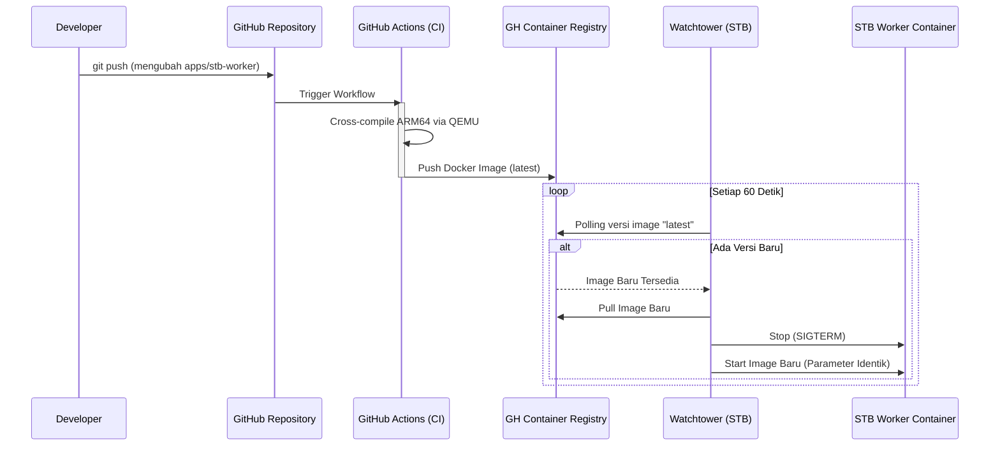

# STB Worker CI/CD Pipeline

## 1. Core Logic
Dokumentasi ini menjelaskan arsitektur *Continuous Integration & Continuous Deployment* (CI/CD) yang dibangun khusus untuk deployment `stb-worker` ke mesin Edge/STB (Amlogic S905X - ARM64). Pipeline ini mengadopsi pola **Push-and-Forget**. Setiap kali *developer* melakukan `git push` ke GitHub yang mengubah file di dalam `apps/stb-worker`, GitHub Actions akan merakit *Docker image* secara otomatis dan memublikasikannya ke GitHub Container Registry (GHCR). Di sisi klien (STB), sebuah agen bernama **Watchtower** akan terus memantau GHCR dan secara mandiri menarik (*pull*) serta menghidupkan versi *image* terbaru tanpa *downtime* yang signifikan.

## 2. Flow Diagram


## 3. Completion Timestamp
**Completed At:** 2026-06-27T15:15:00+07:00 (WIB)

## 4. File Mapping
- **Created:**
  - `.github/workflows/deploy-stb-worker.yml` (Skrip GitHub Actions CI yang melakukan kompilasi dan autentikasi ke GHCR)
  - `apps/stb-worker/Dockerfile` (Instruksi perakitan image berbasis *Multi-Stage Build*)
  - *(Deprecated)* `deploy_worker.sh` (Skrip rsync lokal lama, digantikan sepenuhnya oleh CI/CD ini)

## 5. Connections
- **GitHub Actions (Cloud):** Berjalan di atas *runner* x86 Ubuntu milik GitHub, bertugas mengolah kode menjadi *container image*.
- **GitHub Container Registry (GHCR):** Menjadi titik transit / penyimpanan *image* publik yang menjembatani GitHub Actions (Cloud) dengan mesin STB lokal.
- **Watchtower (STB Edge):** Agen berbasis Docker lokal yang mengeksekusi *lifecycle* manajemen (Stop, Pull, Run) secara otonom di mesin STB.

## 6. Architectural Decisions
- **Multi-Stage Build Dockerfile:** Sangat krusial untuk perangkat *Edge* dengan *storage* & memori terbatas. Stage 1 merakit *virtual environment* Python dan menampung *cache*, lalu Stage 2 hanya meng-copy hasil instalasi yang matang, menyusutkan ukuran *image* akhir hingga lebih dari 50%.
- **Cross-Compilation (QEMU):** Karena GitHub *runners* standar menggunakan arsitektur AMD64/x86_64 sementara STB berjalan pada Aarch64 (ARM64), kompilasi konvensional akan menghasilkan *image* yang mengalami `exec format error` di STB. Penggunaan `docker/setup-qemu-action` di dalam GitHub Actions mengizinkan *runner* x86 meniru *instruction set* ARM64 untuk mem- *build* *image* yang kompatibel secara *native*.
- **Watchtower Polling vs Webhook:** Memilih *polling* interval 60 detik di dalam *Watchtower* alih-alih membuka *port* untuk *webhook inbound* dari GitHub ke STB. Keputusan ini menghapus kebutuhan untuk merutekan trakhik *webhook* manajemen masuk melalui Cloudflare Tunnel, sehingga STB tidak memiliki permukaan serangan (attack surface) administratif yang terekspos ke internet luar. Keamanannya terjamin (*outbound-only polling*).
- **DOCKER_API_VERSION Fallback:** Menanamkan `-e DOCKER_API_VERSION=1.44` pada *Watchtower* karena Daemon Docker yang terinstal di Armbian OS STB memblokir klien versi usang.

## 7. Step-by-Step Installation Guide

Berikut adalah langkah-langkah *end-to-end* mengaplikasikan CI/CD ini dari awal:

### Langkah A: Persiapan Repository (Di Laptop)
1. Buka project Dokyudo di laptop kamu.
2. Pastikan file `.github/workflows/deploy-stb-worker.yml` dan `apps/stb-worker/Dockerfile` sudah ada dan di-*commit*.
3. Lakukan `git push origin main`.
4. Buka tab **Actions** di GitHub dan tunggu hingga proses "*Deploy STB Worker*" berstatus **Hijau (Sukses)**. Ini memakan waktu 3-5 menit karena adanya proses *cross-compilation* QEMU.

### Langkah B: Menjadikan Image Publik (GHCR)
Secara default, image GHCR bersifat privat. Agar STB (Watchtower) bisa men-*download* tanpa perlu berurusan dengan token login:
1. Buka profil GitHub kamu ➔ Tab **Packages**.
2. Klik package `dokyudo-stb-worker`.
3. Buka **Package Settings** di kanan bawah.
4. Pada bagian *Danger Zone*, ubah visibility menjadi **Public**.

### Langkah C: Mematikan Bare-Metal Service (Di STB)
Buka terminal SSH STB, dan matikan *systemd* lama:
```bash
systemctl stop stb-worker
systemctl disable stb-worker
```

### Langkah D: Menjalankan Worker via Docker (Di STB)
Jalankan perintah berikut. Pastikan untuk mengubah `USERNAME_GITHUB` dengan username asli.
```bash
docker run -d \
  --name stb-worker \
  --restart always \
  -p 8080:8080 \
  -v /mnt/hdd/worker_tmp:/mnt/hdd/worker_tmp \
  --env-file /root/stb-worker/.env \
  ghcr.io/USERNAME_GITHUB/dokyudo-stb-worker:latest
```

### Langkah E: Menjalankan Watchtower (Di STB)
Jalankan Watchtower untuk memulai proses pengawasan dan *auto-deploy*:
```bash
docker run -d \
  --name watchtower \
  --restart always \
  -e DOCKER_API_VERSION=1.44 \
  -v /var/run/docker.sock:/var/run/docker.sock \
  -v /root/.docker/config.json:/config.json \
  containrrr/watchtower \
  --interval 60 \
  --cleanup \
  stb-worker
```
Keterangan:
- `--interval 60`: Mengecek ke internet setiap 60 detik.
- `--cleanup`: **(Penting!)** Otomatis menghapus image Docker versi lama agar SSD STB tidak cepat penuh (Dangling images).

---

## 8. Troubleshooting & Bugs Encountered

Selama proses perakitan, berikut adalah *bug* yang sempat ditemui beserta solusinya sebagai catatan di masa depan:

### Bug 1: Error `403 Forbidden` saat `docker run` GHCR
- **Gejala:** Muncul pesan `docker: Error response from daemon: unknown: failed to resolve reference "ghcr.io/...": unexpected status from HEAD request... 403 Forbidden`.
- **Penyebab:** Image di GHCR berstatus Privat, namun kredensial Git di STB tidak memiliki scope `read:packages`, ATAU *Github Actions* di awan belum selesai mem-*build* image (sehingga image memang belum ada).
- **Solusi:** Tunggu Github Actions selesai 100%, lalu ubah pengaturan paket (package visibility) di GitHub dari Private menjadi Public.

### Bug 2: Error `mkdir /mnt/hdd/docker/containers/... no such file or directory`
- **Gejala:** Docker menolak menjalankan kontainer dengan pesan *no such file or directory* pada *data-root* Docker.
- **Penyebab:** STB sebelumnya mengalami penggantian *storage* fisik dari HDD ke SSD, sedangkan *service* Docker Daemon masih menyala memegang sisa-sisa state memori struktur *inode* dari format disk lama.
- **Solusi:** Restart service docker `systemctl restart docker`. Ini memaksa Docker menyusun ulang hierarki folder *data-root*-nya pada partisi/disk SSD yang baru.

### Bug 3: Watchtower Crash dengan Error `client version 1.25 is too old`
- **Gejala:** Watchtower tewas (`Exited (1)`) saat baru dinyalakan. Log `docker logs watchtower` memunculkan `Minimum supported API version is 1.44`.
- **Penyebab:** Docker CE (Daemon) versi terbaru di Armbian Aarch64 menolak komunikasi dari *internal Docker client* bawaan Watchtower yang menawar komunikasi dengan API versi usang (1.25).
- **Solusi:** Paksa Watchtower menggunakan API versi terbaru dengan menambahkan flag *Environment Variable* `-e DOCKER_API_VERSION=1.44` pada argumen eksekusi kontainernya.
