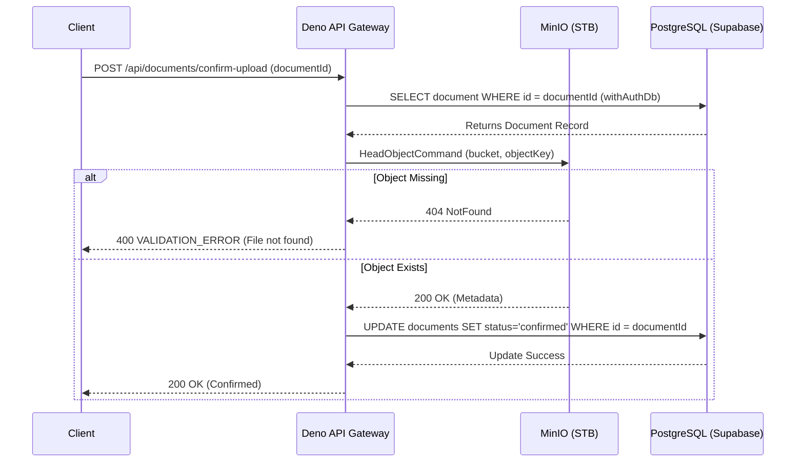

# Document Metadata & Upload Callback

## 1. Core Logic
Fitur ini (`POST /api/documents/confirm-upload`) bertugas memverifikasi unggahan dokumen dari klien ke MinIO (STB). Ketika klien selesai mengunggah via presigned URL, klien menembak endpoint ini dengan `documentId`. Backend lalu mengecek kebenaran file tersebut langsung ke MinIO menggunakan `HeadObjectCommand`. Jika valid, status dokumen di tabel `documents` diupdate dari `pending` menjadi `confirmed`.

## 2. Flow Diagram

## 3. Completion Timestamp
**Completed At:** 2026-06-27T12:24:00+07:00 (WIB)

## 4. File Mapping
- **Created/Modified:**
  - `apps/backend/src/modules/documents/documents.schema.ts` (Ditambah `ConfirmUploadBodySchema`, `ConfirmUploadResponseSchema`)
  - `apps/backend/src/modules/documents/documents.routes.ts` (Ditambah route `/confirm-upload`)
  - `apps/backend/src/modules/documents/documents.controller.ts` (Ditambah `handleConfirmUpload`)
  - `apps/backend/src/modules/documents/documents.service.ts` (Ditambah fungsi `confirmUpload` dengan Drizzle `update`)
  - `apps/backend/src/shared/utils/s3.util.ts` (Ditambah fungsi `checkObjectExists` menggunakan AWS SDK `HeadObjectCommand` + `NoSuchKey` handling)
  - `apps/backend/src/modules/documents/documents.routes.test.ts` (Ditambah *integration tests* khusus `/confirm-upload` mencakup skenario 400, 401, dan 404)
  - `api-collections/Documents/02_Confirm Document Upload.bru` (Renamed & updated endpoint Bruno)

## 5. Connections
- **Database:** Menggunakan pola Drizzle + `withAuthDb` untuk menyeleksi dan melakukan *update* pada tabel `documents`. Row Level Security (RLS) sangat krusial di sini untuk mencegah mutasi data lintas-tenant.
- **Server/MinIO:** Menggunakan `HeadObjectCommand` yang dieksekusi secara asinkron dari Deno untuk mengecek ketersediaan file tanpa men-download-nya secara utuh (bandwidth friendly).
- **Frontend/Client:** Endpoint menerima request dari client dan menjadi katalis pengubah `pending` -> `confirmed`.

## 6. Architectural Decisions
- **Decoupled Verification:** Klien mengirimkan sinyal "sudah selesai", namun Backend tidak langsung percaya. Backend memastikan secara mandiri (melalui `checkObjectExists`) bahwa S3 Object benar-benar ada sebelum menandai status menjadi `confirmed` di Database. Hal ini melindungi sistem dari *false positives*.
- **$0 Cost Egress:** Dengan menggunakan `HeadObject`, kita hanya mengambil header file, tidak ada *payload* (body) yang diunduh. Penghematan drastis memori Deno dan *egress* Edge server.
- **Handling AWS SDK Quirks:** Menambahkan *handling* pengecualian untuk `NotFound` dan `NoSuchKey`, serta status HTTP 404 secara eksplisit pada MinIO (STB) agar *graceful degradation* berujung pada error validasi 400 (bukan crash server 500).
- **RLS Protection:** *Update operation* wajib menggunakan `tenantId` dari token, yang dieksekusi melalui `withAuthDb` (Local `authenticated` Role + Session Claims) untuk menjamin isolasi multitenant di DB.
