# Database Multi-Tenancy Data Isolation Architecture

## Core Logic

This document details the multi-tenant data isolation architecture implemented across the Dokyudo database models (`db.model.ts`) and backend microservices (`documents`, `rag`, `search`). 

Every tenant operates in strict isolation where data access is scoped by `tenant_id`. Single Primary Key (`id` UUID) with explicit Application-Layer Guarding (`WHERE tenant_id = X AND id = Y`) and PostgreSQL Row-Level Security (RLS) is adopted as the industry-standard architecture instead of Composite Primary Keys `(tenant_id, id)`.

### Key Enhancements Implemented
1. **RAG History Isolation**: Updated `streamChat` and `getConversation` in `rag.service.ts` to strictly scope `conversation_turns` queries by `and(eq(conversationTurns.conversationId, conversationId), eq(conversationTurns.tenantId, tenantId))`.
2. **Search Hydration Defense-in-Depth**: Updated `executeHybridSearch` in `search.service.ts` to enforce `eq(documentChunks.tenantId, tenantId)` when hydrating top search results.
3. **Storage Bucket Prefix Isolation**: MinIO/S3 object paths are prefixed with `${tenantId}/${storagePath}`.
4. **Isolated Test Suite Verification**: Verified 40/40 Deno unit test steps across `documents.service.test.ts`, `rag.service.test.ts`, and `search.service.test.ts`.

---

## Flow Diagram

```mermaid
sequenceDiagram
    autonumber
    participant Client as Frontend Client
    participant Controller as Hono Controller
    participant Service as Backend Service
    participant DB as PostgreSQL (Supabase)
    participant Vector as Upstash Vector

    Client->>Controller: HTTP Request (Bearer JWT)
    Controller->>Controller: ContextExtractor.extractAuthContext()
    Note over Controller: Extracts tenantId & userId from JWT Claims

    Controller->>Service: Service.method({ tenantId, userId, payload })
    
    rect rgb(35, 35, 35)
        Note over Service: Application Layer Guard Execution
        Service->>DB: SELECT / UPDATE / DELETE with where(and(eq(id, targetId), eq(tenantId, tenantId)))
        DB-->>Service: Returns matching rows (0 if tenantId mismatch)
    end

    alt Tenant ID matches
        Service->>Vector: Query vector index (filter: "tenantId = '...'")
        Vector-->>Service: Return isolated vectors
        Service-->>Client: 200 OK + Scoped Data Payload
    else Tenant ID mismatch / Not Found
        Service-->>Client: 404 Not Found (Data Leak Prevention)
    end
```



---

## Completion Timestamp

**Date & Time Completed**: 2026-08-06T11:55:00+07:00

---

## File Mapping

| File Path | Action | Description |
|---|---|---|
| `apps/backend/src/shared/models/db.model.ts` | Reference | Defines multi-tenant schema with `tenant_id` columns, FKs, and Composite Indexes |
| `apps/backend/src/modules/rag/rag.service.ts` | Modified | Added explicit `tenantId` filtering on `conversation_turns` history and turn detail queries |
| `apps/backend/src/modules/search/search.service.ts` | Modified | Added explicit `tenantId` filtering on `documentChunks` hydration query |
| `apps/backend/src/modules/documents/documents.service.ts` | Reference | Verified strict `tenantId` filtering across confirm, delete, batch-delete, list, and preview methods |
| `apps/backend/src/modules/rag/rag.service.test.ts` | Modified | Verified multi-tenant chat streaming, history retrieval, and cancellation handling |
| `apps/backend/src/modules/documents/documents.service.test.ts` | Modified | Verified multi-tenant document upload, deletion, batch cleanup, and presigned GET/PUT |
| `docs/backend/database-multi-tenancy-isolation.md` | Created | Second Brain documentation for multi-tenancy data isolation |

---

## Connections

```
[ Frontend Client ]
        │ (Authorization: Bearer <JWT>)
        ▼
[ Hono ContextExtractor ] ──── Extracts tenantId from JWT claim
        │
        ▼
[ Deno Services ] (documents.service / rag.service / search.service)
        │
        ├───────────────────────────────────────────┐
        ▼                                           ▼
[ PostgreSQL / Supabase ]                   [ Upstash Vector / MinIO S3 ]
• WHERE tenant_id = X AND id = Y            • Metadata Filter: "tenantId = 'X'"
• Foreign Key CASCADE / RESTRICT            • S3 Path Prefix: "X/<storage_path>"
• Row-Level Security (RLS)
```

---

## Architectural Decisions

1. **Single UUID PK vs Composite Primary Key `(tenant_id, id)`**:
   - **Decision**: Use globally unique UUID (`id`) as Primary Key, supported by explicit `tenant_id` column and Composite Indexes `(tenant_id, created_at)`.
   - **Rationale**: UUIDv4/UUIDv7 has a $2^{128}$ collision space (effectively 0 collision probability). Composite PK `(tenant_id, id)` forces composite FKs across all child tables (`document_chunks`, `conversation_turns`), creating unnecessary ORM complexity without added security. Single PK + Application Guard provides standard REST URL support (`/api/documents/:id`) with 100% data isolation.

2. **Defense-in-Depth Query Filtering**:
   - **Decision**: Every query (including sub-queries like RAG history and chunk hydration) explicitly enforces `tenant_id` in its `WHERE` clause.
   - **Rationale**: Relying solely on parent record lookup (e.g. checking `conversations` before fetching `conversation_turns`) leaves a potential window for data leakage if sub-queries are refactored or called independently. Adding `eq(table.tenantId, tenantId)` to all child table queries eliminates any risk of cross-tenant data access.

3. **404 Not Found Masking**:
   - **Decision**: Return `404 Not Found` when a `tenant_id` mismatch occurs.
   - **Rationale**: Returning `403 Forbidden` reveals that the resource ID exists in the database. Returning `404 Not Found` completely hides the existence of another tenant's resources from malicious attackers.
