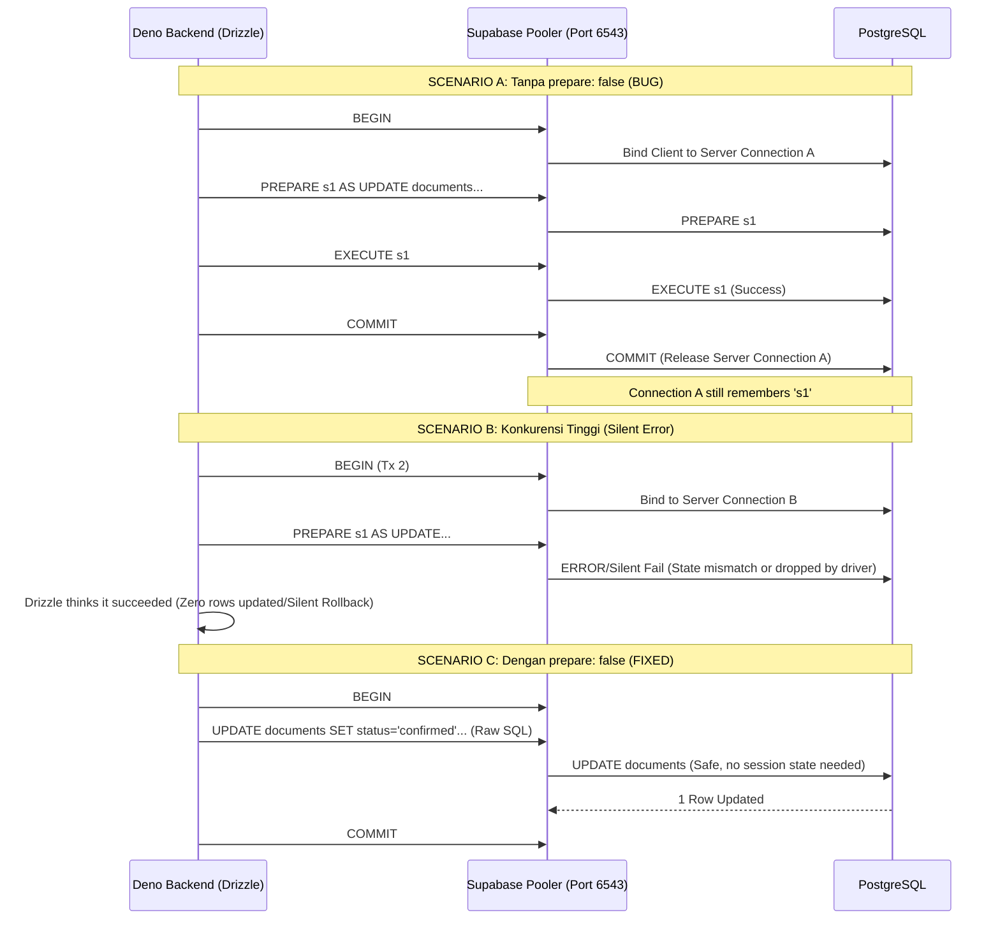

# Supabase PgBouncer & Drizzle Prepared Statements Bug

## 1. Core Logic & Background
Aplikasi ini menggunakan **Supabase PostgreSQL** sebagai basis data dan **Drizzle ORM** (dengan driver `postgres.js`) sebagai query builder.

Secara default, `postgres.js` menggunakan fitur **Prepared Statements** (mengirim perintah `PREPARE` dan `EXECUTE` ke PostgreSQL) untuk mengoptimalkan performa eksekusi query. Di sisi lain, Supabase menyediakan dua jenis koneksi database:
- **Session Mode (Port 5432)**: Koneksi *dedicated* satu per satu ke database.
- **Transaction Mode Pooler (Port 6543 / Supavisor / PgBouncer)**: Menggabungkan (multiplexing) koneksi ke PostgreSQL untuk mendukung ribuan koneksi bersamaan dari aplikasi Serverless/Edge (seperti Deno Deploy).

**Isu Kritis:**
PgBouncer dalam **Transaction Mode** TIDAK MENDUKUNG Prepared Statements. Dalam mode ini, PgBouncer mencabut koneksi fisik (server connection) dari klien ketika sebuah transaksi selesai (COMMIT/ROLLBACK), dan memberikannya ke klien lain. Karena Prepared Statements pada PostgreSQL disimpan pada level *Session/Connection*, hal ini menyebabkan *state* koneksi menjadi kacau. 
Jika sebuah aplikasi memaksakan penggunaan Prepared Statements melalui PgBouncer Transaction Mode di lingkungan konkuren tinggi, operasi seperti `UPDATE` di dalam sebuah `db.transaction()` dapat mengalami **silent rollback** (perintah `EXECUTE` gagal dijalankan tanpa mengembalikan error ke aplikasi).

## 2. Bug History: The "Silent Pending" Document Upload

**Gejala Bug:**
Ketika pengguna mengunggah banyak dokumen secara bersamaan (Batch Upload), UI menampilkan notifikasi sukses dan API `confirm-upload` membalikkan status `200 OK`. Namun, hanya 1 dokumen yang statusnya berubah menjadi `processed`, sedangkan sisa dokumen lainnya nyangkut (*stuck*) di status `pending`. STB Worker tidak pernah memproses dokumen yang `pending` tersebut.

**Flow Penemuan:**
1. Log pada frontend dan backend menunjukkan bahwa eksekusi endpoint `confirm-upload` (yang memanggil fungsi `db.transaction()` berisi 2 query: UPDATE `documents` dan UPDATE `tenant_subscriptions`) diselesaikan dengan sukses secara konkuren untuk seluruh 9 dokumen.
2. Tidak ada error (exception) yang dilempar oleh Drizzle, dan backend log tidak mencetak `"db_update_error"`.
3. Namun, Supabase Realtime hanya memancarkan 1 buah *event* `UPDATE` untuk batch pertama yang terdiri dari 5 dokumen.
4. Karena trigger untuk *webhook* STB (`notify_document_uploaded`) bergantung pada status berubah menjadi `confirmed`, webhook tidak tertrigger untuk 4 dokumen lainnya.
5. Pemeriksaan skrip konkurensi (simulasi `db.transaction()`) menunjukkan bahwa ketika beberapa query dijalankan paralel di bawah satu instans koneksi `postgres.js` yang terhubung ke Port 6543 tanpa flag `prepare: false`, driver ini akan menyebabkan kegagalan transaksional secara diam-diam. Drizzle menganggap transaksi berhasil, padahal row tidak di-update.

## 3. Resolusi
Solusinya adalah mematikan fitur Prepared Statements secara paksa pada tingkat driver `postgres.js`. Ini adalah persyaratan mutlak (mandatory requirement) setiap kali menggunakan PgBouncer Transaction Mode di Supabase dengan `postgres.js`.

**File yang Diperbarui:** `apps/backend/src/config/drizzle.ts`
```typescript
const queryClient = postgres(Deno.env.get("DATABASE_URL") as string, {
    max: 10,
    idle_timeout: 20,
    max_lifetime: 60 * 30,
    prepare: false, // <-- WAJIB: Mematikan Prepared Statements untuk kompatibilitas PgBouncer
});
```

Dengan konfigurasi ini, seluruh Drizzle API akan selalu menggunakan mode kueri sederhana (simple query protocol) alih-alih extended query protocol, mencegah PgBouncer mencampuradukkan sesi *prepared statements*.

## 4. Flow Diagram


## 5. File Mapping & Architectural Decisions
- **`apps/backend/src/config/drizzle.ts`**: Lokasi di mana `postgres.js` diinisialisasi.
- **Architectural Decision**: Harus **selalu** menggunakan `prepare: false` setiap kali `DATABASE_URL` mengarah ke port 6543 (PgBouncer/Supavisor). Jangan pernah menghapus parameter ini kecuali Supabase diakses melalui port 5432 (direct connection), namun direct connection sangat tidak disarankan untuk aplikasi edge/serverless karena akan menyebabkan *connection exhaustion* (kehabisan koneksi maksimal PostgreSQL).

## 6. Completion Timestamp
**Completed At:** 2026-07-24T21:49:00+07:00 (WIB)
