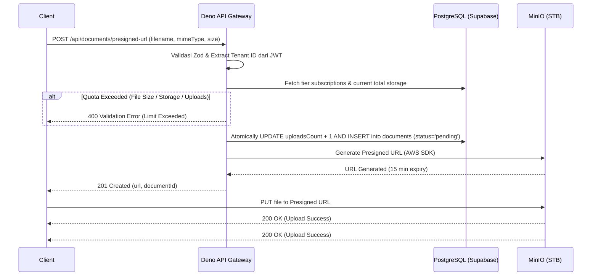

# MinIO Presigned URL Generation

## 1. Core Logic
Fitur ini bertanggung jawab untuk memberikan klien akses upload langsung (direct upload) ke MinIO On-Premise (STB) secara aman tanpa membebani bandwith backend Deno. Klien (Frontend) meminta Presigned URL, backend memvalidasi JWT (tenantId) dan metadata file, mengecek *Tier Subscription Quota* pengguna (file size, total uploads, total storage). Jika semua valid, backend akan menaikkan `uploadsCount` secara atomik, lalu menghasilkan URL AWS S3 Presigned yang valid selama 15 menit. Backend juga membuat record dokumen dengan status `pending` di tabel `documents`.

## 2. Flow Diagram

## 2.5 Upload Cancellation
Jika klien memutuskan untuk membatalkan unggahan (*AbortController* di *frontend*), klien cukup memanggil endpoint `DELETE /api/documents/:id`. Endpoint ini secara otomatis akan menghapus status `pending` di PostgreSQL dan memastikan file di MinIO (jika ada *partial upload*) ikut terhapus.

## 3. Completion Timestamp
**Completed At:** 2026-07-02T15:27:00+07:00 (WIB)

## 4. File Mapping
- **Created/Modified:**
  - `apps/backend/src/modules/documents/documents.schema.ts` (Zod schemas)
  - `apps/backend/src/modules/documents/documents.controller.ts` (Hono handler)
  - `apps/backend/src/modules/documents/documents.service.ts` (Business logic, S3 generation, DB insertion via `withAuthDb`)
  - `apps/backend/src/modules/documents/documents.routes.ts` (Hono OpenAPI routes)
  - `apps/backend/src/modules/documents/documents.routes.test.ts` (HTTP integration testing)
  - `apps/backend/src/shared/utils/s3.util.ts` (AWS SDK S3 wrapper)
  - `apps/backend/src/main.ts` (Mounting document routes)
  - `/etc/default/minio` (STB MinIO Config - fixing HDD mounts and permissions)

## 5. Connections
- **Database:** Memasukkan record ke tabel `documents` menggunakan Drizzle dengan membungkus transaksi menggunakan `withAuthDb(tenantId)` untuk menegakkan Supabase RLS.
- **Server:** Menggunakan npm `@aws-sdk/client-s3` dan `@aws-sdk/s3-request-presigner` via Deno HTTP.
- **Frontend/Client:** Client langsung mengirim file ke STB MinIO (yang diekspos melalui Cloudflare Tunnel `s3.dokyudo.my.id`).

## 6. Architectural Decisions
- **$0 Cost Push-Over-Pull Architecture**: Menggunakan presigned URL agar file besar tidak singgah di memory Deno (Edge/Serverless), menghindari *timeout* dan biaya *egress* yang membengkak.
- **Ext4 HDD Migration on STB**: Menghadapi masalah performa I/O (Error 503 SlowDownWrite) saat STB menggunakan filesystem loopback NTFS/exFAT. Solusi final memindahkan partisi fisik ke `ext4` murni di `/mnt/hdd` dan melakukan `chown`/`chmod` yang tepat untuk user MinIO.
- **Tenant-isolated Object Keys**: Menggunakan pola `<tenant_id>/<doc_id>.<ext>` di MinIO agar struktur rapi dan mencegah bentrok ID (collision).
- **Security**: Menggunakan `withAuthDb` (Local Role `authenticated` + JWT Claims) pada insert database untuk memastikan RLS `documents` berjalan secara kokoh di level database.
- **Tier Quota Enforcement (Pre-flight)**: Pengecekan limit (ukuran file maksimal, jumlah unggahan bulanan, & kapasitas storage maksimal) dilakukan *sebelum* `createPresignedUrl` dipanggil, dan *uploadsCount* di-increment secara atomik dalam 1 transaksi DB bersamaan dengan `INSERT pending document` untuk mencegah eksploitasi *race condition*.
