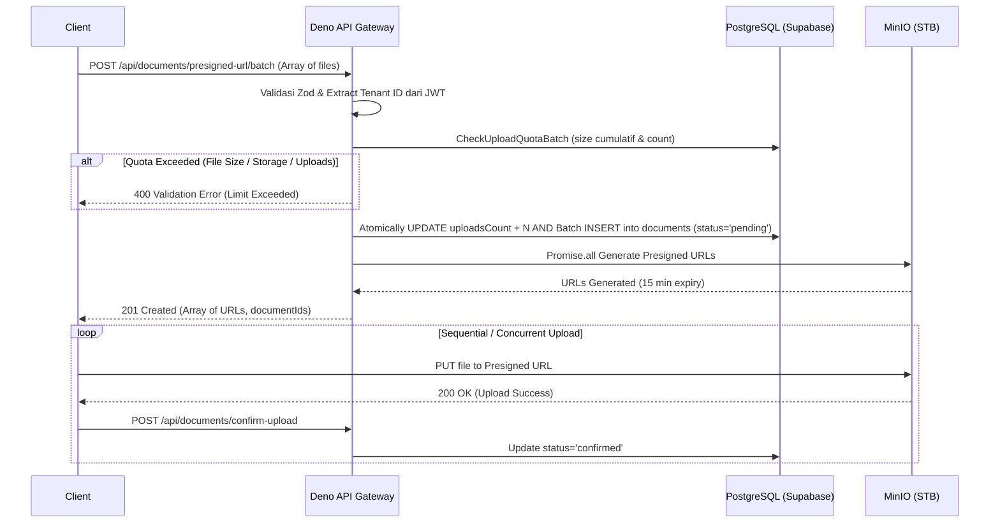

# MinIO Presigned URL Generation (Batch Upload)

## 1. Core Logic
Fitur ini bertanggung jawab untuk memberikan klien akses upload langsung (direct upload) ke MinIO On-Premise (STB) secara aman tanpa membebani bandwith backend Deno. Alur ini kini telah ditingkatkan menjadi **Batch Upload Architecture**. Klien dapat meminta kumpulan *Presigned URL* untuk beberapa file sekaligus (maksimal 10). Backend memvalidasi JWT, mengecek *Tier Subscription Quota* (kumulatif *file size* dan *upload count*), memotong kuota secara atomik, lalu mengembalikan array URL. Backend juga membuat record dokumen (batch insert) dengan status `pending` di tabel `documents`.

## 2. Flow Diagram


## 2.5 Batch Upload Cancellation (`POST /batch-delete`)
Jika klien memutuskan untuk membatalkan unggahan (*Partial Cancel* atau keseluruhan batch), klien tidak menggunakan `DELETE /:id` di dalam *loop* karena tidak efisien, melainkan memanggil endpoint `POST /api/documents/batch-delete` dengan mengirimkan array `documentIds`. Endpoint ini:
1. Membatalkan antrean ekstraksi di STB Worker (jika sudah dikirim).
2. Menghapus vektor dari Upstash.
3. Menghapus fisik file dari MinIO.
4. Menghapus baris di PostgreSQL.
5. **Me-refund kuota upload** (`uploadsCount`) secara otomatis.

## 3. File Mapping
- **Created/Modified:**
  - `apps/backend/src/modules/documents/documents.schema.ts` (Batch Zod schemas)
  - `apps/backend/src/modules/documents/documents.controller.ts` (Batch Hono handlers)
  - `apps/backend/src/modules/documents/documents.service.ts` (Batch insertions, DB transactions, `Promise.all` presigned URL generation)
  - `apps/backend/src/modules/documents/documents.routes.ts` (Hono OpenAPI routes)
  - `apps/backend/src/shared/utils/tier_quota.util.ts` (`checkUploadQuotaBatch` logic)
  - `apps/backend/src/modules/poc/documents.poc.html` (Frontend batch upload simulator)

## 4. Connections
- **Database:** Memasukkan array of records ke tabel `documents` menggunakan Drizzle Batch Insert dengan transaksi `withAuthDb(tenantId)`.
- **Server:** Menggunakan npm `@aws-sdk/client-s3` dan `@aws-sdk/s3-request-presigner` secara konkuren.
- **Frontend/Client:** Client Svelte langsung mengiterasi daftar URL dan mengirim file secara *sequential* (berantai) ke STB MinIO.

## 5. Architectural Decisions
- **$0 Cost Push-Over-Pull Architecture**: Menggunakan presigned URL agar file besar tidak singgah di memory Deno.
- **Batch Processing over Single-file**: Ditingkatkan untuk mendukung array upload. Mengurangi HTTP Overhead secara drastis saat user meng-upload banyak file.
- **Array ID untuk Pembatalan (Bukan `batch_id`)**: Pemilihan `POST /batch-delete` dengan menerima array `documentIds` ketimbang menggunakan pengelompokan `batch_id` di database. Ini memberikan fleksibilitas tertinggi bagi *frontend* untuk melakukan *Partial Cancellation* (hanya membatalkan file yang gagal terupload tanpa menyentuh yang sukses).
- **Security**: Menggunakan `withAuthDb`. Pengecekan kuota bersifat atomik: jika salah satu melanggar, seluruh batch ditolak.

## 6. Completion Timestamp
**Completed At:** 2026-07-14T20:45:00+07:00 (WIB)
## UPDATE (2026-08-31, 15:41 +07:00) — Persyaratan CSP & CORS dari sisi browser

1. **CSP frontend**: origin presigned URL harus ada di `connect-src`. Host publik = **`https://s3.dokyudo.my.id`** (lihat `docs/backend/ci-cd-backend-server.md`), dikonfigurasi via `STORAGE_PUBLIC_URL` di `svelte.config.js` `kit.csp` (dibaca saat build, default statis `https://s3.dokyudo.my.id`). Berlaku untuk: PUT upload (`fetch` di `src/lib/api/documents.ts` dan XHR di `UploadDocumentDialog.svelte`) dan preview PDF (GET presigned yang di-fetch `@embedpdf`). Download via anchor (navigasi) tidak perlu CSP.
2. **Bucket CORS di MinIO WAJIB** (terpisah dari CSP): PUT dengan header `Content-Type` bukan *simple request* → browser mengirim preflight `OPTIONS`; bucket harus menjawab CORS untuk origin `https://dokyudo.my.id`. Contoh rule (`mc cors` / `aws s3api put-bucket-cors`):

   ```json
   {
     "CORSRules": [
       {
         "AllowedOrigins": ["https://dokyudo.my.id"],
         "AllowedMethods": ["PUT", "GET", "HEAD"],
         "AllowedHeaders": ["Content-Type"],
         "ExposeHeaders": ["ETag"],
         "MaxAgeSeconds": 3600
       }
     ]
   }
   ```

   Jangan `AllowedOrigins: "*"` (presigned URL itu kredensial). Tambahkan origin dev (`http://localhost:5173`) untuk pengujian lokal.