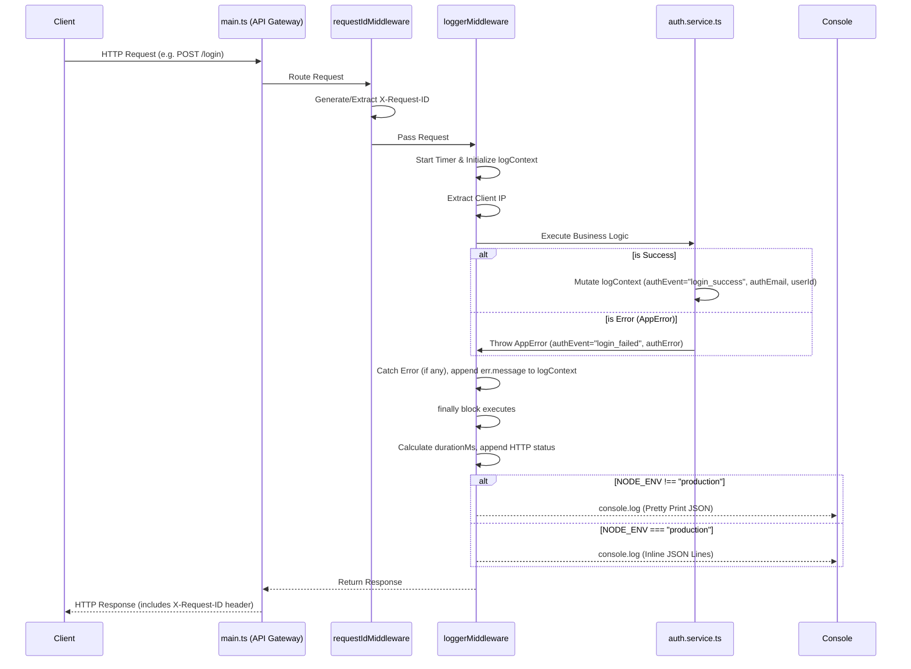

# Observability & Wide Events Logging

## Core Logic
This feature implements the "Wide Events" logging best practice for the Deno backend. Instead of relying on scattered `console.log`, `console.warn`, or `console.error` calls throughout the business logic, the system accumulates context during the HTTP request lifecycle and emits a single, highly structured JSON log entry at the very end of the request. This provides complete traceability, making debugging significantly easier and cheaper since observability tools (like Axiom or Datadog) only need to ingest one comprehensive log per request.

It also includes conditional formatting: logs are pretty-printed in development environments to ease human readability, but serialized as single-line JSON (`NDJSON` / JSON Lines) in production to ensure observability agents can index them efficiently without breaking structures.

## Flow Diagram

## Completion Timestamp
**Completed At:** 2026-06-18 22:15:00 UTC+7

## File Mapping
- **Modified:** `apps/backend/src/shared/middlewares/request.middleware.ts` 
  - Implemented `loggerMiddleware` to capture context, IP (`extractClientIp`), and emit the final JSON log. Added conditional pretty-printing based on `NODE_ENV`.
- **Modified:** `apps/backend/src/shared/types/app.types.ts`
  - Updated Hono `AppEnv` typing to include `logContext: Record<string, any>`.
- **Modified:** `apps/backend/src/shared/types/auth.types.ts`
  - Injected `logContext?: Record<string, any>` into `RegisterParams` and `LoginParams`.
- **Modified:** `apps/backend/src/modules/auth/auth.controller.ts`
  - Extracted `logContext` from Hono context `c.get("logContext")` and passed it down to the service layer.
- **Modified:** `apps/backend/src/modules/auth/auth.service.ts`
  - Replaced all scattered `console.*` calls. Mutated `params.logContext` directly to append business-level information (`authEvent`, `authEmail`, `authError`, `userId`, `failedAttempts`).
- **Modified:** `apps/backend/src/main.ts`
  - Registered `loggerMiddleware` globally. Removed redundant `console.error` from the global `onError` handler since `loggerMiddleware`'s `finally` block captures and logs the error efficiently.

## Connections
- **Database:** Does not interact directly with the database for logs. This is intentional to prevent database bloat during traffic spikes.
- **Server:** Runs as a global Hono middleware. All incoming HTTP traffic passes through it, ensuring 100% log coverage for the API.
- **Frontend:** Receives `X-Request-ID` in the HTTP Response Headers. The frontend can utilize this ID in bug reports (e.g., Sentry) so developers can easily query the exact Wide Event log that corresponds to a user's failed request.

## Architectural Decisions
- **Why Wide Events over scattered logs?** In modern cloud architectures, searching for a single log containing 30 properties is much faster, cheaper, and less prone to race conditions than searching for 5 different log lines tied together by a transaction ID.
- **Why not save logs to PostgreSQL?** To protect the database connection pool. Logging to a relational database under heavy load (like a brute-force attack) can cause the entire system to crash. Standard Output (`console.log`) allows the host server (or Docker/Kubernetes agent) to stream logs asynchronously to an observability platform like Axiom or Datadog.
- **Why conditional pretty-printing?** To balance developer experience (DX) and machine parsing. Humans struggle to read dense inline JSON in a local terminal, while machine log-ingestion agents struggle to parse multi-line pretty-printed logs efficiently. Checking `NODE_ENV` provides the best of both worlds.

## RAG Chat Log Fields (Privacy Rules)

RAG pipeline menambahkan field berikut ke `logContext` (`http_request`):

| Field | Isi | Keterangan |
| --- | --- | --- |
| `fallbackTier` / `fallbackChain` | tier & model LLM yang dipakai | metadata, aman |
| `estimatedTokens` / `estimatedQuestionTokens` / `estimatedHistoryTokens` / `estimatedContextTokens` | hitungan token | angka, aman |
| `historyDepth` | jumlah turn history yang dipakai | angka, aman |
| `ragModelUsed` | model aktual setelah seleksi fallback | metadata, aman |
| `ragScopedDocumentIds` | UUID dokumen yang di-scope retrieval (file upload + `@`-mention) | UUID, bukan konten — bukti scoping mention bekerja |
| `ragEvent` / `ragError` / `turnStatus` / `latencyMs` | event & status pipeline | metadata, aman |

**Aturan privasi (diberlakukan 2026-08-10):** teks pertanyaan user **tidak pernah** dicatat di log — `ragRewrittenQuery` (yang memuat hasil rewrite = teks user) telah dihapus. `ragScopedDocumentIds` adalah satu-satunya jejak mention di log; rewrite prompt, history, dan augmented prompt tidak di-log. Hal yang sama berlaku di frontend: payload chat tidak lagi di-`console.log`.
