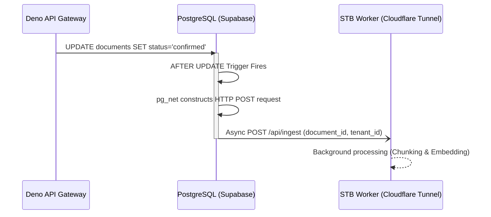

# Supabase pg_net Webhook Trigger

## 1. Core Logic
Fitur ini bertugas mengotomatisasi pengiriman sinyal dari Database (Supabase PostgreSQL) ke MinIO STB Worker secara asinkron menggunakan ekstensi `pg_net`. Ketika `status` dokumen berubah menjadi `confirmed`, *trigger* PostgreSQL secara otomatis menembak *webhook HTTP POST* ke Cloudflare Tunnel milik STB Worker.

## 2. Flow Diagram

## 3. Automatic Daily Resumption (pg_cron)
Sistem ini menggunakan fitur penjadwalan native Supabase (`pg_cron`) untuk melanjutkan pemrosesan dokumen yang tertunda akibat limit Cloudflare TPD (*Tokens Per Day*).
1. Setiap jam **00:05 UTC**, *cron job* mengeksekusi query: `UPDATE documents SET status = 'confirmed' WHERE status = 'quota_exhausted'`.
2. Perubahan status ini secara otomatis akan memicu *trigger* `notify_document_uploaded` yang ada di atas.
3. Webhook akan kembali dikirim ke STB Worker.
4. STB Worker akan melakukan *checkpointing* (`get_last_processed_chunk_index`) dan melanjutkan dari titik berhentinya.

## 4. Completion Timestamp
**Completed At:** 2026-06-27T12:35:00+07:00 (WIB)

## 5. File Mapping
- **Created:**
  - `apps/backend/drizzle/migrations/0002_pgnet_trigger.sql` (File migrasi SQL Drizzle kustom)
  - `docs/management/migrations/pgcron_retry.sql` (SQL untuk mendaftarkan cron job harian)

## 6. Connections
- **Database:** Mengaktifkan ekstensi `pg_net` dan `pg_cron` (native Supabase). Membuat fungsi `notify_document_uploaded` berbasis PL/pgSQL yang terhubung ke `AFTER UPDATE` *trigger*.
- **Worker (STB):** Menerima webhook secara *stateless* dan *async* dengan *payload JSON* berisi identifier yang dibutuhkan.

## 7. Architectural Decisions
- **Event-Driven Database Triggers:** Menggunakan `pg_net` alih-alih melempar HTTP request dari Deno. Keputusan ini menjamin webhook *terjamin (guaranteed)* dikirim hanya jika transaksi database benar-benar di-*commit*, meminimalisasi inkonsistensi data.
- **Async Execution:** Ekstensi `pg_net` berjalan sepenuhnya *asynchronous* tanpa memblokir koneksi database Deno. Transaksi Deno akan langsung ditutup meskipun webhook lambat merespons.
- **Target URL Hardcoding:** URL webhook sementara diisi `https://worker.dokyudo.my.id/api/ingest` (akan disesuaikan dengan infrastruktur *routing* CF Tunnel STB).
- **Trigger `AFTER UPDATE` vs `AFTER INSERT`:** Berbeda dari spesifikasi awal, *trigger* ini sengaja dipasang sebagai `AFTER UPDATE` spesifik saat `status = 'confirmed'`. Hal ini mencegah webhook ditembak sebelum file fisik sepenuhnya terunggah ke MinIO.

## 7. Document Status Lifecycle
Kolom `documents.status` sekarang menggunakan **typed PostgreSQL enum** (`document_status_enum`):

| Status | Makna | Dipicu oleh |
|---|---|---|
| `pending` | Presigned URL digenerate, file belum diunggah | Backend Deno (`createPresignedUrl`) |
| `confirmed` | File berhasil diunggah ke MinIO, trigger menembak webhook | Backend Deno (`confirmUpload`) |
| `processed` | Semua *chunk* berhasil di-*embed* dan diindeks | STB Worker (akhir job) |
| `quota_exhausted` | Kuota harian Cloudflare (TPD) habis di tengah proses | STB Worker (Gatekeeper) |
| `failed` | Error tak terduga — PDF corrupt, jaringan, atau storage gagal | STB Worker / Deno (`confirmUpload`) |

## 8. Completion Timestamp
**Completed At:** 2026-07-14T19:12:00+07:00 (WIB)
