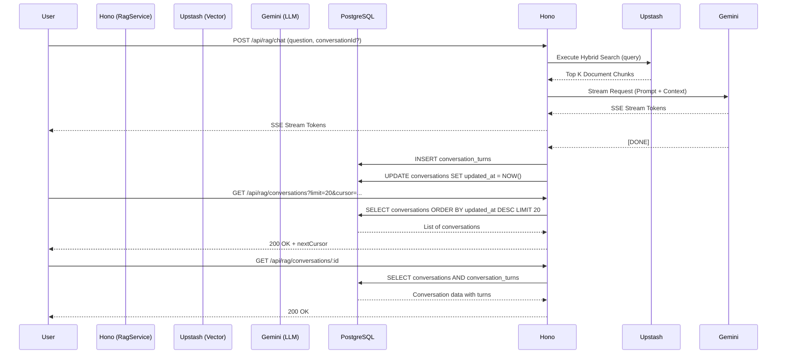

# RAG Streaming & Conversation History

## 1. Core Logic
Fitur ini meng-handle Q&A dari pengguna dengan melakukan *Hybrid Search* (Semantic + Full-Text) ke Upstash Vector, merakit (Context Engineering) hasilnya, dan memberikan jawaban *streaming* menggunakan Google Gemini (SSE Stream). Selain itu, fitur ini juga menyimpan riwayat *chat* ke PostgreSQL dan memungkinkan pengguna mengambil daftar percakapan (*history list*) yang terurut berdasarkan waktu paling mutakhir (berdasarkan *timestamp* turn terakhir).

## 2. Flow Diagram

## 3. Completion Timestamp
**Completed At:** 2026-06-30T18:45:00+07:00 (WIB)

## 4. File Mapping
- `apps/backend/src/modules/rag/rag.service.ts`: Logika *streaming*, *hybrid search*, penyimpanan `updated_at`, dan denormalisasi `contextReferences` saat menyisipkan `conversation_turns`.
- `apps/backend/src/modules/rag/rag.controller.ts`: Endpoint `handleChat`, `handleListConversations`, `handleGetConversation`, `handleUpdateConversationTitle`, `handleDeleteConversation`.
- `apps/backend/src/modules/rag/rag.routes.ts`: Deklarasi OpenAPI Zod untuk semua endpoint di atas.
- `apps/backend/src/modules/rag/rag.schema.ts`: `ContextReferenceSchema`, `ConversationTurnSchema`, dll.
- `apps/backend/src/shared/models/db.model.ts`: Skema tabel `conversations` dan `conversation_turns`.

## 5. Architectural Decisions
- **Push-Over-Pull SSE**: SSE diproses secara *real-time* langsung dari *generator* LLM tanpa antrean polling, menghemat biaya komputasi Edge/Serverless.
- **Write-Time UpdatedAt Touch**: Karena struktur RAG, setiap *turn* baru harus menyentuh `updated_at` pada `conversations` agar *sidebar history* bisa disortir dengan `ORDER BY updated_at DESC` tanpa *join*. Hal ini dilakukan secara eksplisit pada lapisan Service dengan `tx.update(conversations).set({ updatedAt: new Date() })` bersamaan dengan `tx.insert(conversationTurns)`.
- **Cursor-Based Pagination**: Endpoint `GET /api/rag/conversations` menggunakan paginasi berbasis kursor (menggunakan `updated_at`) daripada *offset-based* untuk mencegah redundansi data akibat pembaruan posisi *row* saat obrolan baru berlangsung, dan sangat optimal untuk *Infinite Scroll* di sisi SvelteKit.
- **Denormalization for Context References**: Daripada menggunakan SQL `JOIN` dari array JSONB `chunkIds` ke tabel `document_chunks` (yang lambat dan melanggar prinsip *immutability* sejarah), `contextReferences` disimpan langsung dengan format terstruktur `[{ documentId, pages: [...] }]` saat penulisan (`INSERT`). Dengan ini, query `GET /api/rag/conversations/:id` dapat beroperasi dalam kecepatan sub-10ms (Zero-JOIN).
- **SSE Fallback Streaming**: Jika model LLM pertama gagal karena *Rate Limit*, *circuit breaker* otomatis mencari fallback model lain dan meneruskan token *streaming* ke Svelte.
- **Prompt Injection Gatekeeper**: Mengeksekusi *pre-flight prompt* dengan model *lite* untuk mendeteksi injeksi perintah sebelum masuk ke jalur RAG utama demi keamanan basis data konteks.
