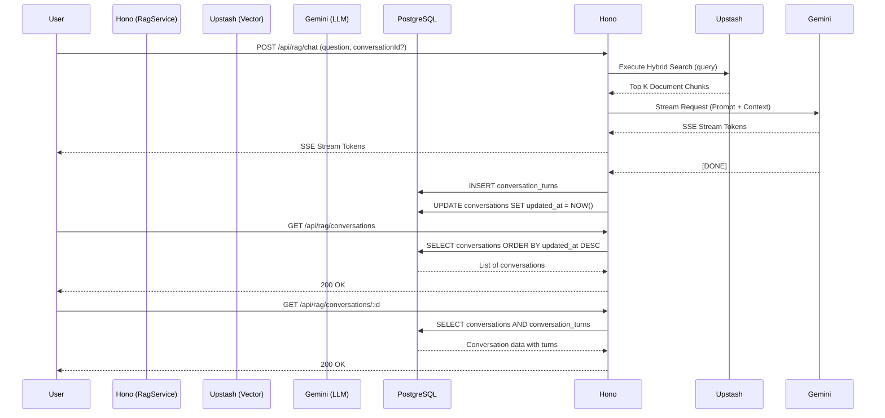

# RAG Streaming & Conversation History

## 1. Core Logic
Fitur ini meng-handle Q&A dari pengguna dengan melakukan *Hybrid Search* (Semantic + Full-Text) ke Upstash Vector, merakit (Context Engineering) hasilnya, dan memberikan jawaban *streaming* menggunakan Google Gemini (SSE Stream). Selain itu, fitur ini juga menyimpan riwayat *chat* ke PostgreSQL dan memungkinkan pengguna mengambil daftar percakapan (*history list*) yang terurut berdasarkan waktu paling mutakhir (berdasarkan *timestamp* turn terakhir).

## 2. Flow Diagram

## 3. Completion Timestamp
**Completed At:** 2026-06-30T18:45:00+07:00 (WIB)

## 4. File Mapping
- `apps/backend/src/modules/rag/rag.service.ts`: Logika *streaming*, *hybrid search*, dan pembaruan `updated_at`.
- `apps/backend/src/modules/rag/rag.controller.ts`: Handler RAG (*chat*, *list*, *delete*, *update title*).
- `apps/backend/src/modules/rag/rag.routes.ts`: Rute OpenAPI Hono.
- `apps/backend/src/modules/rag/rag.schema.ts`: Skema validasi.
- `apps/backend/src/modules/rag/rag.routes.test.ts`: *Test case* integrasi HTTP.
- `apps/backend/src/modules/rag/rag.service.test.ts`: *Test case* isolasi DB.

## 5. Architectural Decisions
- **Optimized Sidebar History (No JOINs)**: Daripada menggunakan `JOIN` dengan tabel `conversation_turns` dan memakai agregasi `MAX(created_at)` yang sangat lambat pada data besar, saya mengeksekusi `UPDATE conversations SET updated_at = NOW()` setiap kali ada pesan masuk. Hal ini memungkinkan pengambilan riwayat *chat* secara instan hanya dari tabel `conversations` yang diurutkan berdasarkan indeks kolom `updated_at`.
- **SSE Fallback Streaming**: Jika model LLM pertama gagal karena *Rate Limit*, *circuit breaker* otomatis mencari fallback model lain dan meneruskan token *streaming* ke Svelte.
- **Prompt Injection Gatekeeper**: Mengeksekusi *pre-flight prompt* dengan model *lite* untuk mendeteksi injeksi perintah sebelum masuk ke jalur RAG utama demi keamanan basis data konteks.
