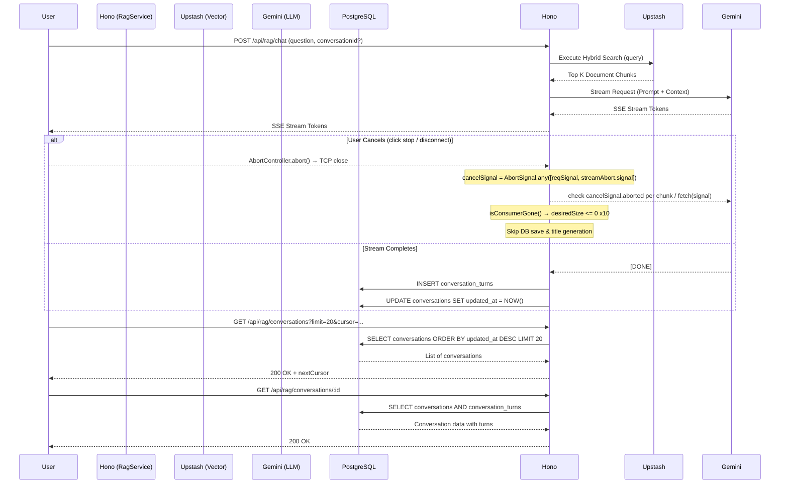

# RAG Streaming & Conversation History

## 1. Core Logic
Fitur ini meng-handle Q&A dari pengguna dengan melakukan *Hybrid Search* (Semantic + Full-Text) ke Upstash Vector, merakit (Context Engineering) hasilnya, dan memberikan jawaban *streaming* menggunakan Google Gemini (SSE Stream). Selain itu, fitur ini juga menyimpan riwayat *chat* ke PostgreSQL dan memungkinkan pengguna mengambil daftar percakapan (*history list*) yang terurut berdasarkan waktu paling mutakhir (berdasarkan *timestamp* turn terakhir).

## 2. Flow Diagram


## 3. Completion Timestamp
**Completed At:** 2026-06-30T18:45:00+07:00 (WIB)  
**Stream Cancellation Added:** 2026-08-05T19:21:00+07:00 (WIB)  
**Stream Cancellation Hardened:** 2026-08-05T20:40:00+07:00 (WIB)  
**Citation & Source Reference Display Hardened:** 2026-08-05T21:20:00+07:00 (WIB)

## 4. File Mapping
- `apps/backend/src/modules/rag/rag.service.ts`: Logika *streaming*, *hybrid search*, penyimpanan `updated_at`, denormalisasi `contextReferences`, `filterReferencesByCitations()`, `AbortSignal.any()` untuk combined cancel signal, helper `isConsumerGone()` (cek live abort + `desiredSize` backpressure), dan guard DB save.
- `apps/backend/src/modules/rag/rag.controller.ts`: Endpoint `handleChat`, `handleListConversations`, `handleGetConversation`, `handleUpdateConversationTitle`, `handleDeleteConversation`. Meneruskan `c.req.raw.signal` ke service layer.
- `apps/backend/src/modules/rag/rag.routes.ts`: Deklarasi OpenAPI Zod untuk semua endpoint di atas.
- `apps/backend/src/modules/rag/rag.schema.ts`: `ContextReferenceSchema`, `ConversationTurnSchema`, `ChatServiceParams` (dengan `signal?: AbortSignal`).
- `apps/backend/src/modules/rag/llm_router.service.ts`: Routing BYOK ke provider (Gemini, Mistral, OpenRouter) dengan dukungan `AbortSignal` — check di loop untuk SDK, pass ke `fetch()` untuk HTTP.
- `apps/backend/src/modules/rag/fallback_llm.service.ts`: Fallback pool 5 provider (Gemini, Mistral, Groq, SambaNova, Cohere) dengan dukungan `AbortSignal`.
- `apps/backend/src/modules/rag/rag.service.test.ts` & `apps/backend/src/modules/rag/rag.routes.test.ts`: Unit/integration test untuk cancel, save guard, dan filter references.
- `apps/backend/src/shared/models/db.model.ts`: Skema tabel `conversations` dan `conversation_turns`.
- `apps/frontend/src/routes/app/chat/[id]/+page.svelte`: Parsing SSE, typewriter, `AbortController`/`signal`, `transformCitationTags()`, render Source References, dan `loadConversation()` dari history.

## 5. Architectural Decisions
- **Push-Over-Pull SSE**: SSE diproses secara *real-time* langsung dari *generator* LLM tanpa antrean polling, menghemat biaya komputasi Edge/Serverless.
- **Write-Time UpdatedAt Touch**: Karena struktur RAG, setiap *turn* baru harus menyentuh `updated_at` pada `conversations` agar *sidebar history* bisa disortir dengan `ORDER BY updated_at DESC` tanpa *join*. Hal ini dilakukan secara eksplisit pada lapisan Service dengan `tx.update(conversations).set({ updatedAt: new Date() })` bersamaan dengan `tx.insert(conversationTurns)`.
- **Cursor-Based Pagination**: Endpoint `GET /api/rag/conversations` menggunakan paginasi berbasis kursor (menggunakan `updated_at`) daripada *offset-based* untuk mencegah redundansi data akibat pembaruan posisi *row* saat obrolan baru berlangsung, dan sangat optimal untuk *Infinite Scroll* di sisi SvelteKit.
- **Denormalization for Context References**: Daripada menggunakan SQL `JOIN` dari array JSONB `chunkIds` ke tabel `document_chunks` (yang lambat dan melanggar prinsip *immutability* sejarah), `contextReferences` disimpan langsung dengan format terstruktur `[{ documentId, pages: [...] }]` saat penulisan (`INSERT`). Dengan ini, query `GET /api/rag/conversations/:id` dapat beroperasi dalam kecepatan sub-10ms (Zero-JOIN).
- **SSE Fallback Streaming**: Jika model LLM pertama gagal karena *Rate Limit*, *circuit breaker* otomatis mencari fallback model lain dan meneruskan token *streaming* ke Svelte.
- **Prompt Injection Gatekeeper**: Mengeksekusi *pre-flight prompt* dengan model *lite* untuk mendeteksi injeksi perintah sebelum masuk ke jalur RAG utama demi keamanan basis data konteks.
- **Stream Cancellation via Combined AbortSignal**: Ketika user mengklik stop (atau disconnect), frontend memanggil `AbortController.abort()`. Backend menggabungkan dua sumber sinyal menjadi satu `cancelSignal`:
  ```ts
  const streamAbort = new AbortController();
  const cancelSignal = signal
      ? AbortSignal.any([signal, streamAbort.signal])
      : streamAbort.signal;
  ```
  - `signal` = `c.req.raw.signal` (abort dari request HTTP).
  - `streamAbort.signal` = dipicu oleh callback `cancel()` pada `ReadableStream`, yang dipanggil runtime saat consumer (HTTP layer) mendeteksi client disconnect.
  
  `cancelSignal` dipakai untuk:
  - Memutus koneksi HTTP ke LLM provider berbasis `fetch()` (OpenRouter, Groq, SambaNova, Cohere) — TCP langsung terputus.
  - Menghentikan iterasi stream pada provider berbasis SDK (Gemini, Mistral) dengan mengecek `signal.aborted` di setiap iterasi `for await`.
  - Melewatkan penyimpanan ke DB (`conversation_turns`) dan generasi judul otomatis.
- **Live Cancel Detection (bukan snapshot)**: Bug awal: `let cancelled = cancelSignal.aborted` disimpan sekali dan tidak pernah diupdate, sehingga loop token tidak pernah berhenti saat cancel terjadi di tengah stream. Perbaikan: helper `isConsumerGone()` dipanggil di **setiap iterasi** kedua token loop (BYOK + fallback), melakukan dua pengecekan:
  1. `cancelSignal.aborted` — sinyal abort benar-benar fired.
  2. `controller.desiredSize <= 0` selama ≥10 iterasi berturut-turut — deteksi backpressure saat HTTP layer berhenti menarik data (client disconnect tanpa signal eksplisit).
  
  Selain itu `controller.enqueue()` di-wrap `try/catch` — jika stream sudah ditutup consumer, `enqueue()` melempar dan loop berhenti.
- **DB Save Guard**: Setelah `controller.close()`, pengecekan `cancelled || cancelSignal.aborted` dilakukan sebelum `INSERT conversation_turns` dan generasi title, sehingga turn yang dibatalkan tidak pernah tercatat di riwayat.

## 6. Context References & Citation Rendering

### 6.1 Data Shape
Setiap turn menyimpan `contextReferences` sebagai array JSONB dengan struktur:
```json
[
  {
    "index": 1,
    "documentId": "76f80810-94d5-4cb3-8b73-d37c14dcf26d",
    "title": "annual_report_pt_harum_energy_tbk_2020.pdf",
    "pages": [48]
  }
]
```
Field `title` berasal dari metadata dokumen saat chunk di-*ingest*.

### 6.2 Filtering by Inline Citations
`RagService.filterReferencesByCitations(answer, references)` dipakai di dua tempat:
1. **Saat stream selesai** — sebelum menyimpan turn, untuk hanya menyimpan referensi yang benar-benar dikutip di jawaban.
2. **Saat `GET /api/rag/conversations/:id`** — server memfilter ulang referensi berdasarkan `answer` yang tersimpan, sehingga client tidak perlu memfilter sendiri.

Regex inline citation yang dikenali:
```regex
/\[Doc (\d+)(?::\s*(?:Hlm\.|Pages?|Page)?\s*([^\]]+))?\]/gi
```
Contoh: `[Doc 1: 48]`, `[Doc 1: Hlm. 48]`, `[Doc 1: Pages 48, 50]`.

### 6.3 Frontend Rendering
- **Inline citation chips** di-render oleh `transformCitationTags()`. Chips menampilkan nama dokumen (tanpa ekstensi, max 20 karakter + ellipsis) dengan tooltip nama lengkap.
- **Source References block** muncul hanya ketika stream benar-benar selesai (`isStreaming === false`) dan tidak dibatalkan (`isCancelled === false`).
- **Saat streaming**, event SSE `event: references` langsung di-assign ke `messages[asstIndex].references` agar inline chips segera menampilkan nama file, bukan fallback `Doc N`.
- **Saat load history**, `loadConversation()` memetakan `contextReferences` dari API ke `DocReference` dengan field `index`, `id`, `name`, dan `pages`, lalu me-render ulang markdown dengan references tersebut.

### 6.4 Abort on Cancel
Tidak ada endpoint cancel terpisah. Frontend membatalkan dengan `AbortController.abort()` pada request `POST /api/rag/chat`. Backend menerima sinyal tersebut via `c.req.raw.signal` dan langsung menghentikan konsumsi LLM serta melewati DB save.
