# RAG Turn Status & Edit Mode (Lifecycle V2)

## 1. Core Logic

Iterasi kedua dari pipeline RAG chat mengubah siklus hidup `conversation_turns` menjadi **write-ahead**: row turn dibuat di **awal** request dengan `status='processing'`, lalu dituntaskan ke salah satu status terminal. Ini menghasilkan tiga hal sekaligus:

1. **Tracking** — pertanyaan user tersimpan segera, sebelum kerja LLM apa pun. Request yang crash/macet bisa terlihat dari row yang tersangkut di `processing`.
2. **State machine eksplisit** — `processing → complete | stopped | failed | blocked`, plus `awaiting_indexing` untuk turn yang menunggu background completion.
3. **Konsistensi UI ↔ DB** — perilaku stop/cancel yang sebelumnya hanya visual (frontend) kini benar-benar tercatat di database.

## 2. State Machine

```mermaid
stateDiagram-v2
    [*] --> processing : write-ahead insert (question disimpan, answer='', model_used=null)
    [*] --> processing : attachment_document_ids + SEMUA dokumen 'processed' (main context — jawab interaktif)
    [*] --> awaiting_indexing : attachment_document_ids + ada dokumen belum 'processed' (pending/confirmed)
    processing --> complete : stream selesai (answer penuh + model aktual)
    processing --> stopped : STOP eksplisit (POST /api/rag/turns/{id}/stop — lihat §16)
    processing --> awaiting_indexing : disconnect (client keluar halaman) — fast path: generasi dilanjutkan in-process; sweep = fallback
    processing --> failed : kegagalan server (provider down, BYOK key error)
    processing --> blocked : prompt injection (answer="Nice try, Diddy.", model_used=null)
    awaiting_indexing --> complete : fast path in-process selesai (gate awaiting_indexing), ATAU Deno.cron sweep (completeTurnDetached)
    awaiting_indexing --> failed : sweep — ada dokumen failed/failed_vectorizing/quota_exhausted/hilang; atau generasi lanjutan gagal
    awaiting_indexing --> blocked : sweep — prompt injection terdeteksi
    awaiting_indexing --> awaiting_indexing : sweep — dokumen masih diingest (skip)
```



Aturan emas: **`processing` dan `awaiting_indexing` tidak boleh jadi status akhir**. Semua jalur kode wajib menuntaskan row — jalur interaktif via `finalizeTurn`, jalur disconnect via fast path / sweep (`sweepAwaitingTurns`, dijalankan `Deno.cron` tiap menit, terdaftar di `main.ts`).

## 3. Alur Request (Write-Ahead)

1. **Cek quota** (`checkQaQuota`, check-only) — dilakukan **sebelum** insert, sehingga request yang ditolak (`QUOTA_EXHAUSTED`) tidak meninggalkan row `processing` yang macet.
2. **Resolusi conversation + eager insert** (satu transaksi `withAuthDb`):
   - Edit mode (`edit_turn_id`): validasi turn milik conversation+tenant → `UPDATE` question baru, `answer=""`, `contextReferences=null`, `status='processing'`, plus `DELETE turn_alternatives` milik turn tersebut.
   - Retry mode (`retry_turn_id`): validasi turn milik conversation+tenant **dan merupakan turn terakhir** (bukan `processing`) → `INSERT` baris `turn_alternatives` dengan `status='processing'` — baris turn kanonik tidak disentuh sama sekali.
   - Mode baru: buat conversation bila belum ada (FK turn ke conversation NOT NULL) → `INSERT` turn dengan `id` pre-generated (`turnId`), `status='processing'`, `answer=""`, `model_used=null`.
   - **Attachment mode** (turn baru + `attachment_document_ids` max **5 per submit** **atau** token mention `@[title](id)` di question): keputusan status di `needsAwaiting` — **semua dokumen `processed`** → `INSERT` dengan `status='processing'` dan jalur interaktif penuh (retrieval di-scope ke dokumen tsb = main context, streaming langsung). **Ada dokumen belum `processed`** → `INSERT` `status='awaiting_indexing'` + `attachment_document_ids` (scope gabungan file+mention, di-persist agar sweep ikut me-rescope) (+ `model_request` bila BYOK), lalu **`incrementQa` langsung di sini** (kuota QA di-reservasi saat submit — pipeline jalan belakangan di sweep). Request langsung `return` stream pendek (`turn_started` + `awaiting_indexing` + `done`) — **tidak ada server-side wait**. Turn diselesaikan `sweepAwaitingTurns` begitu semua dokumen `processed`.
   - **Mention (`@[title](id)` inline di question):** backend mem-parse sendiri (`mentionTokenIds`, max 5 — token ke-6+ = teks biasa), menggabung dengan id file (dedup), dan **men-strip token dari semua prompt LLM** (rewrite, history, augmented prompt, title) — `buildContextAndPrompt` memakai `promptQuestion` hasil strip; question asli (dengan token) tetap tersimpan di DB. Detail: `docs/features/document-mention.md`.
3. **Gatekeeper injeksi**: cek Redis blocklist dulu (lihat §7) → jika hit, block tanpa panggil guard model. Jika miss, panggil guard → `INJECTION` → tulis Redis + block. (Jalur attachment: gatekeeper dijalankan sweep, di `completeTurnDetached`.)
4. **History + rewrite query** — hanya turn `status='complete' AND answer != ''` yang dipakai sebagai konteks (lihat §6).
5. **Hybrid search → context engineering → incrementQa** (quota baru berkurang di sini — request yang di-block/gagal di gatekeeper tidak makan kuota; jalur attachment: search quota terpakai saat sweep, QA sudah di-reservasi di submit).
6. **Stream** → `finalizeTurn` (**UPDATE-only**, gate `WHERE status='processing'`). Jalur attachment: `completeTurnDetached` **UPDATE-only** dengan gate `WHERE status='awaiting_indexing'` — membuat sweep idempotent terhadap invokasi cron yang dobel.

Abort sinyal sebelum stream mulai (saat gatekeeper/search/retrieval) ditangani helper `abortAsStopped` → untuk turn kanonik row di-`UPDATE` ke `awaiting_indexing` (disconnect = diserahkan ke background; kalau stop eksplisit sudah menulis `stopped` lebih dulu, gate `status='processing'` membuat flip-nya no-op). Retry variant tetap `stopped` (sweep tidak mengelola variant). Lihat §16 untuk detail stop vs disconnect.

## 4. Keputusan Arsitektur

- **Insert setelah cek quota**: kalau insert sebelum quota check, request `QUOTA_EXHAUSTED` (HTTP 400) meninggalkan row `processing` yang tidak pernah dituntaskan.
- **`finalizeTurn` UPDATE-only + gate `status='processing'`**: karena row sudah ada dari awal, tidak ada lagi branch INSERT-vs-UPDATE. Gate-nya mencegah writer basi (mis. abort yang tiba terlambat) menimpa status terminal yang sudah ditulis.
- **Keputusan terminal di akhir stream**: tiga cabang — `stopRequested` (flag registri dari endpoint stop) → `stopped`; `detached` (client pergi, generasi dilanjutkan in-process) → `complete`/`failed` dengan **gate `awaiting_indexing`** (sweep yang kebetulan jalan jadi no-op); normal → `finalizeTurn` gate `processing`. Race "abort tiba tepat setelah token terakhir" tertutup: tanpa stop eksplisit, jawaban yang lengkap tetap tercatat `complete`.
- **`model_used` nullable**: `null` berarti "tidak ada model yang pernah dipanggil" (blocked, atau cancel sebelum model terpilih). Diisi saat model benar-benar terpilih.
- **Gatekeeper setelah eager insert**: percobaan injeksi tetap tercatat sebagai row `blocked` (tracking penuh), tetapi kuota tidak berkurang karena `incrementQa` ada di akhir alur.

## 5. Semantik Status

| Status | Arti | Isi row |
|---|---|---|
| `processing` | In-flight (transien) | question tersimpan, answer `""`, model_used `null` |
| `complete` | Jawaban penuh tersimpan | answer penuh, model aktual, references terfilter |
| `stopped` | User membatalkan | answer parsial **mentah** (tanpa marker teks), model aktual (Free Auto) / model yang diminta (BYOK) |
| `failed` | Kegagalan dari sisi server | answer parsial (mungkin kosong), model_used fallback |
| `blocked` | Keputusan keamanan (prompt injection) | answer `"Nice try, Diddy."`, model_used `null` |

Catatan: marker `"⏹ Response Stopped"` **tidak** disimpan di kolom `answer` — itu mencemari konteks LLM di turn berikutnya (`historyText` dibangun dari `turn.answer`). Marker dirender frontend dari `status`.

## 6. Filter Konteks History

Query 3 turn terakhir untuk query-rewriting kini:

```ts
and(
    eq(conversationTurns.conversationId, conversationId),
    eq(conversationTurns.tenantId, tenantId),
    eq(conversationTurns.status, "complete"),
    ne(conversationTurns.answer, ""),
)
```

Efek samping yang diinginkan: turn yang sedang `processing` (termasuk yang sedang di-edit ulang) otomatis tidak pernah masuk konteks LLM — jawaban parsial/basi tidak bisa jadi context.

## 7. Prompt Injection: Status `blocked` + Redis Blocklist

- **Status baru `blocked`** — keputusan keamanan, **bukan** `failed` (yang khusus kegagalan server).
- Turn `blocked`: `model_used=null` (tidak ada model dipanggil), `answer="Nice try, Diddy."` (string persis sama dengan teks inline frontend agar reload konsisten).
- **Redis blocklist cache** (`redis_keys.constant.ts` → `guard:injection:<sha256(question)>` → `"1"`):
  - Dicek **sebelum** memanggil guard model — pertanyaan yang sudah pernah terdeteksi injeksi langsung di-block tanpa membakar token guard.
  - **Hanya hasil positif yang di-cache, tidak pernah `SAFE`** — tanpa risiko whitelisting.
  - TTL 24 jam (`PROMPT_INJECTION_CACHE_TTL_SECONDS`).
  - Kegagalan Redis (get/set) selalu fallback ke guard — tidak pernah memutus request.
  - Nilai disimpan sebagai string `"1"`; pembandingan memakai `String(cachedDecision) === "1"` karena Upstash Redis bisa mengembalikan sentinel sebagai number (`1`) bergantung tipe JSON respons.

## 8. Edit Mode (`edit_turn_id`)

- `POST /api/rag/chat` menerima field opsional `edit_turn_id` (uuid) — **wajib** disertai `conversation_id` (400 kalau tidak).
- Server: validasi turn milik conversation+tenant (404 kalau bukan miliknya) → update question + clear answer/references + `status='processing'` → regenerate → `finalizeTurn` meng-`UPDATE` **row yang sama** (bukan INSERT turn baru).
- `event: done` kini membawa `{"turnId": "..."}` (id pre-generated di server, dipakai juga saat INSERT). Ini memungkinkan frontend meng-edit turn yang baru saja di-stream **tanpa reload** — sebelumnya id turn hanya diketahui dari `getConversation`.
- Edit hanya untuk prompt terakhir (frontend membatasi tombol edit ke `lastUserMsgId`); karena itu tidak perlu truncation turn yang lebih baru.
- **Varian retry ikut terhapus saat edit** — blok edit mengeksekusi `DELETE FROM turn_alternatives WHERE turn_id = edit_turn_id` dalam transaksi yang sama dengan reset turn. Jawaban lama (dan semua variannya) dianggap basi begitu prompt berubah, apa pun hasil regenerasinya (lihat §15).

## 9. Pencatatan Model Saat Stop (Free Auto)

Sebelumnya `successfulModel` hanya diisi setelah stream selesai → turn `stopped` pada mode Free Auto menyimpan `"auto"`. Sekarang:

```ts
const response = await FallbackLlmService.generateStream({...});
// Router fallback sudah memilih model — catat SEKARANG (modelId diketahui
// sebelum token mengalir, fallback_llm.service.ts return {stream, modelId}).
successfulModel = response.modelId;
```

Jadi turn `stopped` menyimpan nama model aktual (mis. `gemini-2.0-flash-lite`), bukan placeholder `"auto"`. BYOK sudah benar sejak awal (fallback ke model yang diminta).

## 10. `updated_at`

Otomatis, tanpa kode manual:

- **Insert** (status `processing`) → `default now()` (= `created_at`).
- **Setiap UPDATE** (processing → terminal, termasuk edit question) → `$onUpdateFn(() => new Date())` di model Drizzle.

Semantik: `created_at` = kapan request masuk; `updated_at` = kapan terakhir berubah (state/isi). Berguna untuk deteksi row yang macet di `processing` (updated_at lama).

## 11. Migrasi

| Migrasi | Isi |
|---|---|
| `0017_common_morgan_stark` | Enum `turn_status_enum` (complete, stopped, failed) + kolom `status` + `updated_at` |
| `0018_jittery_cable` | `ALTER TYPE ... ADD VALUE 'processing'` |
| `0019_powerful_juggernaut` | `ALTER TYPE ... ADD VALUE 'blocked'` + `model_used DROP NOT NULL` |

Catatan: DB lokal tidak dikelola lewat `drizzle-kit migrate` (tabel `drizzle.__drizzle_migrations` kosong) — migrasi diterapkan langsung via SQL dengan guard `IF NOT EXISTS`/`ADD VALUE IF NOT EXISTS`. Staging/prod memakai jalur biasa.

## 12. File Mapping

- `apps/backend/src/modules/rag/rag.service.ts`: write-ahead insert, `abortAsStopped`, `blockAsInjection`, `finalizeTurn` UPDATE-only, filter history, model recording, re-check abort live, done event `{turnId}`.
- `apps/backend/src/modules/rag/rag.schema.ts`: `edit_turn_id`, `TurnStatus` union, status di `ConversationTurnSchema`.
- `apps/backend/src/modules/rag/rag.controller.ts`: meneruskan `editTurnId`.
- `apps/backend/src/shared/models/db.model.ts`: enum `turn_status_enum`, kolom `status`/`updated_at`, `model_used` nullable.
- `apps/backend/src/shared/constants/redis_keys.constant.ts`: `RedisKeys.promptInjection(question)` → `guard:injection:<sha256>`.
- `apps/backend/src/modules/rag/fallback_llm.service.ts`: `generateStream` mengembalikan `modelId` sebelum token mengalir (dipakai §9).
- `apps/backend/src/modules/rag/rag.service.test.ts`: test complete/stopped/failed/blocked, edit in-place, 404/400, cache-hit guard, history filter, model recording.
- `apps/frontend/src/routes/app/chat/[id]/+page.svelte`: lihat `docs/frontend/app-chat-detail-enhancements.md` (Iteration 2).

## 13. Completion Timestamp

**Lifecycle V2 (write-ahead + status):** 2026-08-07  
**Edit mode + done event turnId:** 2026-08-07  
**Blocked status + Redis blocklist:** 2026-08-07

---

## 14. User Feedback (good/bad) — Opsi A (kolom, bukan tabel)

Keputusan desain: feedback 1:1 dengan satu turn per user → cukup **kolom di `conversation_turns`**, bukan tabel baru. Tabel baru hanya diperlukan jika satu turn bisa dinilai banyak user (multi-user per tenant), butuh riwayat perubahan rating, atau retention terpisah.

### 14.1 DB (Migrasi `0020_eminent_master_chief`)

- Enum `feedback_enum` (`good | bad`) + kolom `conversation_turns.feedback` dan `feedback_at` (keduanya nullable).
- `feedback_at` terisi hanya saat ada rating (`null` saat dibatalkan).

### 14.2 Endpoint

`PATCH /api/rag/conversations/{id}/turns/{turnId}/feedback` — body `{ rating: 'good' | 'bad' | null }`:

- Validasi kepemilikan turn (conversation + tenant) → 404 kalau bukan miliknya.
- `rating: null` membersihkan feedback (toggle good → bad → batal).
- **Tidak menyentuh `updated_at` conversation** — memberi rating tidak boleh menaikkan conversation ke atas sidebar.
- `getConversation` mengembalikan `feedback` + `feedbackAt` per turn.

### 14.3 Edit-Regenerasi Me-Reset Feedback

Blok edit mode me-`SET feedback: null, feedbackAt: null` bersama answer/contextReferences — rating lama menunjuk ke jawaban yang sudah tidak ada.

### 14.4 Frontend

- Tombol 👍/👎 di-wire ke `toggleFeedback(msg, 'good'|'bad')`: update optimis + revert + toast saat gagal; klik rating yang sama lagi = batal; state aktif ditandai (`bg-white/10 text-white`).
- `turnId` kini ada di pesan assistant juga (dari `getConversation` untuk history, dari event `done` untuk pesan baru) — jawaban baru bisa langsung di-rating tanpa reload.
- `feedback` dimuat dari DB saat reload → rating bertahan setelah refresh.

### 14.5 Completion Timestamp

**Feedback (Opsi A):** 2026-08-07

---

## 15. Retry Variants (`turn_alternatives`) — Alternatif Jawaban per Turn

Fitur retry memungkinkan user meminta ulang jawaban **hanya pada turn terakhir**, dengan semua hasil tersimpan sebagai varian yang bisa ditelusuri (`◀ 1/3 ▶`). Jawaban yang sedang ditampilkan itulah "pilihan" — selection **tidak dipersist**, tidak ada tombol "pilih response ini".

### 15.1 Keputusan Desain: Tabel Baru, bukan Kolom

| Opsi | Putusan |
|---|---|
| **Tabel baru `turn_alternatives` (1:N ke `conversation_turns`)** | ✅ Dipilih |
| Kolom JSONB `alternatives` di `conversation_turns` | ❌ — finalize jadi read-modify-write di baris yang sama dengan penulis lain (feedback, edit) tanpa gate status; history query ikut berisiko |
| Reuse `conversation_turns` dengan self-FK `variant_of_turn_id` | ❌ — setiap query turn (history, getConversation, branch copy) wajib filter varian |

Alasan tabel baru:
1. Varian berbentuk entitas: `answer`, `modelUsed`, `latencyMs`, `contextReferences`, `status` (processing → terminal) — persis baris turn minus question.
2. State machine write-ahead + `finalizeTurn` (gate `status='processing'`) dipakai ulang 1:1 — alur retry = alur turn biasa dengan target tabel berbeda.
3. Query history untuk follow-up (`status='complete' AND answer != ''`) **tidak berubah** — varian di tabel lain, tidak bisa bocor jadi konteks.
4. Cleanup = satu `DELETE`; cascade delete otomatis saat turn/conversation dihapus.
5. Konsisten dengan gaya skema codebase (JSONB hanya untuk payload seperti `context_references`).

### 15.2 Skema (Migrasi `0023_shiny_eternity`)

```ts
export const turnAlternatives = pgTable("turn_alternatives", {
    id: uuid("id").defaultRandom().primaryKey(),
    tenantId: uuid("tenant_id").notNull().references(() => tenants.id, { onDelete: "cascade" }),
    conversationId: uuid("conversation_id").notNull().references(() => conversations.id, { onDelete: "cascade" }),
    turnId: uuid("turn_id").notNull().references(() => conversationTurns.id, { onDelete: "cascade" }),
    answer: text("answer").notNull(),
    modelUsed: varchar("model_used", { length: 100 }),
    latencyMs: integer("latency_ms"),
    contextReferences: jsonb("context_references"),
    status: turnStatusEnum("status").notNull().default("complete"),
    updatedAt: timestamp(...),
    createdAt: timestamp(...),
}, (table) => ({
    turnIdx: index("idx_turn_alternatives_turn").on(table.turnId),
}));
```

Catatan migrasi: Supabase auto-enable RLS di tabel baru, sedangkan `conversations`/`conversation_turns` RLS-nya off (isolasi tenant dijaga filter `tenant_id` di aplikasi). File migrasi menambahkan `ALTER TABLE "turn_alternatives" DISABLE ROW LEVEL SECURITY` agar konsisten — tanpa ini semua akses via `withAuthDb` gagal diam-diam (0 baris terpengaruh, tanpa error).

### 15.3 API

`POST /api/rag/chat` — dua field baru (opsional):

- `retry_turn_id` (uuid) — **wajib** disertai `conversation_id` (400 kalau tidak). Validasi: turn milik conversation+tenant (404), bukan `processing` (400), dan **turn terakhir** (`ORDER BY createdAt DESC, id DESC` — 400 kalau bukan). Question yang dipakai pipeline = `turn.question` (diambil dari DB, bukan body) agar tidak divergen.
- `selected_variant_id` (uuid) — hanya untuk follow-up normal (bukan retry/edit). Validasi: varian harus milik **turn terakhir** (turn in-flight hasil write-ahead di-*exclude* dari pengecekan), 404/400 kalau tidak.

### 15.4 Alur Retry

1. Write-ahead: `INSERT turn_alternatives (status='processing')` — baris turn kanonik tidak disentuh.
2. Pipeline penuh dijalankan ulang (gatekeeper, history, search, fallback router) dengan question turn — retry bisa memilih model berbeda, itu tujuannya.
3. `abortAsStopped` / `blockAsInjection` / `finalizeTurn` mendapat cabang `isRetry` → UPDATE `turn_alternatives` (gate `status='processing'`), bukan `conversation_turns`.
4. `event: done` membawa `{ "turnId": <turn asli>, "variantId": <id varian> }`.

### 15.5 Follow-up dengan Varian Terpilih (History Override + Promote)

Saat follow-up dikirim dengan `selected_variant_id`:

1. **History context**: jawaban varian menggantikan jawaban kanonik turn terakhir di `historyText` (query-rewrite ikut memakai varian tersebut).
2. **Promosi + cleanup** — hanya jika turn baru finalize `complete` (follow-up `stopped`/`failed` tidak menghapus apa pun):
   - Ada seleksi → `answer`, `modelUsed`, `latencyMs`, `contextReferences` varian **dipromosikan** ke baris turn kanonik; `status='complete'`, `feedback`/`feedbackAt` direset (rating lama menunjuk jawaban yang sudah tidak ada).
   - Tanpa seleksi (user menampilkan jawaban asli) → semua varian dihapus.
   - Setelah promosi, **semua** baris `turn_alternatives` turn itu dihapus — varian terpilih sudah menjadi jawaban kanonik, tidak ada data hilang, konsisten setelah reload.

### 15.6 Siklus Hidup Varian

| Kejadian | Efek |
|---|---|
| Retry (turn terakhir) | `INSERT` varian `processing` → terminal (complete/stopped/failed/blocked) |
| Edit turn yang punya varian | **Semua** varian dihapus di write-ahead (jawaban lama basi) |
| Follow-up sukses (complete) | Varian terpilih dipromosikan → semua varian dihapus |
| Follow-up stopped/failed | Varian bertahan (belum "berhasil") |
| Delete turn / conversation | Cascade delete via FK |
| Branch conversation | Varian **tidak** ikut dicopy (branch memakai jawaban kanonik) |

### 15.7 `getConversation`

Response turn bertambah `alternatives: [{ id, answer, status, modelUsed, latencyMs, contextReferences, createdAt }]` — hanya varian **terminal** (`status != 'processing'`) dengan `answer != ''` (varian junk tidak dirender), `contextReferences` difilter ulang via `filterReferencesByCitations` per varian, urut `createdAt` ASC.

### 15.8 Event SSE `turn_started`

Event pertama di setiap stream (main, prompt-injection block, provider-unavailable):

```
event: turn_started
data: {"turnId":"...","variantId":"..."}   // variantId hanya untuk retry
```

Id write-target dilaporkan **sebelum token pertama**, sehingga turn yang di-stop (stream terpotong sebelum `done`) tetap punya id untuk di-retry/di-edit **tanpa reload** — sebelumnya id hanya sampai via `done`.

### 15.9 File Mapping

- `apps/backend/src/shared/models/db.model.ts`: tabel `turnAlternatives`.
- `apps/backend/drizzle/migrations/0023_shiny_eternity.sql`: tabel + FK + index + `DISABLE ROW LEVEL SECURITY`.
- `apps/backend/src/modules/rag/rag.schema.ts`: `retry_turn_id`, `selected_variant_id`, `TurnAlternativeSchema`, `ConversationTurnSchema.alternatives`.
- `apps/backend/src/modules/rag/rag.controller.ts`: meneruskan `retryTurnId`/`selectedVariantId`.
- `apps/backend/src/modules/rag/rag.service.ts`: write-ahead retry, dual-write finalize (`abortAsStopped`/`blockAsInjection`/`finalizeTurn`), history override, `promoteAndCleanupVariants`, event `turn_started`/`done {variantId}`, `getConversation` alternatives.
- `apps/backend/src/modules/rag/rag.service.test.ts`: retry validation (400/404), retry happy path (`variantId` di `turn_started` + `done`), edit clears variants, history override + promote, `getConversation` filter, cleanup tanpa seleksi.
- `apps/frontend/src/routes/app/chat/[id]/+page.svelte`: lihat `docs/frontend/app-chat-detail-enhancements.md` (Iteration 4).
- `api-collections/Search & RAG/02_RAG QA Chat.bru` & `06_Get Conversation.bru`: contoh body + dokumentasi event.

### 15.10 Completion Timestamp

**Retry variants + promote/cleanup:** 2026-08-09  
**Event `turn_started` (retry tanpa reload):** 2026-08-09

## 16. Stop vs Disconnect — Background Continuation (Lifecycle V3)

Sejak fast-path (2026-08-10), server **membedakan** dua bentuk teardown koneksi:

### 16.1 STOP eksplisit → `stopped`

- Endpoint baru `POST /api/rag/turns/{turnId}/stop` (auth, idempotent). `turnId` = write-target (id turn kanonik, atau `variantId` di retry mode — keduanya dikirim via event `turn_started`).
- Registri in-memory `activeGenerations` (key: write-target id) menyimpan `AbortController` **khusus generasi** (`stopGenerationAbort`) + flag `stopRequested`:
  - Stream di isolate yang sama → flag + abort → loop berhenti → `finalizeTurn('stopped')` dengan jawaban parsial.
  - Stream di isolate lain / sudah selesai → fallback UPDATE langsung `processing → stopped` (gate).
- Frontend **menunggu ack endpoint sebelum men-teardown stream lokal** — urutan ini membuat stop deterministik (tidak kalah race dengan flip disconnect).

### 16.2 Disconnect (keluar halaman / pindah percakapan / tutup tab) → background

Koneksi SSE mati **tanpa** stop eksplisit:

1. **Fast path (utama)**: generasi LLM **tidak di-abort** — ia berjalan di `stopGenerationAbort` yang hanya menyala saat stop. Loop token berhenti mengirim ke koneksi mati tapi tetap mengakumulasi jawaban; saat selesai, turn ditulis `complete` dengan **gate `awaiting_indexing`** (turn di-flip dulu sebagai jaring pengaman). Jawaban jadi dalam hitungan detik — tidak menunggu sweep, tidak regenerate.
2. **Fallback (sweep)**: kalau isolate mati sebelum selesai (mis. Deno Deploy menyuspensi isolate setelah respons berakhir), turn yang sudah di-flip `awaiting_indexing` di-regenarasi oleh `sweepAwaitingTurns` (Deno.cron tiap menit) → `completeTurnDetached`. Sama dengan jalur attachment.
3. **Retry variant** pada disconnect → `stopped` (sweep tidak mengelola `turn_alternatives`).
4. **Pre-stream** (gatekeeper/search, ~1-3 detik pertama) pada disconnect → flip ke `awaiting_indexing` → fallback sweep (≤1 menit). Window kecil; sengaja tidak meneruskan pipeline pre-stream.

Gate status membuat fast path dan sweep race-safe: yang menulis `complete` lebih dulu menang, yang lain no-op (tidak ada jawaban dobel).

### 16.3 Debug Log

- `[RAG DETACH] turnId=... client left — flipped to awaiting_indexing, continuing generation in-process` → fast path mulai.
- `[RAG DETACH] turnId=... completed in-process after client left (Xms, status=complete)` → fast path selesai (cepat).
- `[RAG SWEEP] turnId=... picked up after Xs awaiting — running detached pipeline` → fallback (isolate tidak bertahan / pre-stream).
- `[RAG DETACHED] turnId=... pipeline started / answer generated (Xms) — persisting complete` → pipeline sweep.

### 16.4 File Mapping

- `apps/backend/src/modules/rag/rag.service.ts`: `activeGenerations`, `stopGenerationAbort`, `markTurnDetached`, `detached` finalize (gate awaiting), `stopTurnGeneration`, `abortAsStopped` flip, sweep log.
- `apps/backend/src/modules/rag/rag.routes.ts` & `rag.controller.ts` & `rag.schema.ts`: `POST /turns/{turnId}/stop` + `StopTurnResponseSchema`.
- `apps/frontend/src/routes/app/chat/[id]/+page.svelte`: `stopCurrentStream` menunggu endpoint `/stop`; polling conversation untuk turn `awaiting_indexing`; indikator spinner + thinking status.
- `api-collections/Search & RAG/18_Stop Turn Generation.bru`: contoh request stop.

### 16.5 Completion Timestamp

**Fast-path disconnect + endpoint stop:** 2026-08-10
