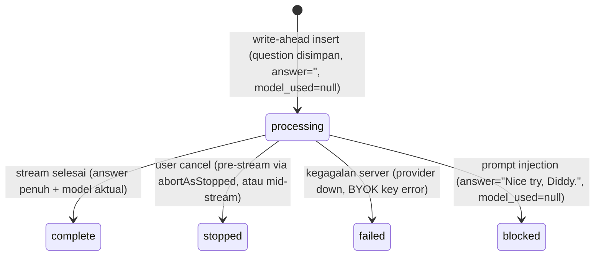

# RAG Turn Status & Edit Mode (Lifecycle V2)

## 1. Core Logic

Iterasi kedua dari pipeline RAG chat mengubah siklus hidup `conversation_turns` menjadi **write-ahead**: row turn dibuat di **awal** request dengan `status='processing'`, lalu dituntaskan ke salah satu status terminal. Ini menghasilkan tiga hal sekaligus:

1. **Tracking** — pertanyaan user tersimpan segera, sebelum kerja LLM apa pun. Request yang crash/macet bisa terlihat dari row yang tersangkut di `processing`.
2. **State machine eksplisit** — `processing → complete | stopped | failed | blocked`.
3. **Konsistensi UI ↔ DB** — perilaku stop/cancel yang sebelumnya hanya visual (frontend) kini benar-benar tercatat di database.

## 2. State Machine



Aturan emas: **`processing` tidak boleh jadi status akhir**. Semua jalur kode wajib menuntaskan row.

## 3. Alur Request (Write-Ahead)

1. **Cek quota** (`checkQaQuota`, check-only) — dilakukan **sebelum** insert, sehingga request yang ditolak (`QUOTA_EXHAUSTED`) tidak meninggalkan row `processing` yang macet.
2. **Resolusi conversation + eager insert** (satu transaksi `withAuthDb`):
   - Edit mode (`edit_turn_id`): validasi turn milik conversation+tenant → `UPDATE` question baru, `answer=""`, `contextReferences=null`, `status='processing'`.
   - Mode baru: buat conversation bila belum ada (FK turn ke conversation NOT NULL) → `INSERT` turn dengan `id` pre-generated (`turnId`), `status='processing'`, `answer=""`, `model_used=null`.
3. **Gatekeeper injeksi**: cek Redis blocklist dulu (lihat §7) → jika hit, block tanpa panggil guard model. Jika miss, panggil guard → `INJECTION` → tulis Redis + block.
4. **History + rewrite query** — hanya turn `status='complete' AND answer != ''` yang dipakai sebagai konteks (lihat §6).
5. **Hybrid search → context engineering → incrementQa** (quota baru berkurang di sini — request yang di-block/gagal di gatekeeper tidak makan kuota).
6. **Stream** → `finalizeTurn` (**UPDATE-only**, gate `WHERE status='processing'`).

Abort sinyal sebelum stream mulai (saat gatekeeper/search/retrieval) ditangani helper `abortAsStopped()` → row di-`UPDATE` ke `stopped` (tetap ber-gate `status='processing'`).

## 4. Keputusan Arsitektur

- **Insert setelah cek quota**: kalau insert sebelum quota check, request `QUOTA_EXHAUSTED` (HTTP 400) meninggalkan row `processing` yang tidak pernah dituntaskan.
- **`finalizeTurn` UPDATE-only + gate `status='processing'`**: karena row sudah ada dari awal, tidak ada lagi branch INSERT-vs-UPDATE. Gate-nya mencegah writer basi (mis. abort yang tiba terlambat) menimpa status terminal yang sudah ditulis.
- **Re-check sinyal abort live saat finalize**: keputusan status terakhir memakai `cancelled || cancelSignal.aborted`, bukan flag `cancelled` yang bisa basi — menutup race "abort tiba tepat setelah token terakhir" agar request yang di-cancel tidak pernah tercatat `complete`.
- **`model_used` nullable**: `null` berarti "tidak ada model yang pernah dipanggil" (blocked, atau cancel sebelum model terpilih). Diisi saat model benar-benar terpilih.
- **Gatekeeper setelah eager insert**: percobaan injeksi tetap tercatat sebagai row `blocked` (tracking penuh), tetapi kuota tidak berkurang karena `incrementQa` ada di akhir alur.

## 5. Semantik Status

| Status | Arti | Isi row |
|---|---|---|
| `processing` | In-flight (transien) | question tersimpan, answer `""`, model_used `null` |
| `complete` | Jawaban penuh tersimpan | answer penuh, model aktual, references terfilter |
| `stopped` | User membatalkan | answer parsial **mentah** (tanpa marker teks), model aktual (Free Auto) / model yang diminta (BYOK) |
| `failed` | Kegagalan dari sisi server | answer parsial (mungkin kosong), model_used fallback |
| `blocked` | Keputusan keamanan (prompt injection) | answer `"Nice try, Diddy."`, model_used `null` |

Catatan: marker `"⏹ Response Stopped"` **tidak** disimpan di kolom `answer` — itu mencemari konteks LLM di turn berikutnya (`historyText` dibangun dari `turn.answer`). Marker dirender frontend dari `status`.

## 6. Filter Konteks History

Query 3 turn terakhir untuk query-rewriting kini:

```ts
and(
    eq(conversationTurns.conversationId, conversationId),
    eq(conversationTurns.tenantId, tenantId),
    eq(conversationTurns.status, "complete"),
    ne(conversationTurns.answer, ""),
)
```

Efek samping yang diinginkan: turn yang sedang `processing` (termasuk yang sedang di-edit ulang) otomatis tidak pernah masuk konteks LLM — jawaban parsial/basi tidak bisa jadi context.

## 7. Prompt Injection: Status `blocked` + Redis Blocklist

- **Status baru `blocked`** — keputusan keamanan, **bukan** `failed` (yang khusus kegagalan server).
- Turn `blocked`: `model_used=null` (tidak ada model dipanggil), `answer="Nice try, Diddy."` (string persis sama dengan teks inline frontend agar reload konsisten).
- **Redis blocklist cache** (`redis_keys.constant.ts` → `guard:injection:<sha256(question)>` → `"1"`):
  - Dicek **sebelum** memanggil guard model — pertanyaan yang sudah pernah terdeteksi injeksi langsung di-block tanpa membakar token guard.
  - **Hanya hasil positif yang di-cache, tidak pernah `SAFE`** — tanpa risiko whitelisting.
  - TTL 24 jam (`PROMPT_INJECTION_CACHE_TTL_SECONDS`).
  - Kegagalan Redis (get/set) selalu fallback ke guard — tidak pernah memutus request.
  - Nilai disimpan sebagai string `"1"`; pembandingan memakai `String(cachedDecision) === "1"` karena Upstash Redis bisa mengembalikan sentinel sebagai number (`1`) bergantung tipe JSON respons.

## 8. Edit Mode (`edit_turn_id`)

- `POST /api/rag/chat` menerima field opsional `edit_turn_id` (uuid) — **wajib** disertai `conversation_id` (400 kalau tidak).
- Server: validasi turn milik conversation+tenant (404 kalau bukan miliknya) → update question + clear answer/references + `status='processing'` → regenerate → `finalizeTurn` meng-`UPDATE` **row yang sama** (bukan INSERT turn baru).
- `event: done` kini membawa `{"turnId": "..."}` (id pre-generated di server, dipakai juga saat INSERT). Ini memungkinkan frontend meng-edit turn yang baru saja di-stream **tanpa reload** — sebelumnya id turn hanya diketahui dari `getConversation`.
- Edit hanya untuk prompt terakhir (frontend membatasi tombol edit ke `lastUserMsgId`); karena itu tidak perlu truncation turn yang lebih baru.

## 9. Pencatatan Model Saat Stop (Free Auto)

Sebelumnya `successfulModel` hanya diisi setelah stream selesai → turn `stopped` pada mode Free Auto menyimpan `"auto"`. Sekarang:

```ts
const response = await FallbackLlmService.generateStream({...});
// Router fallback sudah memilih model — catat SEKARANG (modelId diketahui
// sebelum token mengalir, fallback_llm.service.ts return {stream, modelId}).
successfulModel = response.modelId;
```

Jadi turn `stopped` menyimpan nama model aktual (mis. `gemini-2.0-flash-lite`), bukan placeholder `"auto"`. BYOK sudah benar sejak awal (fallback ke model yang diminta).

## 10. `updated_at`

Otomatis, tanpa kode manual:

- **Insert** (status `processing`) → `default now()` (= `created_at`).
- **Setiap UPDATE** (processing → terminal, termasuk edit question) → `$onUpdateFn(() => new Date())` di model Drizzle.

Semantik: `created_at` = kapan request masuk; `updated_at` = kapan terakhir berubah (state/isi). Berguna untuk deteksi row yang macet di `processing` (updated_at lama).

## 11. Migrasi

| Migrasi | Isi |
|---|---|
| `0017_common_morgan_stark` | Enum `turn_status_enum` (complete, stopped, failed) + kolom `status` + `updated_at` |
| `0018_jittery_cable` | `ALTER TYPE ... ADD VALUE 'processing'` |
| `0019_powerful_juggernaut` | `ALTER TYPE ... ADD VALUE 'blocked'` + `model_used DROP NOT NULL` |

Catatan: DB lokal tidak dikelola lewat `drizzle-kit migrate` (tabel `drizzle.__drizzle_migrations` kosong) — migrasi diterapkan langsung via SQL dengan guard `IF NOT EXISTS`/`ADD VALUE IF NOT EXISTS`. Staging/prod memakai jalur biasa.

## 12. File Mapping

- `apps/backend/src/modules/rag/rag.service.ts`: write-ahead insert, `abortAsStopped`, `blockAsInjection`, `finalizeTurn` UPDATE-only, filter history, model recording, re-check abort live, done event `{turnId}`.
- `apps/backend/src/modules/rag/rag.schema.ts`: `edit_turn_id`, `TurnStatus` union, status di `ConversationTurnSchema`.
- `apps/backend/src/modules/rag/rag.controller.ts`: meneruskan `editTurnId`.
- `apps/backend/src/shared/models/db.model.ts`: enum `turn_status_enum`, kolom `status`/`updated_at`, `model_used` nullable.
- `apps/backend/src/shared/constants/redis_keys.constant.ts`: `RedisKeys.promptInjection(question)` → `guard:injection:<sha256>`.
- `apps/backend/src/modules/rag/fallback_llm.service.ts`: `generateStream` mengembalikan `modelId` sebelum token mengalir (dipakai §9).
- `apps/backend/src/modules/rag/rag.service.test.ts`: test complete/stopped/failed/blocked, edit in-place, 404/400, cache-hit guard, history filter, model recording.
- `apps/frontend/src/routes/app/chat/[id]/+page.svelte`: lihat `docs/frontend/app-chat-detail-enhancements.md` (Iteration 2).

## 13. Completion Timestamp

**Lifecycle V2 (write-ahead + status):** 2026-08-07  
**Edit mode + done event turnId:** 2026-08-07  
**Blocked status + Redis blocklist:** 2026-08-07
