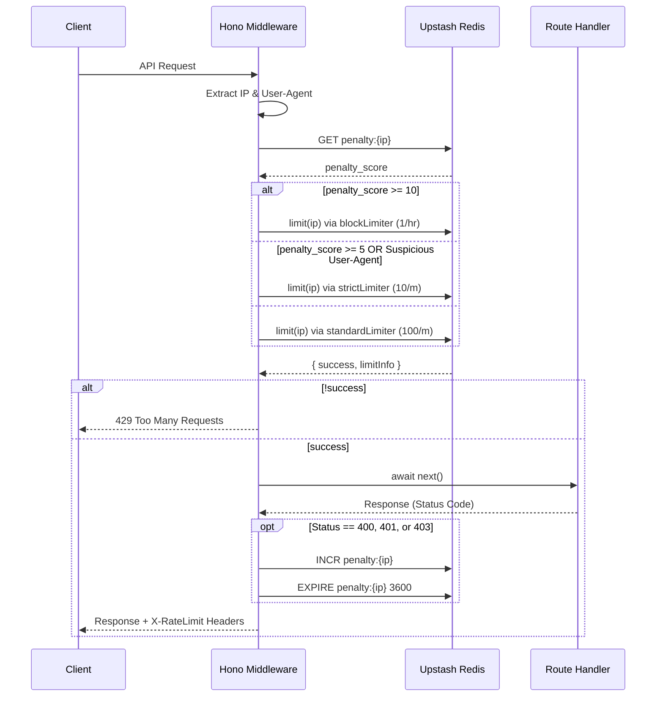

# Redis Gatekeeper: Global Rate Limiting & Anomaly Detection

**Completion Timestamp:** 2026-06-26 18:15:00 UTC+7

## Core Logic

The **Redis Gatekeeper** is a global Hono middleware that protects the API Gateway from abuse, bot scraping, and brute-force attacks. It implements an intelligent rate limiter utilizing Upstash Redis with a sliding window algorithm.

Rather than a static IP rate limit, the Gatekeeper uses **Anomaly Detection** and a **Dynamic Penalty System**:
- Legitimate users get high request quotas (100 req/minute).
- Suspicious bots (detected via `User-Agent` strings) are restricted (10 req/minute).
- IPs that repeatedly trigger `400`, `401`, or `403` errors accumulate a "penalty score". As this score increases, their limits are dynamically downgraded (down to 1 req/hour).

## Flow Diagram

## File Mapping

- **[MODIFY]** `apps/backend/deno.json`: Added `@upstash/redis` and `@upstash/ratelimit` dependencies.
- **[NEW]** `apps/backend/src/config/redis.ts`: Initializes the `@upstash/redis` client safely via Environment variables.
- **[NEW]** `apps/backend/src/shared/middlewares/rate_limiter.middleware.ts`: The core rate limiter middleware containing the multi-tier limit logic and dynamic penalty system.
- **[NEW]** `apps/backend/src/shared/middlewares/rate_limiter.middleware.test.ts`: Complete unit tests verifying standard requests, bot limits, and penalty escalations.
- **[MODIFY]** `apps/backend/src/main.ts`: Registers the middleware globally immediately after the `loggerMiddleware`.

## Connections

- **Client to API Gateway:** Returns HTTP `429 Too Many Requests` on violation and appends `X-RateLimit-Limit`, `X-RateLimit-Remaining`, and `X-RateLimit-Reset` headers to every valid response.
- **API Gateway to Upstash Redis:** Communicates over HTTP REST (via Upstash SDK) to fetch and mutate rate limit counters and penalty scores.
- **Integration with Auth (`dky-003` & `dky-004`):** When the Auth routes throw `401 Unauthorized` (e.g., wrong password) or `400 Bad Request` (e.g., validation failed), this global middleware intercepts the status codes and automatically builds the penalty score for the offending IP, preventing distributed password spraying.

## Architectural Decisions

1. **Upstash REST SDK:** Chosen over standard TCP Redis clients because it works natively within serverless/edge environments (like Deno Deploy) without persistent connection overhead.
2. **Global Middleware Placement:** Placed *before* the application logic (but *after* the logger) to ensure that malicious traffic is rejected before consuming database CPU or external API quotas (like Gemini/Groq).
3. **Fail-Open Strategy:** If the Redis connection fails or times out, the `try-catch` blocks silently log the error and permit the request. This ensures a Redis outage does not bring down the entire application (favoring Availability over strict Security in the CAP theorem context).
4. **`redis as any` Type Casting:** Required to resolve a minor type definition conflict between the `@upstash/ratelimit` internal Redis interface and the standalone `@upstash/redis` SDK within Deno's NPM compatibility layer.
