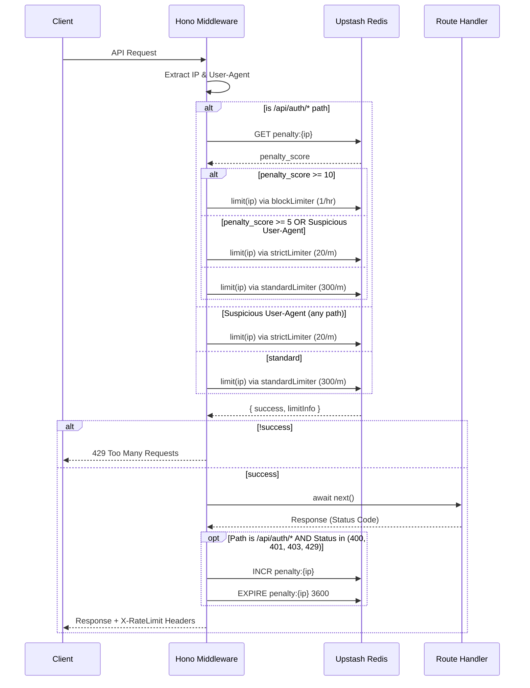

# Redis Gatekeeper: Global Rate Limiting & Anomaly Detection

**Completion Timestamp:** 2026-06-26 18:15:00 UTC+7
**Updated:** 2026-08-16 — limits relaxed (`300/m` standard, `20/m` strict), penalties & escalation scoped to `/api/auth/*`, load-test bypass moved to env var (`LOAD_TEST_BYPASS_TOKEN`, off by default).

## Core Logic

The **Redis Gatekeeper** is a global Hono middleware that protects the API Gateway from abuse, bot scraping, and brute-force attacks. It implements an intelligent rate limiter utilizing Upstash Redis with a sliding window algorithm.

Rather than a static IP rate limit, the Gatekeeper uses **Anomaly Detection** and a **Dynamic Penalty System**:
- Legitimate users get a generous quota (**300 req/minute**). An SPA page load fires ~5 parallel requests (`/api/me`, `/api/me/usage`, `/api/documents`, `/api/keys`, `/api/rag/conversations`), so routine browsing and rapid reloads never trip the limiter.
- Suspicious bots (detected via `User-Agent` strings) are restricted globally (**20 req/minute**).
- **Penalties only accrue on `/api/auth/*`** (login, register, password reset, dll): repeated `400`/`401`/`403`/`429` from those endpoints accumulate a "penalty score" (TTL 1 hour). At score `>= 5` the auth path is downgraded to strict (`20/m`); at `>= 10`, to block (**1 req/hour**). Non-auth 4xx — e.g. a `401` from an expired session token on `/api/me` — does **not** count, because that used to snowball a routine page load into a 1-hour block.
- The **load-test bypass is opt-in via env**: only honored when `LOAD_TEST_BYPASS_TOKEN` is set in the deployment and the request sends `X-Load-Test-Bypass` with that value. Off by default; the source contains no hardcoded secret.

## Flow Diagram

## File Mapping

- **[MODIFY]** `apps/backend/deno.json`: Added `@upstash/redis` and `@upstash/ratelimit` dependencies.
- **[NEW]** `apps/backend/src/config/redis.ts`: Initializes the `@upstash/redis` client safely via Environment variables.
- **[NEW]** `apps/backend/src/shared/middlewares/rate_limiter.middleware.ts`: The core rate limiter middleware containing the multi-tier limit logic and dynamic penalty system.
- **[NEW]** `apps/backend/src/shared/middlewares/rate_limiter.middleware.test.ts`: Complete unit tests verifying standard requests, bot limits, auth-path penalty escalation, and the penalty scoping regression test.
- **[MODIFY]** `apps/backend/src/main.ts`: Registers the middleware globally immediately after the `loggerMiddleware`.
- **[MODIFY]** `apps/backend/.env.example`: Documents `LOAD_TEST_BYPASS_TOKEN` (opt-in load-test bypass).
- **[MODIFY]** `tests/k6/load_test_supabase.js`: Reads `K6_JWT_TOKEN` and `LOAD_TEST_BYPASS_TOKEN` from environment variables instead of hardcoded values.

## Connections

- **Client to API Gateway:** Returns HTTP `429 Too Many Requests` on violation and appends `X-RateLimit-Limit`, `X-RateLimit-Remaining`, and `X-RateLimit-Reset` headers to every valid response.
- **API Gateway to Upstash Redis:** Communicates over HTTP REST (via Upstash SDK) to fetch and mutate rate limit counters and penalty scores.
- **Integration with Auth (`dky-003` & `dky-004`):** When the Auth routes (`/api/auth/*`) throw `401 Unauthorized` (e.g., wrong password) or `400 Bad Request` (e.g., validation failed), this global middleware intercepts the status codes and builds the penalty score for the offending IP, preventing distributed password spraying. Escalation stays scoped to the auth path, so auth abuse never throttles unrelated traffic from the same IP.

## Architectural Decisions

1. **Upstash REST SDK:** Chosen over standard TCP Redis clients because it works natively within serverless/edge environments (like Deno Deploy) without persistent connection overhead.
2. **Global Middleware Placement:** Placed *before* the application logic (but *after* the logger) to ensure that malicious traffic is rejected before consuming database CPU or external API quotas (like Gemini/Groq).
3. **Fail-Open Strategy:** If the Redis connection fails or times out, the `try-catch` blocks silently log the error and permit the request. This ensures a Redis outage does not bring down the entire application (favoring Availability over strict Security in the CAP theorem context).
4. **`redis as any` Type Casting:** Required to resolve a minor type definition conflict between the `@upstash/ratelimit` internal Redis interface and the standalone `@upstash/redis` SDK within Deno's NPM compatibility layer.
5. **Penalty Scoping (2026-08-16):** Only `/api/auth/*` 4xx responses feed the penalty score, and strict/block escalation applies only to auth paths. Rationale: ordinary 4xx from a browser (expired session 401s) is a normal lifecycle event, not abuse; counting it used to lock legitimate users out for an hour. Brute-force protection remains intact because the auth module also enforces its own per-IP/per-email limits and lockouts (see `auth-login.md`, `auth-security.md`).
6. **Env-Gated Load-Test Bypass (2026-08-16):** The bypass previously used a hardcoded secret string (`rahasia123`) that lived in the public repo. It now requires `LOAD_TEST_BYPASS_TOKEN` to be explicitly set in the deployment environment; without it the bypass is closed everywhere. A deployment should set the token only for an authorized load-test window, then remove it.