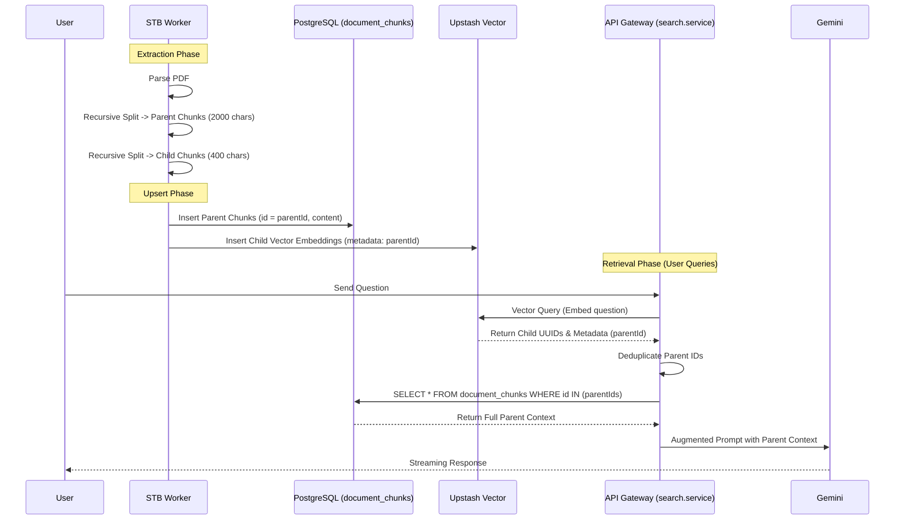

# Dokyudo RAG: Small-to-Big Retrieval Architecture

**Completion Timestamp:** 2026-07-02T15:49:27+07:00

## Core Logic
Fitur **Small-to-Big Retrieval** meningkatkan akurasi sistem *Retrieval-Augmented Generation* (RAG). Sebelumnya, dokumen dipecah menjadi bagian-bagian besar dan diproses langsung sebagai *embedding*. Dengan Small-to-Big Retrieval, pemecahan dilakukan secara hierarkis:
1. **Parent Chunks** (besar, misal ~2000 karakter) menyimpan konteks yang utuh.
2. **Child Chunks** (kecil, misal ~400 karakter) di-*embed* menjadi vektor.

Saat pencarian dilakukan, *Vector Search* mencari kecocokan semantik di tingkat *Child Chunk* (yang lebih akurat), tetapi LLM diberikan *Parent Chunk*-nya (konteks utuh dari mana kalimat tersebut berasal) untuk merumuskan jawaban akhir tanpa kehilangan makna paragraf.

## File Mapping
- `apps/stb-worker/services/extractor.py`: Modifikasi untuk mengimplementasikan *Recursive Character Text Splitting* dari *Parent* menuju *Children*.
- `apps/stb-worker/services/processor.py`: Pemisahan *pipeline* di mana *Parent Chunk* dikirim ke Postgres, sedangkan *Child Chunk* beserta `parentId` dikirim sebagai embedding ke Upstash Vector.
- `apps/backend/src/modules/search/search.service.ts`: Penyesuaian `executeHybridSearch()` untuk membaca metadata `parentId` dari Upstash, lalu menarik teks *Parent Chunk* utuh dari Postgres FTS.

## Flow Diagram

## Connections
1. **Worker ↔ PostgreSQL**: STB Worker memasukkan teks berukuran penuh ke dalam `document_chunks`. `fts` index di PostgreSQL berjalan secara terpisah untuk memproses teks ini menjadi *full-text search vector*.
2. **Worker ↔ Upstash Vector DB**: STB Worker hanya mengkalkulasi embedding (lewat Gemini API) untuk *Child Chunks* dan menyimpan ke Upstash. *Metadata* di Upstash bertindak sebagai *foreign-key* tidak langsung ke PostgreSQL.
3. **API Gateway ↔ Upstash & PostgreSQL**: `search.service.ts` pertama-tama meng-kueri Upstash (vektor) dan PostgreSQL (FTS) secara konstan/paralel (*Hybrid Search*). Dari Upstash, ia tidak membaca data teks vektor melainkan hanya ID referensi *Parent* untuk kemudian dicari teks aktualnya di Postgres.

## Architectural Decisions
- **Recursive Character Splitter Custom**: Diimplementasikan murni menggunakan standard library Python (`re`, `str.split`) tanpa meng-install LangChain untuk menjaga *footprint* dan ukuran *container docker* STB Worker tetap kecil dan *dependency-free*.
- **No Vectors in Postgres**: Menggunakan Upstash sepenuhnya untuk *Vector DB* dan PostgreSQL untuk *Storage & FTS*. Menghilangkan dependensi eksistensi pgvector lokal dan mendistribusikan beban.
- **Child-Only Embedding**: Sangat menghemat token API LLM karena embedding Gemini tidak perlu memproses ulang kalimat-kalimat besar yang tumpang tindih (*overlap*). Model *embedding* juga jauh lebih efektif saat memetakan kalimat deklaratif pendek ketimbang narasi tebal di dalam sebuah vektor ruang-*n*.
