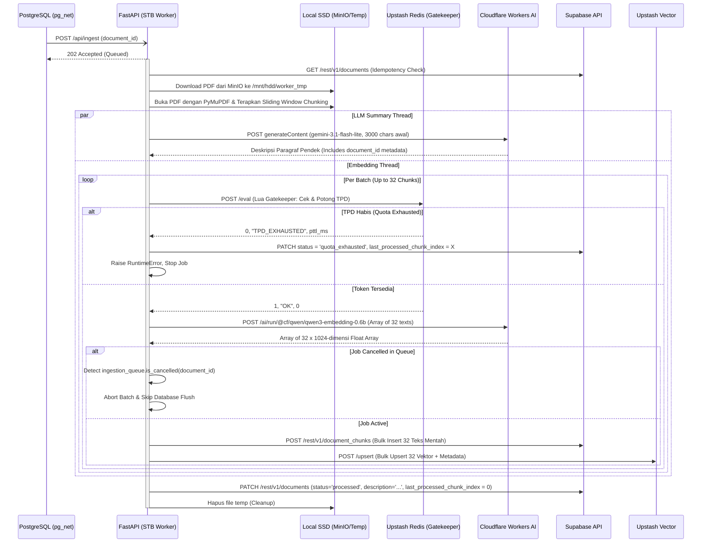

# STB Ingestion, Chunking, & Embedding Worker

## 1. Core Logic
Fitur ini (`apps/stb-worker`) adalah layanan asinkron berbasis Python (FastAPI) dengan pola **Clean Architecture** yang berjalan secara fisik di dalam STB (Set Top Box). 
Ketika Supabase Trigger mengirimkan sinyal melalui Webhook `/api/ingest`, worker ini akan:
1. **Download**: Mengunduh file PDF dari instans MinIO lokal ke penyimpanan *temporary*.
2. **Extraction & Slicing (Chunking)**: Mengekstrak teksnya halaman per halaman menggunakan `PyMuPDF`, lalu memecah teks tersebut menjadi *chunks* (potongan teks) menggunakan *tokenizer* `tiktoken` (OpenAI cl100k_base).
3. **Rate Limiting (Gatekeeper)**: Memeriksa kuota token harian (**TPD**) ke Upstash Redis menggunakan *script Lua* sebelum menembak API eksternal.
4. **Embedding & LLM Description (Parallel)**: Menerjemahkan potongan teks menjadi vektor **1024-dimensi** secara sekuensial menggunakan **Cloudflare Workers AI (`@cf/qwen/qwen3-embedding-0.6b`)**. Bersamaan dengan ini, di *thread* lain, potongan awal teks sepanjang 3000 karakter diproses oleh LLM (`gemini-3.1-flash-lite`) untuk menghasilkan deskripsi/rangkuman dokumen. Menyertakan `document_id` pada seluruh event log LLM metadata (`llm.generation_started`, `llm.generation_success`).
5. **Pre-Flush Cancellation Guard**: Memeriksa `ingestion_queue.is_cancelled(document_id)` tepat sebelum melakukan operasi insert ke database Postgres dan Upstash. Jika job dibatalkan oleh pengguna saat pemrosesan embedding berjalan, worker langsung membatalkan eksekusi secara elegan tanpa melempar unhandled `409 Conflict` exception.
6. **Upserting & Updating**: Mem-format *payload* vektor beserta metadatanya lalu mengunggahnya secara *batch* ke Upstash Vector DB dan Supabase Postgres (`document_chunks`). Terakhir, mengirimkan 1 kali PATCH ke Postgres untuk menandai status menjadi `processed` sekaligus menanamkan `description` dari LLM.
7. **Quota Exhausted (Antrian ke Besok)**: Jika kuota harian Cloudflare (TPD) habis di tengah proses, worker menghentikan pekerjaan secara elegan dan mengubah status dokumen menjadi `quota_exhausted` di database. Dokumen akan diproses ulang keesokan harinya ketika kuota Cloudflare di-*reset* pada UTC 00:00.

## 2. Flow Diagram

## 3. Deep-Dive: Slicing / Chunking & Batching Mechanism
Saat ini sistem menggunakan teknik **Sliding Window Chunking**:
- **Ukuran Potongan (`chunk_size`)**: 1000 token.
- **Tumpang Tindih (`overlap`)**: 150 token.

**Batching (BATCH_SIZE = 32)**:
Worker mengelompokkan *chunk* dalam *array* berisi maksimal 32 teks. Batch dikirim dalam **1 HTTP Request** ke Cloudflare, dan hasilnya di-*insert* secara *bulk* ke Postgres dan Upstash Vector. Jika token Gatekeeper tersisa tidak cukup untuk 32 *chunk*, worker memperkecil ukuran batch agar sesuai kuota.

## 4. Deep-Dive: Cancellation Safety & Graceful Exit
Saat pengguna menghentikan unggahan di tengah jalan:
1. Backend Deno mengirim request `POST /api/cancel` ke STB Worker dan menghapus baris dokumen dari Postgres.
2. STB Worker mencatat `document_id` ke dalam `IngestionQueue._cancelled_ids`.
3. Sebelum batch vektor di-*flush* ke database, worker melakukan pengecekan `is_cancelled(document_id)`.
4. Jika status terdeteksi `cancelled`, worker menghentikan siklus batch secara langsung, menghindari eksekusi `insert_document_chunks` yang dapat memicu exception `409 Conflict`.
5. Jika exception 409/404 tertangkap akibat penghapusan dokumen oleh pengguna, worker menangkapnya secara tenang dan mencatat event warning `processor.job_cancelled_clean` tanpa melempar unhandled `processor.fatal_error`.

## 5. Document Status Lifecycle
| Status | Makna | Dipicu oleh |
|---|---|---|
| `pending` | Presigned URL digenerate, file belum diunggah | Backend Deno |
| `confirmed` | File berhasil diunggah ke MinIO, trigger webhook tembak | Backend Deno (`confirmUpload`) |
| `processing` | STB Worker sedang aktif memproses PDF | STB Worker (awal job) |
| `processed` | Semua *chunk* berhasil di-*embed* dan diindeks | STB Worker (akhir job) |
| `quota_exhausted` | Kuota TPD Cloudflare habis di tengah proses | STB Worker (Gatekeeper) |
| `failed` | Error tak terduga — PDF corrupt, MinIO unreachable, Cloudflare error | STB Worker / Deno (`confirmUpload`) |

## 6. Files Modified / Created
| File | Perubahan |
|---|---|
| `apps/stb-worker/services/processor.py` | Tambahkan pre-flush cancellation guard `ingestion_queue.is_cancelled(document_id)`, teruskan `document_id` ke `generate_llm_description`, dan tangkap 409/404 conflict secara terisolasi. |
| `apps/stb-worker/services/llm.py` | Terima parameter `document_id` pada `generate_llm_description` dan sertakan pada seluruh log event metadata (`llm.generation_started`, `llm.generation_success`). |

## 7. Completion Timestamp
**Completed At:** 2026-07-24T19:15:00+07:00 (WIB)
