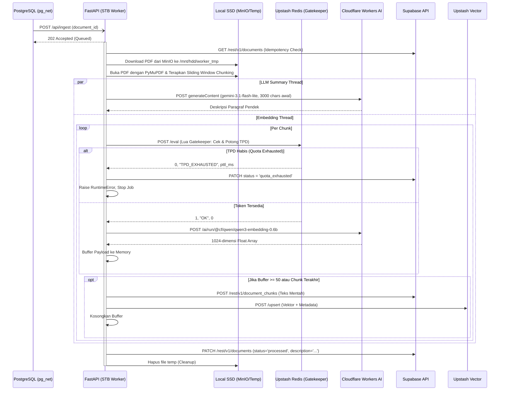

# STB Ingestion, Chunking, & Embedding Worker

## 1. Core Logic
Fitur ini (`apps/stb-worker`) adalah layanan asinkron berbasis Python (FastAPI) dengan pola **Clean Architecture** yang berjalan secara fisik di dalam STB (Set Top Box). 
Ketika Supabase Trigger mengirimkan sinyal melalui Webhook `/api/ingest`, worker ini akan:
1. **Download**: Mengunduh file PDF dari instans MinIO lokal ke penyimpanan *temporary*.
2. **Extraction & Slicing (Chunking)**: Mengekstrak teksnya halaman per halaman menggunakan `PyMuPDF`, lalu memecah teks tersebut menjadi *chunks* (potongan teks) menggunakan *tokenizer* `tiktoken` (OpenAI cl100k_base).
3. **Rate Limiting (Gatekeeper)**: Memeriksa kuota token harian (**TPD**) ke Upstash Redis menggunakan *script Lua* sebelum menembak API eksternal.
4. **Embedding & LLM Description (Parallel)**: Menerjemahkan potongan teks menjadi vektor **1024-dimensi** secara sekuensial menggunakan **Cloudflare Workers AI (`@cf/qwen/qwen3-embedding-0.6b`)**. Bersamaan dengan ini, di *thread* lain, potongan awal teks sepanjang 3000 karakter diproses oleh LLM (`gemini-3.1-flash-lite`) untuk menghasilkan deskripsi/rangkuman dokumen.
5. **Upserting & Updating**: Mem-format *payload* vektor beserta metadatanya lalu mengunggahnya secara *batch* ke Upstash Vector DB dan Supabase Postgres (`document_chunks`). Terakhir, mengirimkan 1 kali PATCH ke Postgres untuk menandai status menjadi `processed` sekaligus menanamkan `description` dari LLM.
6. **Quota Exhausted (Antrian ke Besok)**: Jika kuota harian Cloudflare (TPD) habis di tengah proses, worker menghentikan pekerjaan secara elegan dan mengubah status dokumen menjadi `quota_exhausted` di database. Frontend dapat membaca status ini dan menampilkan pesan kepada user. Dokumen akan diproses ulang keesokan harinya ketika kuota Cloudflare di-*reset* pada UTC 00:00.

## 2. Flow Diagram

## 3. Deep-Dive: Slicing / Chunking Mechanism
Saat ini sistem menggunakan teknik **Sliding Window Chunking**:
- **Ukuran Potongan (`chunk_size`)**: 1000 token.
- **Tumpang Tindih (`overlap`)**: 150 token.
- **Alasan**: Ketika sebuah dokumen dipecah secara buta per 1000 token, ada kemungkinan kalimat penting atau gagasan utama terbelah dua tepat di batas pemotongan. Dengan memaksa *chunk* selanjutnya untuk "mundur" dan mengambil 150 token dari *chunk* sebelumnya (*overlap*), kita memastikan bahwa konteks di sekitar perbatasan tidak hilang (konteks terhubung/tidak terputus).

## 4. Deep-Dive: Gatekeeper & Limiting
Cloudflare Workers AI (Free) memiliki batas **10.000 Neuron per hari** yang setara dengan sekitar **9.300.000 token input per hari** untuk model `@cf/qwen/qwen3-embedding-0.6b`. Jika STB Worker membombardir Cloudflare tanpa batas:
1. API Cloudflare akan menolak *request* dengan HTTP 429.
2. Kuota harian akan habis dan semua pemrosesan dokumen akan gagal sampai besok.

**Solusi Arsitekturnya (TPD — Tokens Per Day):**
- **Lua Script Gatekeeper**: STB mengeksekusi *script* atomik ke **Upstash Redis** melalui REST API. Script ini mengelola satu kuota global: `ratelimit:cloudflare:tpd:global`.
- **Token Deduction**: Sebelum meminta vektor, STB menaksir estimasi token (panjang string / 3). Jika sisa TPD di Redis tidak cukup, Redis menolak *request* dan mengembalikan sinyal `TPD_EXHAUSTED`.
- **Antrian ke Besok (Graceful Degradation)**: Berbeda dari sistem Gemini lama yang tidur menunggu kuota per menit, kuota harian Cloudflare tidak bisa di-*wait*. Ketika TPD habis, worker segera berhenti, mengubah status dokumen menjadi `quota_exhausted` di Postgres, dan membiarkan kuota Cloudflare *reset* sendiri di UTC 00:00 keesokan harinya. Sistem Deno Cron atau trigger database bertanggung jawab untuk me-*retry* dokumen-dokumen berstatus `quota_exhausted` ini esok harinya.

## 5. Document Status Lifecycle
| Status | Makna | Dipicu oleh |
|---|---|---|
| `pending` | Presigned URL digenerate, file belum diunggah | Backend Deno |
| `confirmed` | File berhasil diunggah ke MinIO, trigger webhook tembak | Backend Deno (`confirmUpload`) |
| `processing` | STB Worker sedang aktif memproses PDF | STB Worker (awal job) |
| `processed` | Semua *chunk* berhasil di-*embed* dan diindeks | STB Worker (akhir job) |
| `quota_exhausted` | Kuota TPD Cloudflare habis di tengah proses | STB Worker (Gatekeeper) |
| `failed` | Error tak terduga — PDF corrupt, MinIO unreachable, Cloudflare error | STB Worker / Deno (`confirmUpload`) |

## 6. Architectural Decisions
- **Cloudflare Workers AI (Qwen3-0.6B, 1024-dim):** Dipilih menggantikan Gemini `gemini-embedding-2` karena: (1) Limit harian berbasis jumlah token (9,3 Juta/hari) jauh lebih mudah diprediksi dan dikelola daripada limit per-menit Gemini; (2) Dimensi 1024 memberikan akurasi pencarian semantik yang lebih tinggi dibanding 768; (3) Qwen3 mencapai SOTA di MTEB untuk tugas pencarian teks multi-bahasa; (4) Tidak ada lagi mekanisme *sleep* per menit yang membuang uptime STB.
- **REST API for Databases & AI:** STB Worker murni menggunakan HTTP (REST via `httpx`) untuk PostgREST, Upstash Vector, Upstash Redis, dan Cloudflare. Hal ini membuang *overhead* dependensi SDK/Driver ORM berat (seperti `psycopg2` atau `redis-py`) demi menyesuaikan kapabilitas CPU S905X di STB.
- **Push-over-Pull & Idempotency:** STB dibangun murni digerakkan oleh webhook (Supabase Trigger `pg_net`), BUKAN dengan cara *long-polling* database setiap 5 detik. Jika webhook gagal atau *timeout*, `pg_net` akan me-*retry*. Untuk mencegah *double processing*, STB melakukan pengecekan idempoten di awal (`status == 'processed'`).
- **Memory Constraint Mitigation:** Alih-alih melahap seluruh PDF ke dalam RAM (yang sangat langka di STB), PDF didownload murni ke SSD/External HDD (`/mnt/hdd/worker_tmp`), diproses secara berurutan, lalu *garbage file*-nya selalu dihapus di dalam block `finally`.
- **Parallel LLM Summarization:** Untuk menghemat waktu eksekusi, pengambilan vektor per *chunk* dan pembuatan deskripsi 2-3 kalimat dokumen (menggunakan 3000 karakter pertama via `gemini-3.1-flash-lite`) diparalelisasi (*multithreaded* via `ThreadPoolExecutor`). Fitur LLM disetel agar melakukan *Graceful Degradation* (kembali kosong jika terblokir *safety filters*) agar tidak membatalkan operasi inti vektorisasi. Keduanya kemudian dirapatkan dalam **satu kali** HTTP PATCH akhir ke database untuk meminimalkan beban I/O.

## 7. Files Modified / Created
| File | Perubahan |
|---|---|
| `apps/stb-worker/core/config.py` | Hapus `GEMINI_EMBEDDING_MODEL`, tambah `CF_EMBEDDING_MODEL`, `CLOUDFLARE_ACCOUNT_ID`, `CLOUDFLARE_AUTH_TOKEN` |
| `apps/stb-worker/services/embedding.py` | Ganti seluruh implementasi dari Gemini REST ke Cloudflare Workers AI REST. Response path diubah dari `data["embedding"]["values"]` ke `data["result"]["data"][0]`. Dimensi output: 768 → 1024. |
| `apps/stb-worker/services/gatekeeper.lua` | Rombak total dari 3-bucket (TPM/RPM/RPD) menjadi 1-bucket (TPD). Kuota: 9.300.000 token/hari. |
| `apps/stb-worker/services/processor.py` | Ubah Redis key dari `ratelimit:gemini:*` ke `ratelimit:cloudflare:tpd:global`. Ganti perilaku `TPD_EXHAUSTED` dari *sleep* ke *abort* via `RuntimeError`. Tangkap `RuntimeError` dan `Exception` secara terpisah: keduanya memanggil `mark_document_queued()` atau `mark_document_failed()`. |
| `apps/stb-worker/services/database.py` | Tambah fungsi `mark_document_queued()` → status `quota_exhausted`. Tambah fungsi `mark_document_failed()` → status `failed` (best-effort, menelan exception sendiri). |

## 8. Completion Timestamp
**Completed At:** 2026-07-14T19:12:00+07:00 (WIB)
