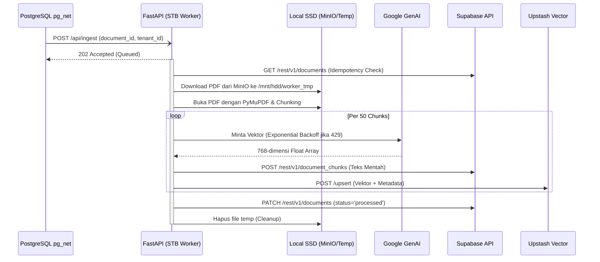

# STB Ingestion, Chunking, & Embedding Worker

## 1. Core Logic
Fitur ini (`apps/stb-worker`) adalah layanan asinkron berbasis Python (FastAPI) dengan pola **Clean Architecture** yang berjalan secara fisik di dalam STB (Set Top Box). 
Ketika Supabase Trigger mengirimkan sinyal melalui Webhook `/api/ingest`, worker ini akan:
1. Mengunduh file PDF dari instans MinIO lokal.
2. Mengekstrak teksnya halaman per halaman menggunakan `PyMuPDF`.
3. Memecah teks tersebut menjadi *chunks* menggunakan *tokenizer* berbasis `tiktoken` (OpenAI cl100k_base).
4. **Menerjemahkan teks (Embedding)** menjadi vektor 768-dimensi secara sekuensial menggunakan API Google Gemini (`gemini-embedding-2`) dan mem-format *payload* agar siap dikirim ke Upstash Vector DB.

## 2. Flow Diagram

## 3. Completion Timestamp
**Completed At:** 2026-06-27T21:02:00+07:00 (WIB)

## 4. File Mapping (Clean Architecture)
Struktur aplikasi telah difaktorkan ulang (*refactored*) agar mudah di-_maintenance_:
- `apps/stb-worker/main.py`: Entry point aplikasi dan inisiasi FastAPI.
- `apps/stb-worker/core/config.py`: Pengaturan environment (S3, Token, API Key, DB).
- `apps/stb-worker/api/ingest.py`: Definisi *routing* HTTP.
- `apps/stb-worker/services/storage.py`: Logika komunikasi AWS S3 / MinIO.
- `apps/stb-worker/services/extractor.py`: Logika PyMuPDF dan TikToken.
- `apps/stb-worker/services/embedding.py`: Logika SDK `google-genai` dengan Exponential Backoff.
- `apps/stb-worker/services/database.py`: Logika HTTP client (`httpx`) untuk PostgREST dan Upstash Vector.
- `apps/stb-worker/services/processor.py`: Menyatukan semua *services* menjadi satu alur utuh (*Background Task*).
- `apps/stb-worker/tests/test_api.py`: Unit test dasar (Pytest) untuk mengecek kesehatan *endpoint*.

## 5. Architectural Decisions
- **REST API for Databases & AI:** STB Worker tidak menggunakan Driver ORM/SQL (seperti SQLAlchemy atau asyncpg) maupun SDK AI resmi (`google-genai`) untuk menghindari *overhead* ukuran dependensi dan isu kompatibilitas. Melainkan, worker berkomunikasi dengan Supabase Postgres, Upstash Vector, dan Google Gemini API secara langsung menggunakan REST API via library `httpx`.
- **Idempotency Check:** Melakukan *query* ke Supabase sebelum memproses PDF. Jika `status == 'processed'`, proses akan langsung berhenti untuk mencegah duplikasi *embedding* jika pg_net me- *retry* pengiriman webhook.
- **Clean Architecture Modularization:** File dipecah menjadi modul agar tidak menumpuk di `main.py`. Ini mempermudah tim untuk mencari sumber *bug*.
- **Custom Exponential Backoff:** Mempertimbangkan limitasi Gemini API (*Rate Limit 429*), layanan *embedding* menggunakan perulangan sederhana yang akan melakukan "tidur" secara eksponensial (5s, 10s, 20s, 40s) jika terdeteksi kuota tersentuh.
- **Python over Deno:** Tetap dipertahankan dalam Python demi ekosistem dokumen (`PyMuPDF`) dan AI Tokenizer. 
- **Memory Constraint Mitigation:** PDF didownload murni ke SSD (disk), bukan disedot ke RAM, lalu *garbage file*-nya dihapus di dalam block `finally`.
