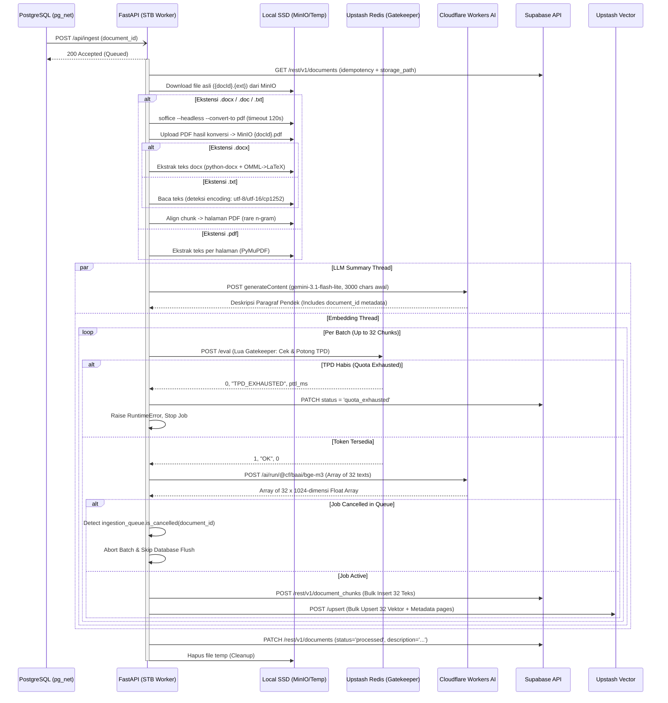

# STB Ingestion, Chunking, & Embedding Worker

## 1. Core Logic
Fitur ini (`apps/stb-worker`) adalah layanan asinkron berbasis Python (FastAPI) dengan pola **Clean Architecture** yang berjalan secara fisik di dalam STB (Set Top Box).
Ketika Supabase Trigger mengirimkan sinyal melalui Webhook `/api/ingest`, worker ini akan:
1. **Resolve & Download**: Mengambil `storage_path` dokumen dari Supabase (key asli seperti `{docId}.pdf` / `{docId}.docx` — tidak di-hardcode `.pdf`), lalu mengunduh file dari instans MinIO lokal ke penyimpanan *temporary*.
2. **Konversi DOCX/TXT → PDF (jika diperlukan)**: Untuk `.docx`/`.doc`/`.txt`, worker menjalankan LibreOffice headless (`soffice --headless --convert-to pdf`) dengan timeout 120 detik dan profil terisolasi per job. PDF hasil konversi di-*upload* kembali ke MinIO sebagai `{tenant}/{docId}.pdf` — inilah yang dipakai frontend untuk viewer. **`libreoffice-math` wajib terpasang**: tanpa komponen ini rumus OMML (insert equation di Word) diimpor sebagai objek kosong dan hilang dari PDF.
3. **Extraction & Chunking**:
   - **PDF**: teks per halaman via `PyMuPDF`, dipecah menjadi *chunks* dengan *tokenizer* `tiktoken` (cl100k_base, 1000 token, overlap 150) — mapping token→halaman melekat pada metadata.
   - **DOCX**: teks diekstrak dari dokumen itu sendiri via `python-docx` (paragraf, sel tabel, textbox secara berurutan), dengan rumus OMML dikonversi menjadi **LaTeX** yang dibungkus delimiter `$...$` (inline) / `$$...$$` (display) — lihat §3. Chunking memakai blok yang digabung *newline* (mencegah kata menyatu lintas blok).
   - **TXT**: dibaca via `services/txt_extractor.py` dengan deteksi encoding berantai (UTF-8 BOM → UTF-16 BOM → UTF-8 → cp1252 sebagai fallback yang tidak pernah gagal untuk teks Windows lawas). File biner yang diklaim `.txt` (NUL bytes, selain UTF-16) ditolak dengan status `failed`.
4. **Page Alignment (khusus DOCX)**: chunk hasil ekstraksi docx tidak punya halaman — pager mencocokkan setiap chunk ke halaman PDF hasil konversi memakai **rare n-gram** (jendela alnum 25 karakter yang muncul ≤3× di teks PDF). Alasan utama: LibreOffice **mengulang header + tabel kartu** di halaman berikutnya saat kartu melewati batas halaman, sehingga stream PDF lebih panjang dari teks docx dan pendekatan advance berbasis posisi selalu meleset — n-gram langka menembusnya karena yang dicocokkan adalah konten unik, bukan boilerplate. Lihat §5.
5. **Rate Limiting (Gatekeeper)**: Memeriksa kuota token harian (**TPD**) ke Upstash Redis menggunakan *script Lua* sebelum menembak API eksternal.
6. **Embedding & LLM Description (Parallel)**: Menerjemahkan potongan teks menjadi vektor **1024-dimensi** secara sekuensial menggunakan **Cloudflare Workers AI (`@cf/baai/bge-m3`)**. Bersamaan dengan ini, di *thread* lain, potongan awal teks sepanjang 3000 karakter diproses oleh LLM (`gemini-3.1-flash-lite`) untuk menghasilkan deskripsi/rangkuman dokumen. Menyertakan `document_id` pada seluruh event log LLM metadata (`llm.generation_started`, `llm.generation_success`).
7. **Pre-Flush Cancellation Guard**: Memeriksa `ingestion_queue.is_cancelled(document_id)` tepat sebelum melakukan operasi insert ke database Postgres dan Upstash. Jika job dibatalkan oleh pengguna saat pemrosesan embedding berjalan, worker langsung membatalkan eksekusi secara elegan tanpa melempar unhandled `409 Conflict` exception.
8. **Upserting & Updating**: Mem-format *payload* vektor beserta metadatanya lalu mengunggahnya secara *batch* ke Upstash Vector DB dan Supabase Postgres (`document_chunks`). Metadata menyimpan `pages` hasil alignment (untuk lompat halaman kutipan). Terakhir, mengirimkan 1 kali PATCH ke Postgres untuk menandai status menjadi `processed` sekaligus menanamkan `description` dari LLM.
9. **Quota Exhausted (Antrian ke Besok)**: Jika kuota harian Cloudflare (TPD) habis di tengah proses, worker menghentikan pekerjaan secara elegan dan mengubah status dokumen menjadi `quota_exhausted` di database. Dokumen akan diproses ulang keesokan harinya ketika kuota Cloudflare di-*reset* pada UTC 00:00 (dilanjutkan dari checkpoint `chunk_index` terakhir).

## 2. Flow Diagram

## 3. Deep-Dive: DOCX Text Extraction (OMML → LaTeX)
`services/docx_extractor.py` membaca dokumen dalam urutan visual (paragraf + sel tabel + textbox, depth-first). Karena banyak dokumen soal menaruh teks di **floating text box** (`w:pict → v:textbox → w:txbxContent`), setiap paragraf *nested* digabung dengan spasi agar kata tidak menyatu (`"Kunci Soal: E" + "No. Soal: 5"` ≠ `"ENo."`).

Rumus OMML dikonversi ke **LaTeX** (bukan notasi linear ad-hoc) supaya bisa dirender KaTeX di frontend dan tetap terbaca LLM:

| Konstruk OMML | Output LaTeX |
|---|---|
| `m:sSup` / `m:sSub` / `m:sSubSup` | `x^{2}` / `x_{1}` / `x_{1}^{2}` |
| `m:f` (pecahan) | `\frac{num}{den}` |
| `m:rad` (akar) | `\sqrt[3]{x}` |
| `m:limLow` / `m:limUpp` | `\lim_{x\to 3}` (nama operator lim/max/sin/... otomatis jadi command) |
| `m:nary` (integral/sum) | `\int_{0}^{1} x dx`, `\sum`, `\prod` |
| `m:m` (matriks) | `\begin{matrix} ... \\ ... \end{matrix}` |
| delimiter `m:d` | `\left( ... \right)` |
| teks `m:t` | di-escape (LaTeX special chars) + konversi unicode (→ `\to`, ≤ `\leq`, × `\times`) |

Inline equation dibungkus `$...$`, display equation (`m:oMathPara`) dibungkus `$$...$$`. Konten chunk inilah yang di-embed dan masuk konteks LLM — satu bentuk LaTeX yang sama dirender KaTeX di UI chat.

## 4. Deep-Dive: Slicing / Chunking & Batching Mechanism
Saat ini sistem menggunakan teknik **Sliding Window Chunking**:
- **Ukuran Potongan (`chunk_size`)**: 1000 token.
- **Tumpang Tindih (`overlap`)**: 150 token.
- Untuk DOCX, blok-blok teks digabung dengan token *newline* sebelum di-chunk — tanpa ini, `"No. Soal: 4" + "Buku Sumber:"` menyatu menjadi token `"4Buku"` yang merusak tokenisasi dan alignment. Setiap chunk menyimpan `_align_text` (core tanpa overlap) yang dipakai pager agar advance tidak meleset.

**Batching (BATCH_SIZE = 32)**:
Worker mengelompokkan *chunk* dalam *array* berisi maksimal 32 teks. Batch dikirim dalam **1 HTTP Request** ke Cloudflare, dan hasilnya di-*insert* secara *bulk* ke Postgres dan Upstash Vector. Jika token Gatekeeper tersisa tidak cukup untuk 32 *chunk*, worker memperkecil ukuran batch agar sesuai kuota.

## 5. Deep-Dive: Chunk-to-Page Alignment (DOCX)
`services/pager.py` menempelkan nomor halaman 1-based ke chunk hasil ekstraksi docx dengan membandingkannya terhadap teks PDF hasil konversi:

1. **Normalisasi alnum** kedua sisi (huruf+digit saja, lowercase) — menyatukan perbedaan spasi dan menyamakan representasi rumus (`x^2` docx vs `x2` glyph PDF).
2. **Rare n-gram**: setiap chunk dipatok oleh jendela alnum 25 karakter yang muncul ≤3× di stream PDF (dikumpulkan dari ujung awal dan akhir chunk, diambil **kuartil 25%/75%** dari kandidat untuk menahan fragmen semi-umum seperti indikator yang dipakai ulang di dua kartu).
3. **Monoton & interpolasi**: halaman chunk dipaksa non-decreasing; chunk tanpa anchor diinterpolasi antar tetangga yang aligned.

Kenapa pendekatan ini, bukan advance berbasis posisi: LibreOffice **mengulang header + tabel kartu di halaman berikutnya** ketika satu kartu melewati batas halaman, sehingga stream PDF bisa ~2.3x lebih panjang dari teks docx di wilayah yang sama — advance `pos + len(needle)` selalu undershoot dan drift menumpuk. N-gram langka menembusnya karena boilerplate yang diulang punya frekuensi tinggi dan ditolak. Hasil terverifikasi: 25/25 soal pada dokumen kartu soal 18 halaman ter-petakan ke halaman yang benar. Event log `pager.alignment_done` melaporkan `aligned`/`interpolated` per dokumen.

## 6. Cancellation Safety & Graceful Exit
Saat pengguna menghentikan unggahan di tengah jalan:
1. Backend Deno mengirim request `POST /api/cancel` ke STB Worker dan menghapus baris dokumen dari Postgres.
2. STB Worker mencatat `document_id` ke dalam `IngestionQueue._cancelled_ids`.
3. Sebelum batch vektor di-*flush* ke database, worker melakukan pengecekan `is_cancelled(document_id)` (juga sebelum dan sesudah konversi DOCX).
4. Jika status terdeteksi `cancelled`, worker menghentikan siklus batch secara langsung, menghindari eksekusi `insert_document_chunks` yang dapat memicu exception `409 Conflict`.
5. Jika exception 409/404 tertangkap akibat penghapusan dokumen oleh pengguna, worker menangkapnya secara tenang dan mencatat event warning `processor.job_cancelled_clean` tanpa melempar unhandled `processor.fatal_error`.

## 7. Document Status Lifecycle
| Status | Makna | Dipicu oleh |
|---|---|---|
| `pending` | Presigned URL digenerate, file belum diunggah | Backend Deno |
| `confirmed` | File berhasil diunggah ke MinIO, trigger webhook tembak | Backend Deno (`confirmUpload`) |
| `processed` | Semua *chunk* berhasil di-*embed* dan diindeks | STB Worker (akhir job) |
| `quota_exhausted` | Kuota TPD Cloudflare habis di tengah proses; dilanjutkan besok dari checkpoint | STB Worker (Gatekeeper) |
| `failed_vectorizing` | Gagal memproses vektor (embedding error non-transient) | STB Worker |
| `failed` | Error tak terduga — file corrupt, MinIO unreachable, ekstensi tidak didukung | STB Worker / Deno (`confirmUpload`) |

> Catatan: status `processing` tidak pernah ditulis — dokumen tetap `confirmed` selama antrean/diproses; frontend menampilkan "Vectorizing..." berdasarkan kehadiran event realtime/status belum `processed`.

## 8. Files Modified / Created
| File | Perubahan |
|---|---|
| `apps/stb-worker/services/processor.py` | Pre-flush cancellation guard, alur ekstensi-aware (download via `storage_path`, konversi DOCX, upload PDF konversi, branch ekstraksi docx vs pdf) |
| `apps/stb-worker/services/docx_extractor.py` | Ekstraksi docx (paragraf + tabel + textbox), konverter OMML → LaTeX `$...$`/`$$...$$` |
| `apps/stb-worker/services/pager.py` | Alignment chunk → halaman PDF via rare n-gram (kuartil anchor, interpolasi, jaminan monoton) |
| `apps/stb-worker/services/extractor.py` | Chunker stream dengan separator newline antar blok + `_align_text` |
| `apps/stb-worker/services/converter.py` | Subprocess LibreOffice headless dengan timeout & profil terisolasi (`convert_to_pdf` — generik untuk docx/txt) |
| `apps/stb-worker/services/txt_extractor.py` | Baca .txt dengan deteksi encoding (utf-8-sig, utf-16, utf-8, cp1252) + tolak file biner |
| `apps/stb-worker/services/storage.py` | `download_document` berbasis storage_path, `upload_document` (PDF konversi) |
| `apps/stb-worker/services/database.py` | `fetch_document_storage_path` |
| `apps/stb-worker/Dockerfile` | `libreoffice-writer` + `libreoffice-math` + `fonts-liberation` |
| `apps/stb-worker/services/llm.py` | Terima `document_id` pada `generate_llm_description` untuk metadata log |

## 9. Completion Timestamp
**Completed At:** 2026-08-13 (WIB) — DOCX pipeline, LaTeX extraction, page alignment (supersedes versi 2026-07-24)
