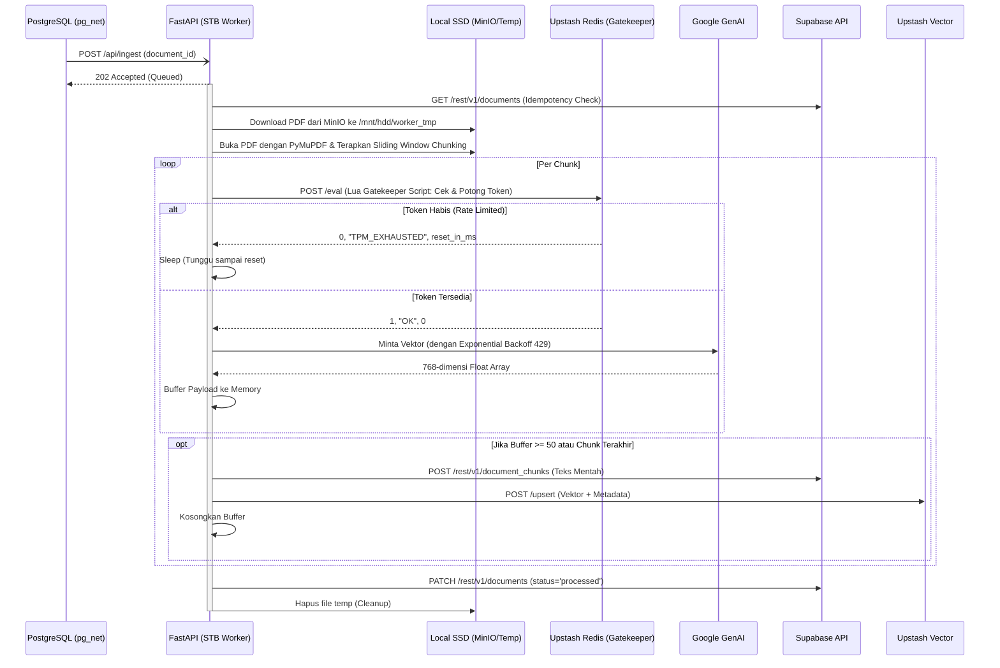

# STB Ingestion, Chunking, & Embedding Worker

## 1. Core Logic
Fitur ini (`apps/stb-worker`) adalah layanan asinkron berbasis Python (FastAPI) dengan pola **Clean Architecture** yang berjalan secara fisik di dalam STB (Set Top Box). 
Ketika Supabase Trigger mengirimkan sinyal melalui Webhook `/api/ingest`, worker ini akan:
1. **Download**: Mengunduh file PDF dari instans MinIO lokal ke penyimpanan *temporary*.
2. **Extraction & Slicing (Chunking)**: Mengekstrak teksnya halaman per halaman menggunakan `PyMuPDF`, lalu memecah teks tersebut menjadi *chunks* (potongan teks) menggunakan *tokenizer* `tiktoken` (OpenAI cl100k_base).
3. **Rate Limiting (Gatekeeper)**: Memeriksa kuota token harian/menit ke Upstash Redis menggunakan *script Lua* sebelum menembak API eksternal.
4. **Embedding**: Menerjemahkan potongan teks menjadi vektor 768-dimensi secara sekuensial menggunakan API Google Gemini (`gemini-embedding-2`).
5. **Upserting**: Mem-format *payload* vektor beserta metadatanya lalu mengunggahnya secara *batch* ke Upstash Vector DB dan Supabase Postgres.

## 2. Flow Diagram

## 3. Deep-Dive: Slicing / Chunking Mechanism
Saat ini sistem menggunakan teknik **Sliding Window Chunking**:
- **Ukuran Potongan (`chunk_size`)**: 1000 token.
- **Tumpang Tindih (`overlap`)**: 150 token.
- **Alasan**: Ketika sebuah dokumen dipecah secara buta per 1000 token, ada kemungkinan kalimat penting atau gagasan utama terbelah dua tepat di batas pemotongan. Dengan memaksa *chunk* selanjutnya untuk "mundur" dan mengambil 150 token dari *chunk* sebelumnya (*overlap*), kita memastikan bahwa konteks di sekitar perbatasan tidak hilang (konteks terhubung/tidak terputus).

## 4. Deep-Dive: Gatekeeper & Limiting
Layanan AI eksternal seperti Google Gemini memiliki batasan RPM (Requests Per Minute) dan TPM (Tokens Per Minute). Jika STB Worker membombardir Gemini secara membabi-buta:
1. Akun Google API akan diblokir atau di-*throttle* (HTTP 429).
2. Sistem akan *crash* karena tidak ada *backoff*.

**Solusi Arsitekturnya:**
- **Lua Script Gatekeeper**: STB mengeksekusi *script* atomik ke **Upstash Redis** melalui REST API. Script ini mengelola kuota *global* (lintas STB/Tenant).
- **Token Deduction**: Sebelum meminta vektor, STB menaksir estimasi token (panjang string / 3). Jika sisa token di Redis tidak cukup, Redis menolak request dan mengembalikan waktu `PTTL` (kapan kuota reset).
- **Sleep & Auto-Resume**: Worker di STB akan otomatis `time.sleep()` selama `PTTL` tersebut (tanpa mematikan *container*), lalu melanjutkan *embedding* begitu kuota terisi kembali. Ini membuat *ingestion* puluhan ribu halaman berjalan sangat stabil walau memakan waktu semalaman (Fire-and-Forget).

## 5. Architectural Decisions
- **REST API for Databases & AI:** STB Worker murni menggunakan HTTP (REST via `httpx`) untuk PostgREST, Upstash Vector, Upstash Redis, dan Gemini. Hal ini membuang *overhead* dependensi SDK/Driver ORM berat (seperti `psycopg2` atau `redis-py`) demi menyesuaikan kapabilitas CPU S905X di STB.
- **Push-over-Pull & Idempotency:** STB dibangun murni digerakkan oleh webhook (Supabase Trigger `pg_net`), BUKAN dengan cara *long-polling* database setiap 5 detik. Jika webhook gagal atau *timeout*, `pg_net` akan me-*retry*. Untuk mencegah *double processing*, STB melakukan pengecekan idempoten di awal (`status == 'processed'`).
- **Memory Constraint Mitigation:** Alih-alih melahap seluruh PDF ke dalam RAM (yang sangat langka di STB), PDF didownload murni ke SSD/External HDD (`/mnt/hdd/worker_tmp`), diproses secara berurutan, lalu *garbage file*-nya selalu dihapus di dalam block `finally`.

## 6. Completion Timestamp
**Completed At:** 2026-06-27T23:30:00+07:00 (WIB)
