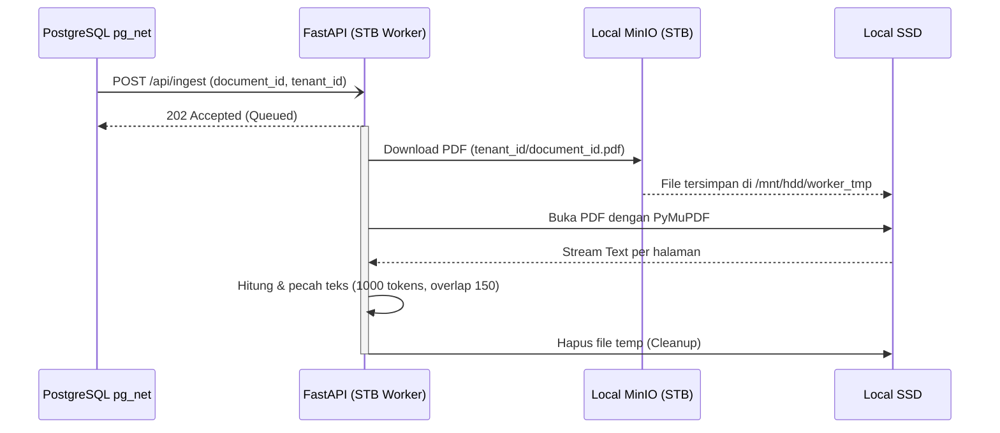

# STB Text Extraction & Chunking Worker

## 1. Core Logic
Fitur ini (`apps/stb-worker`) adalah layanan asinkron berbasis Python (FastAPI) yang berjalan secara fisik di dalam STB (Set Top Box). Ketika Supabase Trigger mengirimkan sinyal melalui Webhook `/api/ingest`, worker ini akan mengunduh file PDF dari instans MinIO lokal, mengekstrak teksnya halaman per halaman menggunakan `PyMuPDF`, dan memecah teks tersebut menjadi *chunks* menggunakan *tokenizer* berbasis `tiktoken` (OpenAI cl100k_base).

## 2. Flow Diagram

## 3. Completion Timestamp
**Completed At:** 2026-06-27T13:30:00+07:00 (WIB)

## 4. File Mapping
- **Created:**
  - `apps/stb-worker/main.py` (Entry point FastAPI dan logika chunking)
  - `apps/stb-worker/requirements.txt` (Dependensi: fastapi, uvicorn, pymupdf, tiktoken, boto3, python-dotenv)
  - `apps/stb-worker/.env.example` (Konfigurasi path S3 dan Tmp dir)
  - `deploy_worker.sh` (Script rsync untuk mempermudah deploy kode laptop ke STB)

## 5. Connections
- **Database (Supabase):** Sebagai *Sender* yang memicu proses ekstraksi via ekstensi `pg_net`.
- **MinIO:** Sebagai *Data Source* dengan routing *loopback* (127.0.0.1) tanpa melewati internet agar unduhan PDF stabil, tidak berbayar (zero egress), dan sangat cepat.
- **Hardware (STB):** Terdapat konfigurasi khusus di `main.py` menggunakan `tempfile` berparameter direktori SSD, agar ukuran RAM STB yang terbatas (~900MB) tidak kehabisan akibat default `/tmp` berbasis `tmpfs`.

## 6. Architectural Decisions
- **Python over Deno:** Meskipun *backend* utama memakai Deno, Worker ini ditulis dalam Python demi mengakses ekosistem pemrosesan dokumen dan AI (*tokenizer*) yang jauh lebih superior, ringan, dan cepat di arsitektur ARM64.
- **FastAPI BackgroundTasks:** Webhook yang ditembak oleh `pg_net` tidak disarankan untuk dibiarkan terbuka (blocking) karena batas *timeout* HTTP. Oleh karena itu, *endpoint* `/api/ingest` langsung mengembalikan `202 Accepted`, dan memindah proses unduhan+ekstraksi ke `BackgroundTasks` internal FastAPI.
- **Memory Constraint Mitigation:** Download PDF tidak disedot langsung ke memori (string/bytes buffer) karena sangat berbahaya untuk PDF > 50MB. File didownload murni ke SSD (disk), dibaca sedikit demi sedikit oleh `PyMuPDF`, lalu *garbage file*-nya dihapus di dalam block `finally`.
