# Activity Logs & Audit Trail Feature Documentation

**Completion Timestamp**: 2026-07-31T16:43:00+07:00 (WIB)

## Core Logic

The Activity Logs system provides a comprehensive audit trail and user activity feed for all significant operations within a tenant's workspace. It records authentication events, document operations, payment transactions, and system failures, enabling workspace members and administrators to monitor account security, verify background tasks, and maintain compliance.

### Key Capabilities
1. **Audit Context Extraction**: Every backend controller extracts client IP addresses (`x-forwarded-for`, `x-real-ip`, `cf-connecting-ip`), user-agent strings, and request IDs via `ContextExtractor.extractAuditContext()` and passes them down to the service layer.
2. **Denormalization via Metadata (JSONB)**: Specific event snapshot metadata (e.g., file names, subscription tiers, payment amounts, failure reasons) is stored in a JSONB column at event emission time, guaranteeing log immutability even if the target resource is deleted later.
3. **Selective Business Failure Audit Logging**: In addition to successful operations (`document.uploaded`, `billing.payment_completed`), business-level processing failures (`document.failed`, `document.quota_exhausted`, `billing.payment_failed`) are recorded so users have visibility into background pipeline outcomes.
4. **Tenant Isolation**: Every query and insert is strictly scoped to `tenant_id` to enforce multi-tenancy data isolation.
5. **Interactive Frontend Presentation**: The Svelte 5 frontend renders logs using TanStack Table and shadcn-svelte `Table` primitives, parsing raw User-Agent strings into clean client labels (e.g., `Firefox 152.0`, `Bruno 3.4.2`), displaying relative timestamps with full date-time tooltips, and rendering color-coded event dot indicators.

---

## Flow Diagram

```mermaid
sequenceDiagram
    autonumber
    actor User as Client / User
    participant FE as SvelteKit Activity Page
    participant API as Hono Router & Controller
    participant Extractor as ContextExtractor
    participant Service as Business Service
    participant DB as PostgreSQL (activity_logs)

    rect rgb(30, 41, 59)
    note over User,DB: 1. Audit Context Extraction & Logging Flow
    User->>API: HTTP Request (e.g. POST /api/documents/confirm)
    API->>Extractor: extractAuditContext(c)
    Extractor-->>API: { clientIp, userAgent, requestId }
    API->>Service: confirmUpload({ tenantId, documentId, clientIp, userAgent })
    Service->>DB: INSERT INTO activity_logs (tenant_id, action, ip_address, user_agent, metadata)
    Service-->>API: Success Response
    API-->>User: 200 OK
    end

    rect rgb(15, 23, 42)
    note over User,DB: 2. Activity Feed Retrieval & Rendering Flow
    User->>FE: Navigate to /app/activity
    FE->>API: GET /api/activities?page=1&limit=15
    API->>Extractor: extractAuthContext(c)
    API->>DB: SELECT * FROM activity_logs WHERE tenant_id = ? ORDER BY created_at DESC LIMIT 15
    DB-->>API: Paginated ActivityLog rows + total count
    API-->>FE: JSON { data: ActivityLog[], meta: { page, limit, total, totalPages } }
    FE->>FE: Parse UA & timestamps, render TanStack Table with status dot indicators
    FE-->>User: Display Audit Trail Table
    end
```

---

## File Mapping

### Frontend Files (`apps/frontend/`)
| File | Purpose / Changes |
|---|---|
| `apps/frontend/src/routes/app/activity/+page.svelte` | Main Activity Log page component. Configures page breadcrumbs, header, and connects `DataTable` to `GET /api/activities`. Handles server-side pagination and URL sync. |
| `apps/frontend/src/routes/app/activity/+page.ts` | Page load script setting `export const ssr = false;` for client-side API fetching with bearer auth tokens. |
| `apps/frontend/src/routes/app/activity/columns.ts` | TanStack ColumnDef definitions. Defines event dot color mappings (`bg-emerald-400`, `bg-[#DB8F5E]`, `bg-red-400`, `bg-amber-400`), User-Agent parser, relative timestamp calculator, and tooltip formatting helpers. |
| `apps/frontend/src/routes/app/activity/data-table.svelte` | Reactive TanStack Table component wrapping shadcn-svelte `Table.*` primitives (`Table.Root`, `Table.Header`, `Table.Row`, `Table.Cell`). Renders skeleton loaders, empty states, and pagination controls. |

### Backend Files (`apps/backend/`)
| File | Purpose / Changes |
|---|---|
| `apps/backend/src/shared/models/db.model.ts` | Updated `activityActionEnum` with `document.failed`, `document.quota_exhausted`, and `billing.payment_failed`. Defines `activity_logs` table schema and index on `(tenantId, createdAt DESC)`. |
| `apps/backend/src/shared/utils/activity.util.ts` | Fixed `activityActionEnum` import from `import type` to value import. Exports `logActivity()` helper function. |
| `apps/backend/src/shared/utils/context.util.ts` | Provides `ContextExtractor.extractAuditContext()` to parse client IP headers (`x-forwarded-for`, `x-real-ip`, `cf-connecting-ip`), user agents, and request IDs from Hono context. |
| `apps/backend/src/modules/documents/documents.schema.ts` | Added optional `clientIp` and `userAgent` fields to `ConfirmUploadParamsSchema`, `DeleteDocumentParamsSchema`, and `BatchDeleteDocumentsParamsSchema`. |
| `apps/backend/src/modules/documents/documents.controller.ts` | Extracted audit context via `extractor.extractAuditContext()` in `handleConfirmUpload`, `handleDeleteDocument`, and `handleBatchDeleteDocuments`. |
| `apps/backend/src/modules/documents/documents.service.ts` | Passed `clientIp` and `userAgent` into `logActivity()` calls for `document.uploaded` and `document.deleted`. Added `logActivity` for `document.failed` inside `markDocumentFailed()`. |
| `apps/backend/src/modules/auth/auth.schema.ts` | Added `clientIp` and `userAgent` to `UpdateTenantNameParamsSchema`. |
| `apps/backend/src/modules/auth/auth.controller.ts` | Extracted audit context in `handleUpdateTenantName`. |
| `apps/backend/src/modules/auth/auth.service.ts` | Passed `clientIp` and `userAgent` to `logActivity()` for `tenant.name_updated`. Updated `updateTenantName` signature to use `AuthParams.UpdateTenantNameParams`. |
| `apps/backend/src/modules/payments/payments.controller.ts` | Extracted audit context in `handleCheckout`, `handleWebhook`, and `handlePortal`. |
| `apps/backend/src/modules/payments/payments.service.ts` | Added `clientIp` and `userAgent` params to `handleWebhook`. Fixed payment status enum values (`SUCCEEDED`) and added webhook handlers for `checkout.session.async_payment_failed` and `invoice.payment_failed` to log `billing.payment_failed`. |

---

## Connections

- **Database**: All read and write queries against `activity_logs` in PostgreSQL are strictly filtered by `tenantId`. An index on `(tenant_id, created_at DESC)` ensures efficient pagination.
- **API Gateway**: Endpoint `GET /api/activities` is served by Hono and protected by `authMiddleware`.
- **Frontend Presentation**: SvelteKit fetches activity data via `apiRequest` from `$lib/api/client.ts` and renders clean UI elements formatted with Inter typography and theme design tokens.

---

## Architectural Decisions

1. **Option 1 Frontend UI Presentation**: Rather than exposing raw, unformatted technical data directly, the UI parses raw User-Agent strings into recognizable browser/client names (`Firefox 152.0`, `Bruno 3.4.2`) and hides full timestamps / raw user-agents inside hover tooltips.
2. **Selective Business Failure Audit Logging**: 
   - **Logged in `activity_logs`**: Business-level outcome failures (e.g., `document.failed`, `document.quota_exhausted`, `billing.payment_failed`) so workspace members understand why an operation or background pipeline failed.
   - **Not logged in `activity_logs`**: Generic HTTP 4xx syntax validation errors (e.g., malformed JSON) and 5xx infrastructure crashes, which are handled by application logging middleware (Loki / stdout) to prevent PostgreSQL disk exhaustion.
3. **Standardized ContextExtractor Audit Propagation**: All controllers extract client IP and user-agent metadata via `ContextExtractor.extractAuditContext()` and propagate them down the service layer inside single structured parameter objects.
