# Activity Logs & Audit Trail

**Completion Timestamp**: 2026-07-15T20:07:00+07:00 (WIB)

## Core Logic
Sistem Activity Log berfungsi sebagai *audit trail* yang merekam berbagai aktivitas krusial pengguna (seperti login, hapus dokumen, atau pembayaran) di dalam platform Dokyudo.

Alih-alih bergantung pada *database triggers* atau melakukan *JOIN* yang kompleks ke tabel-tabel asalnya, sistem ini menggunakan pendekatan **Denormalization via JSON Metadata**. Hal ini memastikan informasi spesifik dari sebuah event (seperti nama dokumen atau tier langganan) langsung disimpan ke dalam kolom JSON secara kekal (immutable) saat event tersebut terjadi. Jika objek asalnya dihapus di masa depan, log historis tidak akan rusak (blank).

## Flow Diagram

```mermaid
sequenceDiagram
    autonumber
    actor User
    participant Controller as Dokyudo API
    participant Service as Business Service
    participant DB as Postgres (Main Tables)
    participant ActivityUtil as logActivity() Utility
    participant ActivityDB as activity_logs Table

    User->>Controller: Action (e.g., DELETE /documents/:id)
    Controller->>Service: handleRequest()
    Service->>DB: Mutate resource & RETURNING {title}
    DB-->>Service: Return mutated row data
    
    rect rgb(30, 41, 59)
    note right of Service: Fire-and-Forget (No Await)
    Service-)ActivityUtil: logActivity({ action: "document.deleted", metadata: { fileName } })
    ActivityUtil-)ActivityDB: INSERT INTO activity_logs
    end

    Service-->>Controller: Return Success Response
    Controller-->>User: 200 OK
```

## File Mapping

| File | Change / Purpose |
|---|---|
| `apps/backend/src/shared/models/db.model.ts` | Mendefinisikan enum `activity_action_enum` dan tabel `activity_logs` beserta indeks `(tenantId, createdAt)` |
| `apps/backend/src/shared/utils/activity.util.ts` | Memuat fungsi utilitas `logActivity()` yang bersifat *fire-and-forget* (tidak memblokir eksekusi API) |
| `apps/backend/src/modules/auth/auth.service.ts` | Menginjeksi *logging* untuk event `auth.login`, `auth.logout`, `auth.password_reset`, dan `tenant.name_updated` |
| `apps/backend/src/modules/payments/payments.service.ts` | Menginjeksi *logging* untuk event `billing.payment_completed` (beserta data `amount`, `currency`, `tier`) |
| `apps/backend/src/modules/documents/documents.service.ts` | Memperbarui query dengan klausa `.returning({ title: documents.title })` untuk menyimpan nama dokumen di dalam *metadata* pada event `document.uploaded` dan `document.deleted` |
| `apps/backend/src/modules/activities/*` | Pembuatan module baru (`schema`, `controller`, `service`, `routes`) untuk endpoint `GET /api/activities` (Paginated) |
| `api-collections/Activities/1_Get Activities.bru` | Request collection Bruno untuk *testing* endpoint Activities |

## Connections
- **Database**: Semua operasi baca/tulis ke tabel `activity_logs` diikat dengan `tenantId` untuk menegakkan batasan Supabase RLS (Row Level Security) per workspace.
- **API Gateway**: Endpoint `GET /api/activities` disambungkan ke `router.ts` utama dan dilindungi menggunakan `authMiddleware` standar Dokyudo. Endpoint ini mengambil ekstensi dari fungsi bawaan `ContextExtractor.extractAuthContext()` dan `ContextExtractor.extractValidQuery()`.

## Architectural Decisions
1. **Denormalization via Metadata (JSONB)**: Diambil untuk mengatasi masalah *fragility* pada sistem Audit Trail. Ketika sebuah row dihapus (misal dokumen A), menyimpannya di kolom `metadata` sebagai snapshot string akan menghindari masalah *reference null / orphan records* pada tabel *activity logs*.
2. **Fire-and-Forget Pattern**: Utilitas `logActivity()` dipanggil *tanpa* `await` di dalam layer *service*. Ini memastikan bahwa jika koneksi / transaksi khusus log gagal karena alasan apa pun (termasuk validasi schema), alur bisnis utama pengguna tidak ikut error. Ia akan diam-diam masuk ke log `console.error` server.
3. **Application Layer Logging (Bukan Database Triggers)**: Kita tidak memakai Supabase / PostgreSQL trigger karena *triggers* beroperasi di dalam konteks database yang sangat sempit dan kekurangan akses terhadap metadata HTTP tingkat aplikasi seperti `IP Address`, `User-Agent`, dan `Request ID`. Logic ditulis seluruhnya di TypeScript agar mudah di-mock dan diuji.
