# Document Library, Hybrid Search & Worker Resilience Enhancements

## Completion Timestamp
**Date & Time**: July 25, 2026 at 10:22:00 UTC+7

---

## 1. Executive Summary & Core Logic
This update introduces comprehensive improvements across the entire Dokyudo stack (Frontend, Backend, STB Worker, Database):
- **Hybrid Semantic Search UI**: Embedded toggle group, search clear ("X") button, collapsible relevant text chunks, AI match score badges (e.g. `3.28% Match`), and direct page navigation inside EmbedPDF viewer via plugin hooks.
- **Icon-Only Action Toolbar & Batch ZIP Export**: Standardized Filter, Sort, Select, Delete, and Download action buttons to icon-only buttons across desktop and mobile. Implemented a zero-dependency client-side ZIP generator (`zip.ts`) to archive multiple selected files directly in the browser.
- **Worker Transient Error & Quota Resilience**: Improved `apps/stb-worker` to handle transient Cloudflare Workers AI API errors (`401`, `403`, `429`, `5xx`, timeouts) with exponential backoff and jitter. Implemented checkpoint-based re-queueing (`mark_document_queued`) so documents resume from the exact last batch instead of failing.
- **Schema & Migration for Vector Failures**: Added `failed_vectorizing` enum value to `document_status_enum` in PostgreSQL with Drizzle migration `0015`. Added corresponding UI badges (`Failed Vectorizing` and `Resuming Tomorrow`).

---

## 2. System Flow Diagram (Mermaid)

```mermaid
sequenceDiagram
    autonumber
    actor User
    participant FE as SvelteKit Frontend
    participant API as Hono Backend API
    participant DB as PostgreSQL (Supabase)
    participant Worker as STB Python Worker
    participant CF as Cloudflare Workers AI
    participant Upstash as Upstash Vector / Redis

    rect rgb(25, 25, 25)
        note right of User: 1. Batch Document Upload & Realtime Tracking
        User->>FE: Select & Upload PDF Files
        FE->>API: POST /api/documents/confirm-upload
        API->>DB: Insert Document (status: 'pending')
        DB-->>FE: Supabase Realtime UPDATE ('pending')
        FE->>FE: Display "Vectorizing..." Badge
    end

    rect rgb(35, 35, 35)
        note right of Worker: 2. Worker Processing & Resilience
        Worker->>DB: Checkpoint check (get_last_processed_chunk_index)
        Worker->>CF: Generate Batch Embeddings (1024-dim)
        alt Transient API Error (401/403/429/5xx)
            Worker->>Worker: Exponential Backoff (2s, 4s, 8s, 16s, 32s + jitter)
            alt Retries Exhausted
                Worker->>DB: mark_document_queued (status: 'quota_exhausted')
                DB-->>FE: Realtime UPDATE -> Badge: "Resuming Tomorrow"
            end
        else Fatal Vector Error
            Worker->>DB: mark_document_failed_vectorizing (status: 'failed_vectorizing')
            DB-->>FE: Realtime UPDATE -> Badge: "Failed Vectorizing"
        else Batch Success
            Worker->>DB: Flush Chunks to Postgres
            Worker->>Upstash: Upsert Vectors
            Worker->>DB: mark_document_processed (status: 'processed')
        end
    end

    rect rgb(45, 45, 45)
        note right of User: 3. Hybrid Search & Client-Side ZIP Download
        User->>FE: Enter Query + Hybrid Toggle
        FE->>API: GET /api/search?query=...
        API->>Upstash: Vector Query + RRF
        API-->>FE: Return Matched Chunks & Scores
        FE->>FE: Render Score Badge (x.xx% Match) & Collapsible Chunk
        User->>FE: Click Preview
        FE->>EmbedPDF: Hook onLayoutReady -> scrollToPage(matchedPage)
        User->>FE: Batch Select & Click Download
        FE->>FE: generate Zip Blob (zip.ts) -> Download .zip
    end
```



---

## 3. Connections & Component Interactions

```
+-----------------------------------------------------------------------------------+
|                              SvelteKit Frontend                                   |
|  - +page.svelte (ToggleGroup, Search Clear, Card Actions, Badges)                |
|  - data.ts (Document Interface with 'failed_vectorizing' & 'quota_exhausted')     |
|  - zip.ts (Zero-dependency Client-side ZIP Generator)                             |
+----------------------------------------+------------------------------------------+
                                         | HTTP / Realtime
                                         v
+-----------------------------------------------------------------------------------+
|                              Hono Backend API                                     |
|  - /api/documents (Presigned S3 URLs, CRUD, Confirm Upload)                      |
|  - /api/search (Application-Layer RRF Hybrid Search Proxy)                       |
|  - config/drizzle.ts (queryClient with prepare: false for PgBouncer)              |
+----------------------------------------+------------------------------------------+
                                         | Drizzle ORM / Supabase REST
                                         v
+-----------------------------------------------------------------------------------+
|                           PostgreSQL & Upstash Vector                             |
|  - document_status_enum ('pending','confirmed','processed','quota_exhausted',   |
|                          'failed','failed_vectorizing')                           |
|  - document_chunks table & pgvector index                                         |
+----------------------------------------+------------------------------------------+
                                         ^
                                         | DB Updates / Gatekeeper / Vectors
+----------------------------------------+------------------------------------------+
|                              STB Python Worker                                    |
|  - services/embedding.py (401/403/429 Exponential Backoff + TransientAPIError)    |
|  - services/processor.py (Checkpoint resumption & mark_document_queued)          |
|  - services/database.py (mark_document_failed_vectorizing)                      |
+-----------------------------------------------------------------------------------+
```

---

## 4. File Mapping

### Frontend (`apps/frontend/`)
- `src/routes/app/documents/+page.svelte`: Added Hybrid Search toggle group, search clear button, collapsible relevant chunks, score badges, EmbedPDF plugin scroll hook, icon-only toolbar, ZIP download trigger, and `quota_exhausted` / `failed_vectorizing` status badges.
- `src/routes/app/documents/data.ts`: Updated `Document` interface with `'failed_vectorizing'` status.
- `src/lib/utils/zip.ts` *(NEW)*: Pure TypeScript store-compression ZIP archive builder.

### Backend (`apps/backend/`)
- `src/shared/models/db.model.ts`: Updated `documentStatusEnum` with `"failed_vectorizing"`.
- `src/config/drizzle.ts`: Added `prepare: false` to Drizzle `postgres.js` client for Supabase Transaction Pooler compatibility.
- `drizzle/migrations/0015_add_failed_vectorizing_enum.sql` *(NEW)*: `ALTER TYPE "public"."document_status_enum" ADD VALUE 'failed_vectorizing';`
- `drizzle/migrations/meta/_journal.json`: Registered migration `0015`.

### Worker (`apps/stb-worker/`)
- `services/embedding.py`: Enhanced `generate_embedding_with_retry` to retry on `401`, `403`, `408`, `429`, `5xx`, timeouts with exponential backoff + jitter. Raises `TransientAPIError` on max retries.
- `services/processor.py`: Updated exception handling to catch `TransientAPIError` and call `mark_document_queued()`. Calls `mark_document_failed_vectorizing()` on fatal non-transient vector failures.
- `services/database.py`: Added `mark_document_failed_vectorizing()` function.

---

## 5. Architectural Decisions

1. **Client-Side ZIP Generation**:
   - **Why**: Avoids creating a heavy zip endpoint on backend/Deno Deploy and streaming large binary buffers through serverless functions.
   - **Implementation**: Written as a 100-line pure TypeScript utility (`zip.ts`) using standard `Uint8Array` binary headers (`PK\x03\x04`, `PK\x01\x02`, `PK\x05\x06`) and CRC-32 calculation.

2. **EmbedPDF Plugin Hook Navigation**:
   - **Why**: The EmbedPDF viewer uses WebGL/PDFium WASM rendering rather than standard PDF.js iframe hash navigation (`#page=N`).
   - **Implementation**: Hooked into `scrollPlugin.provides().onLayoutReady` via `<PDFViewer onready={...}>`. When `event.isInitial` confirms WASM page layout calculation is complete, calls `scrollToPage({ pageNumber: targetPage })`.

3. **STB Worker Resiliency & Checkpointing**:
   - **Why**: Transient Cloudflare API errors (`401`, `403`, `429`) should never turn a document status into permanent `failed`.
   - **Implementation**: Progress is checkpointed per batch in PostgreSQL (`get_last_processed_chunk_index`). Re-queueing the document via `mark_document_queued()` ensures seamless resumption when retried later without losing already vectorized chunks.
