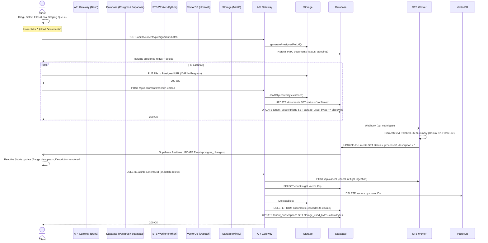

# Document Upload & Management

## UPDATE (2026-08-13) — Title rename (PATCH /{id})

- **Endpoint baru**: `PATCH /api/documents/{id}` — memperbarui judul dokumen. Auth JWT wajib; body `{ title }` divalidasi zod (`documents.schema.ts` → `DocumentTitleSchema`).
- **Whitelist karakter anti-XSS/SQLi**: hanya huruf Unicode, digit, spasi, dan `.-_,&+@#:!?()` (max 255 karakter, di-trim). `< > " ' \` ; = / %` dst. ditolak 400 — title tidak bisa membawa payload script atau fragmen SQL. Drizzle parameterized query (bukan string concatenation).
- **Extension immutable**: extension diturunkan dari `storage_path` file asli (`{docId}.{ext}`) dan wajib muncul di akhir title baru (case-insensitive). Ganti extension → 400 `VALIDATION_ERROR` (`Title must end with .{ext}`). Rename hanya label; penyimpanan, preview, dan download tetap memakai file asli.
- **Aktivitas**: log `document.renamed` (metadata `fileName` → `newFileName`) — enum baru `activity_action_enum` + migrasi `0028_document_renamed.sql` (idempotent).
- **Frontend** (`apps/frontend/src/routes/app/documents/`):
  - `document-card-actions.svelte` — item menu "Rename" (ikon `edit2-outline`).
  - `+page.svelte` — dialog rename: input nama dengan **extension dikunci** sebagai suffix terpisah; validasi klien mirror regex backend untuk feedback instan; setelah sukses nama di daftar ter-update dan `url` preview cache di-reset (unduhan berikutnya memakai nama baru).
- **Perbaikan terkait**: toast realtime `Document processed` kini hanya muncul saat `status` benar-benar berubah (bandingkan `prevStatus`), bukan setiap UPDATE payload — rename tidak lagi memicu toast ganda.

## UPDATE (2026-08-13) — DOCX support, title dedup, dual-file storage

- **DOCX upload**: Backend contract menerima `.docx` (`application/vnd.openxmlformats-officedocument.wordprocessingml.document`) selain `.pdf`/`.txt`. Frontend upload dialog dan chat attachment sama-sama menerima `.docx` (batas 25MB/file, 10 file/batch).
- **TXT kini benar-benar diproses**: `.txt` sudah diterima sejak awal, tetapi worker gagal memprosesnya (diekstrak sebagai PDF). Sekarang `.txt` melewati jalur yang sama dengan DOCX: dikonversi LibreOffice → PDF untuk viewer, teks asli dibaca dengan deteksi encoding (UTF-8 BOM → UTF-16 BOM → UTF-8 → cp1252; file biner ber-NUL ditolak), chunk di-align ke halaman PDF konversi. Preview dan kutipan halaman bekerja seperti PDF.
- **Title dedup "(n)"**: `POST /presigned-url/batch` memuat judul dokumen milik tenant, dan judul duplikat (case-insensitive) otomatis di-rename sebelum ekstensi — `laporan.pdf` → `laporan (1).pdf`, dst. Berlaku juga untuk duplikat dalam satu batch. Response `filename` membawa judul final; dialog upload & attachment chat menampilkan judul tersimpan agar konsisten dengan daftar dokumen. `storage_path` tetap dari ekstensi file asli — rename judul tidak mengubah penyimpanan.
- **Dual-file storage untuk non-PDF**: STB Worker mengonversi `.docx`/`.txt` → PDF dan menyimpannya sebagai `{tenant}/{docId}.pdf` di MinIO (untuk viewer EmbedPDF). Jadi satu dokumen non-PDF menyimpan **dua objek**: file asli + PDF konversi.
- **Preview**: `GET /{id}/preview` — mode view mengarah ke PDF hasil konversi (non-PDF) atau file asli (PDF); `download=true` selalu mengembalikan file asli user.
- **Delete**: single & batch menghapus kedua objek (asli + PDF konversi) — tidak ada orphan; best-effort bila salah satu tidak ada.

## Core Logic
This feature encompasses the entire lifecycle of a knowledge document within the RAG pipeline. It facilitates direct client-to-storage file uploads to bypass server memory limits, guarantees database consistency upon upload confirmation, provides safe, cascading deletion to purge data across the relational database, object storage, and vector index, tracks storage consumption per tenant, and handles document previews, direct browser downloads, and real-time status updates via Supabase Realtime.

Key capabilities:
- **Two-Phase Staged Batch Upload**: Files added via drag-and-drop or browse are queued locally in browser memory (`staged`) without sending network requests until the user clicks "Upload Documents". Includes real-time total queue file count and byte size status summary bar.
- **Batch Retry Failed Uploads**: Provides a dedicated "Retry Failed (N)" action button in the upload dialog footer to re-enqueue all failed upload items simultaneously.
- **Presigned URLs**: Grants secure, temporary (15-min) PUT access for the client to upload files directly to MinIO (S3-compatible storage), registering the file as `pending` in the DB.
- **Upload Confirmation & Storage Accounting**: Transitions a `pending` document to `confirmed` after verifying the object physically exists in S3, atomically updating `tenant_subscriptions.storage_used_bytes` and `uploads_count`.
- **List Documents**: A `GET` endpoint that retrieves all documents belonging to a tenant, designed specifically to supply the SvelteKit frontend load function for client-side table rendering (TanStack Table).
- **Document Preview & Download**: A `GET` endpoint (`/api/documents/:id/preview`) that securely generates a short-lived Presigned GET URL (12 hours). Passing `download=true` sets `Content-Disposition: attachment; filename="..."` so the browser directly prompts the user for a download location rather than rendering inline in a new tab.
- **Comprehensive & Batch Deletion**: Single `DELETE /api/documents/:id` and batch `POST /api/documents/batch-delete` endpoints that purge documents, cancel STB Worker jobs, remove vector embeddings from Upstash Vector, delete binary files in MinIO, and refund tenant storage quota in Postgres.
- **Supabase Realtime Status & Description Sync**: A `postgres_changes` wildcard channel listener in SvelteKit (`+page.svelte`) combined with a smart 4-second polling backup interval. Automatically streams document `status` transitions (`pending`/`confirmed` -> `processed`) and LLM-generated `description` text to the UI without requiring page refreshes.
- **Monochrome Gray AI Sparkle & Generating UI**:
  - Displays a sleek monochrome gray status badge (`border-white/20 bg-white/10 text-white/90`) matching card hover state with `<SparklesIcon class="animate-pulse text-white" />` and `"Vectorizing..."` exclusively while in the processing phase.
  - Displays an italicized pulsing placeholder `<SparklesIcon class="animate-spin text-white/70" /> Generating summary with AI...` in Card Row 2, smoothly transitioning into the generated summary text once received.

## Flow Diagram

## Completion Timestamp
**Date:** 2026-07-24  
**Time:** 19:15 (UTC+7)

## File Mapping
- `apps/backend/src/shared/utils/tier_quota.util.ts`: Formatted MB display with `.toFixed(2)` and updated storage quota check to read `tenant_subscriptions.storage_used_bytes` directly.
- `apps/backend/src/modules/documents/documents.service.ts`: Implemented `createPresignedUrlBatch`, `confirmUpload`, `deleteDocument`, `batchDeleteDocuments`, `listDocuments`, and `getDocumentPreview` with atomic quota updates.
- `apps/backend/src/modules/documents/documents.controller.ts`: Added request handlers bridging Zod validation and query parameter extraction to the service layer.
- `apps/backend/src/modules/documents/documents.routes.ts`: OpenAPI schemas for all Document CRUD operations, preview, download, and batch endpoints.
- `apps/backend/src/modules/documents/documents.schema.ts`: Standardized Zod I/O, query validation, and presigned url batch schemas.
- `apps/backend/src/shared/utils/s3.util.ts`: Extended `generatePresignedGetUrl` with `ResponseContentDisposition` support.
- `apps/frontend/src/lib/supabase/client.ts`: Supabase browser client helper initialized with public environment credentials.
- `apps/frontend/src/routes/app/documents/data.ts`: Updated `Document` interface with `status` union types.
- `apps/frontend/src/routes/app/documents/+page.ts`: Client-side loader fetching tenant documents and mapping `status` property.
- `apps/frontend/src/routes/app/documents/+page.svelte`: Main document library page with Supabase Realtime listener (`postgres_changes`), smart 4s polling backup, monochrome gray AI sparkle "Vectorizing..." badge, and "Generating summary with AI..." placeholder.
- `apps/frontend/src/routes/app/documents/UploadDocumentDialog.svelte`: Two-phase staged batch upload modal with real-time XHR progress, queue file & size summary status bar, red "Cancel All" danger button, and "Retry Failed (N)" action.
- `apps/frontend/src/routes/app/documents/document-card-actions.svelte`: Dropdown menu for document preview, download, rename, and deletion.
- `apps/stb-worker/services/processor.py`: Added pre-flush cancellation guard `ingestion_queue.is_cancelled(document_id)` and graceful HTTP 409/404 conflict handling for deleted documents.
- `apps/stb-worker/services/llm.py`: Added `document_id` parameter to `generate_llm_description` and included `document_id` in log event metadata.
- `api-collections/Documents/06_Get Document Preview.bru`: Updated Bruno API collection with `download` query param.
- `api-collections/Documents/04_Rename Document.bru`: Bruno request for `PATCH /api/documents/{id}` (title rename with immutable extension).

## Connections
- **Client (Frontend):** Manages local staging, streams uploads to MinIO with real-time percentage feedback, listens to Supabase Realtime WebSocket events for instant status and description updates, previews PDFs inline using `@embedpdf/svelte-pdf-viewer`, and triggers direct attachment downloads.
- **Deno API (Backend):** Manages authorization, orchestration, OpenAPI contracts, S3 URL signing, STB Worker cancellation dispatch, and atomic quota management in PostgreSQL.
- **STB Worker (Python):** Handles async PDF parsing, Qwen3 embedding generation, Gemini 3.1 Flash Lite description generation, pre-flush cancellation safety, and graceful exception handling.
- **PostgreSQL (Database):** Stores metadata, broadcasts Realtime changes, and enforces `tenant_subscriptions.storage_used_bytes` quota tracking alongside `ON DELETE CASCADE` chunk cleanup.
- **Upstash Vector:** Purges vectors via the Upstash SDK `vectorIndex.delete()`.
- **MinIO (S3):** Stores raw files securely with private access.

## Architectural Decisions
1. **Direct-to-S3 Uploads**: Prevents the Deno Edge Worker from hitting memory or timeout constraints when processing large PDF files by eliminating the need to buffer uploads in RAM.
2. **Order of Deletion Operations**: The backend extracts `chunkIds` *before* hitting Postgres, deletes from Vector, then S3, then finally Postgres. This ensures that if the process dies halfway, we don't have orphaned data in external stores without a DB record to track them.
3. **Tenant-Level Isolation**: All document database queries (`SELECT`, `UPDATE`, `DELETE`) enforce an explicit `and(eq(documents.tenantId, params.tenantId))` constraint, strictly preventing IDOR vulnerabilities.
4. **Client-Side Data Processing**: For listing documents, the backend sends the entire tenant's document list in one JSON response. The SvelteKit frontend utilizes TanStack Table to handle sorting, filtering, and pagination exclusively on the client side.
5. **Secure Previews**: The MinIO bucket is kept strictly private. Previews are generated dynamically via `getDocumentPreview` using AWS SDK's `GetObjectCommand`, yielding a 12-hour Presigned GET URL.
6. **Direct Attachment Presigned URLs for Downloads**: Passing `ResponseContentDisposition` during S3 presigned GET URL creation instructs the browser to stream the file straight to disk and prompt for a save location, bypassing JS memory buffers.
7. **Two-Phase Staged Batch Upload**: Decouples file selection from network execution. Files sit in browser memory (`staged`) until the user explicitly clicks "Upload Documents", preventing accidental API calls and orphaned S3 objects.
8. **Storage Quota Accounting at `confirm-upload` and `delete`**: Updating `tenant_subscriptions.storage_used_bytes` during `confirm-upload` ensures storage is charged only for files physically present in S3. Deleting documents automatically decrements `storage_used_bytes` to refund tenant capacity.
9. **Destructive Action Safeguards**: Provides a confirmation modal with an animated spinner for single document deletions and a red glass "Cancel All" button during batch uploads.
10. **Dual-Layer Real-Time Synchronization**: Combines Supabase Realtime WebSocket events (`postgres_changes`) with a smart 4-second polling backup interval. Ensures 0ms instant UI updates while guaranteeing fallthrough recovery if WebSockets drop or RLS filters restrict anon payloads.
11. **Exclusive Vectorizing Status & Generating Animation**: Limits status badge rendering exclusively to active processing states (`pending`/`confirmed`), keeping the card UI clean once completed. Replaces static description text with an animated AI generating placeholder until STB Worker finishes text summarization.
12. **Pre-Flush Worker Cancellation Guard**: Checks `ingestion_queue.is_cancelled(document_id)` right before database inserts in `processor.py`. Prevents 409 Conflict database errors when a user cancels an in-flight upload job.
